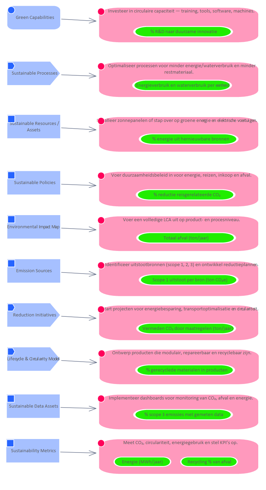
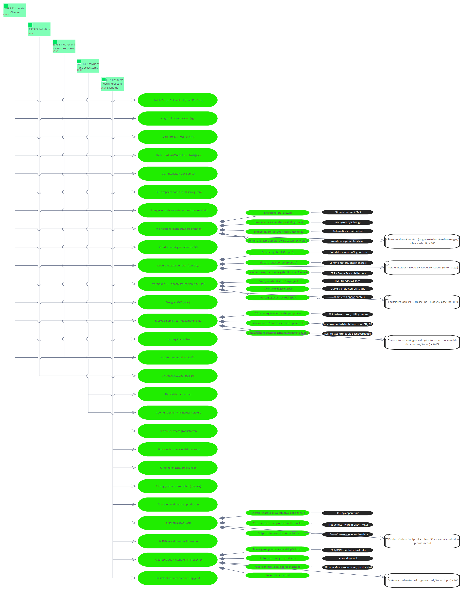

# Metric Scope 1 uitstoot per bron (ton CO₂e)

**Type:** Requirement  **Stereotype:** Metric  **StereotypeEx:** Metric  **FQStereotype:** EDGY::Metric  **Status:** Proposed  
**Created:** 2025-12-03  **Modified:** 2025-12-03

[Home](../index.md) / [Edgy](../Edgy/index.md) / [Metrics](index.md)

## Tagged Values

| Name | Value | Notes |
|------|-------|-------|
| EDGY::MetricStatus | Good | Default: Good  |
| EDGY::MetricValue | <VALUE> | Default: <VALUE>  |

[↑ Back to top](#)

## Relationships

| Type | Stereotype | Connected To |
|------|------------|-------------|
| ControlFlow | Flow | [ESRS E1 Climate Change](../ESRS E1/ESRS E1 Climate Change.md) |
| Association | Link | [Identificeer uitstootbronnen (scope 1, 2, 3) en ontwikkel reductieplannen.](../Task/Identificeer uitstootbronnen (scope 1, 2, 3) en ontwikkel reductieplannen..md) |
| Aggregation | Tree | [Brandstofgebruik (Scope 1)](Brandstofgebruik (Scope 1).md) |
| Aggregation | Tree | [Elektriciteitsverbruik (Scope 2)](Elektriciteitsverbruik (Scope 2).md) |
| Aggregation | Tree | [Leveranciers-, transport-, gebruiksdata (Scope 3)](Leveranciers-, transport-, gebruiksdata (Scope 3).md) |
| ControlFlow | Flow | [Totale uitstoot = Scope 1 + Scope 2 + Scope 3 (in ton CO₂e)](Totale uitstoot = Scope 1 + Scope 2 + Scope 3 (in ton CO₂e).md) |

[↑ Back to top](#)

### Appears on Diagrams

  <a href="../Architecture/diagrams/Architecture.html" class="diagram-thumb">Architecture</a>
  <a href="diagrams/Metrics.html" class="diagram-thumb">Metrics</a>

[↑ Back to top](#)

### Referenced By

| Type | Stereotype | Source |
|------|------------|--------|
| ControlFlow | Flow | [ESRS E1 Climate Change](../ESRS E1/ESRS E1 Climate Change.md) |
| Association | Link | [Identificeer uitstootbronnen (scope 1, 2, 3) en ontwikkel reductieplannen.](../Task/Identificeer uitstootbronnen (scope 1, 2, 3) en ontwikkel reductieplannen..md) |

[↑ Back to top](#)

---

## Relationship Graph

{"nodes":[{"id":"e36","label":"ESRS E1 Climate Change","fullName":"ESRS E1 Climate Change","packageName":"ESRS E1","layer":"edgy-id","isFocal":false,"hasUrl":true,"url":"../ESRS E1/ESRS E1 Climate Change.html"},{"id":"e154","label":"Identificeer uitstootbr…","fullName":"Identificeer uitstootbronnen (scope 1, 2, 3) en ontwikkel reductieplannen.","packageName":"Task","layer":"edgy-ex","isFocal":false,"hasUrl":true,"url":"../Task/Identificeer uitstootbronnen (scope 1, 2, 3) en ontwikkel reductieplannen..html"},{"id":"e197","label":"Brandstofgebruik (Scope…","fullName":"Brandstofgebruik (Scope 1)","packageName":"Metrics","layer":"edgy-lb","isFocal":false,"hasUrl":true,"url":"Brandstofgebruik (Scope 1).html"},{"id":"e198","label":"Elektriciteitsverbruik …","fullName":"Elektriciteitsverbruik (Scope 2)","packageName":"Metrics","layer":"edgy-lb","isFocal":false,"hasUrl":true,"url":"Elektriciteitsverbruik (Scope 2).html"},{"id":"e199","label":"Leveranciers-, transpor…","fullName":"Leveranciers-, transport-, gebruiksdata (Scope 3)","packageName":"Metrics","layer":"edgy-lb","isFocal":false,"hasUrl":true,"url":"Leveranciers-, transport-, gebruiksdata (Scope 3).html"},{"id":"e233","label":"Totale uitstoot = Scope…","fullName":"Totale uitstoot = Scope 1 + Scope 2 + Scope 3 (in ton CO₂e)","packageName":"Metrics","layer":"edgy-lb","isFocal":false,"hasUrl":true,"url":"Totale uitstoot = Scope 1 + Scope 2 + Scope 3 (in ton CO₂e).html"},{"id":"e180","label":"Scope 1 uitstoot per br…","fullName":"Scope 1 uitstoot per bron (ton CO₂e)","packageName":"Metrics","layer":"edgy-lb","isFocal":true,"hasUrl":false,"url":""},{"id":"e111","label":"Totale Scope 1-3 uitsto…","fullName":"Totale Scope 1-3 uitstoot (ton CO₂e/jaar)","packageName":"Metrics","layer":"edgy-lb","isFocal":false,"hasUrl":true,"url":"Totale Scope 1-3 uitstoot (ton CO₂e_jaar).html"},{"id":"e115","label":"Reductiedoel CO₂ (% t.o…","fullName":"Reductiedoel CO₂ (% t.o.v. basisjaar)","packageName":"Metrics","layer":"edgy-lb","isFocal":false,"hasUrl":true,"url":"Reductiedoel CO₂ (% t.o.v. basisjaar).html"},{"id":"e117","label":"Jaarlijkse CO₂-reductie…","fullName":"Jaarlijkse CO₂-reductie (%)","packageName":"Metrics","layer":"edgy-lb","isFocal":false,"hasUrl":true,"url":"Jaarlijkse CO₂-reductie (%).html"},{"id":"e169","label":"CO₂-intensiteit per € o…","fullName":"CO₂-intensiteit per € omzet","packageName":"Metrics","layer":"edgy-lb","isFocal":false,"hasUrl":true,"url":"CO₂-intensiteit per € omzet.html"},{"id":"e172","label":"CO₂ per klanttransactie…","fullName":"CO₂ per klanttransactie (kg)","packageName":"Metrics","layer":"edgy-lb","isFocal":false,"hasUrl":true,"url":"CO₂ per klanttransactie (kg).html"},{"id":"e173","label":"CO₂ bespaard door digit…","fullName":"CO₂ bespaard door digitalisering (ton)","packageName":"Metrics","layer":"edgy-lb","isFocal":false,"hasUrl":true,"url":"CO₂ bespaard door digitalisering (ton).html"},{"id":"e176","label":"Energieverbruik en wate…","fullName":"Energieverbruik en waterverbruik per eenheid","packageName":"Metrics","layer":"edgy-lb","isFocal":false,"hasUrl":true,"url":"Energieverbruik en waterverbruik per eenheid.html"},{"id":"e177","label":"% energie uit hernieuwb…","fullName":"% energie uit hernieuwbare bronnen","packageName":"Metrics","layer":"edgy-lb","isFocal":false,"hasUrl":true,"url":"% energie uit hernieuwbare bronnen.html"},{"id":"e178","label":"% reductie reisgerelate…","fullName":"% reductie reisgerelateerde CO₂","packageName":"Metrics","layer":"edgy-lb","isFocal":false,"hasUrl":true,"url":"% reductie reisgerelateerde CO₂.html"},{"id":"e181","label":"Vermeden CO₂ door maatr…","fullName":"Vermeden CO₂ door maatregelen (ton/jaar)","packageName":"Metrics","layer":"edgy-lb","isFocal":false,"hasUrl":true,"url":"Vermeden CO₂ door maatregelen (ton_jaar).html"},{"id":"e183","label":"% scope 3 emissies met …","fullName":"% scope 3 emissies met gemeten data","packageName":"Metrics","layer":"edgy-lb","isFocal":false,"hasUrl":true,"url":"% scope 3 emissies met gemeten data.html"},{"id":"e185","label":"# SDGs met meetbare KPI…","fullName":"# SDGs met meetbare KPI’s","packageName":"Metrics","layer":"edgy-lb","isFocal":false,"hasUrl":true,"url":"_ SDGs met meetbare KPI’s.html"},{"id":"e186","label":"Energie (MWh/jaar)","fullName":"Energie (MWh/jaar)","packageName":"Metrics","layer":"edgy-lb","isFocal":false,"hasUrl":true,"url":"Energie (MWh_jaar).html"},{"id":"e187","label":"Recycling % van afval","fullName":"Recycling % van afval","packageName":"Metrics","layer":"edgy-lb","isFocal":false,"hasUrl":true,"url":"Recycling % van afval.html"},{"id":"e510","label":"Company subject to CSRD","fullName":"Company subject to CSRD","packageName":"People","layer":"edgy-pe","isFocal":false,"hasUrl":true,"url":"../People/Company subject to CSRD.html"},{"id":"e350","label":"ESRS E1 - Climate","fullName":"ESRS E1 - Climate","packageName":"ESRS Navigator Stakeholder Map","layer":"business","isFocal":false,"hasUrl":true,"url":"../ESRS Navigator Stakeholder Map/ESRS E1 - Climate.html"},{"id":"e531","label":"European Commission","fullName":"European Commission","packageName":"People","layer":"edgy-pe","isFocal":false,"hasUrl":true,"url":"../People/European Commission.html"},{"id":"e555","label":"European Sustainability…","fullName":"European Sustainability Reporting Standards","packageName":"European Sustainability Reporting Standards","layer":"edgy-id","isFocal":false,"hasUrl":true,"url":"../European Sustainability Reporting Standards/European Sustainability Reporting Standards.html"},{"id":"e133","label":"Emission Sources","fullName":"Emission Sources","packageName":"Asset","layer":"edgy-ar","isFocal":false,"hasUrl":true,"url":"../Asset/Emission Sources.html"},{"id":"e218","label":"Brandstofsensoren/logbo…","fullName":"Brandstofsensoren/logboeken","packageName":"Metrics","layer":"edgy-lb","isFocal":false,"hasUrl":true,"url":"Brandstofsensoren_logboeken.html"},{"id":"e219","label":"Slimme meters, energien…","fullName":"Slimme meters, energienota’s","packageName":"Metrics","layer":"edgy-lb","isFocal":false,"hasUrl":true,"url":"Slimme meters, energienota’s.html"},{"id":"e220","label":"ERP + Scope 3-calculati…","fullName":"ERP + Scope 3-calculatietools","packageName":"Metrics","layer":"edgy-lb","isFocal":false,"hasUrl":true,"url":"ERP + Scope 3-calculatietools.html"}],"edges":[{"id":"c19","source":"e36","target":"e111","label":"ControlFlow","sourceLayer":"edgy-id"},{"id":"c24","source":"e36","target":"e115","label":"ControlFlow","sourceLayer":"edgy-id"},{"id":"c32","source":"e36","target":"e117","label":"ControlFlow","sourceLayer":"edgy-id"},{"id":"c93","source":"e36","target":"e169","label":"ControlFlow","sourceLayer":"edgy-id"},{"id":"c96","source":"e36","target":"e172","label":"ControlFlow","sourceLayer":"edgy-id"},{"id":"c97","source":"e36","target":"e173","label":"ControlFlow","sourceLayer":"edgy-id"},{"id":"c100","source":"e36","target":"e176","label":"ControlFlow","sourceLayer":"edgy-id"},{"id":"c102","source":"e36","target":"e177","label":"ControlFlow","sourceLayer":"edgy-id"},{"id":"c103","source":"e36","target":"e178","label":"ControlFlow","sourceLayer":"edgy-id"},{"id":"c105","source":"e36","target":"e180","label":"ControlFlow","sourceLayer":"edgy-id"},{"id":"c106","source":"e36","target":"e181","label":"ControlFlow","sourceLayer":"edgy-id"},{"id":"c108","source":"e36","target":"e183","label":"ControlFlow","sourceLayer":"edgy-id"},{"id":"c112","source":"e36","target":"e185","label":"ControlFlow","sourceLayer":"edgy-id"},{"id":"c115","source":"e36","target":"e186","label":"ControlFlow","sourceLayer":"edgy-id"},{"id":"c117","source":"e36","target":"e187","label":"ControlFlow","sourceLayer":"edgy-id"},{"id":"c556","source":"e510","target":"e36","label":"reports according to","sourceLayer":"edgy-pe"},{"id":"c565","source":"e350","target":"e36","label":"Abstraction","sourceLayer":"business"},{"id":"c586","source":"e531","target":"e36","label":"Association","sourceLayer":"edgy-pe"},{"id":"c599","source":"e555","target":"e36","label":"Aggregation","sourceLayer":"edgy-id"},{"id":"c48","source":"e133","target":"e154","label":"ControlFlow","sourceLayer":"edgy-ar"},{"id":"c132","source":"e154","target":"e180","label":"Association","sourceLayer":"edgy-ex"},{"id":"c198","source":"e180","target":"e197","label":"Aggregation","sourceLayer":"edgy-lb"},{"id":"c218","source":"e197","target":"e218","label":"Association","sourceLayer":"edgy-lb"},{"id":"c199","source":"e180","target":"e198","label":"Aggregation","sourceLayer":"edgy-lb"},{"id":"c219","source":"e198","target":"e219","label":"Association","sourceLayer":"edgy-lb"},{"id":"c200","source":"e180","target":"e199","label":"Aggregation","sourceLayer":"edgy-lb"},{"id":"c220","source":"e199","target":"e220","label":"Association","sourceLayer":"edgy-lb"},{"id":"c232","source":"e180","target":"e233","label":"ControlFlow","sourceLayer":"edgy-lb"}]}

---

*Generated: 2026-06-30 15:54:13*