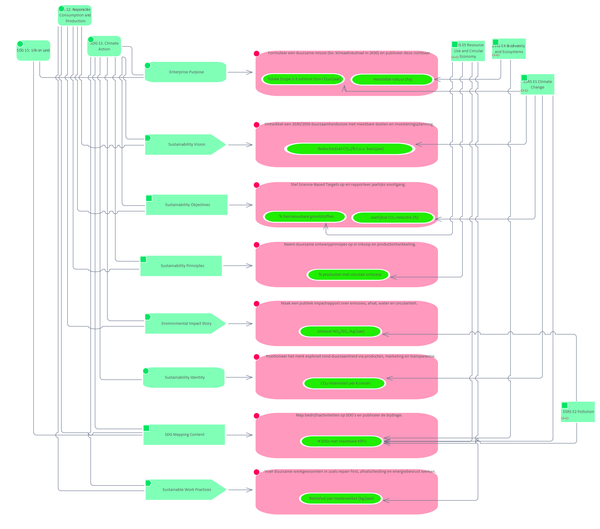

# Purpose SDG 12. Responsible Consumption and Production

**Type:** Activity  **Stereotype:** Purpose  **StereotypeEx:** Purpose  **FQStereotype:** EDGY::Purpose  **Status:** Proposed  
**Created:** 2025-12-02  **Modified:** 2025-12-02

[Home](../index.md) / [Edgy](../Edgy/index.md) / [SDGs](../SDGs/index.md) / [Sustainability Development Goals](index.md)

Ensure sustainable consumption and production patterns.

## Tagged Values

| Name | Value | Notes |
|------|-------|-------|
| EDGY::TextAlign | Center | Default: Center  |

[↑ Back to top](#)

## Relationships

| Type | Stereotype | Connected To |
|------|------------|-------------|
| Association | Link | [Sustainability Vision](../Story/Sustainability Vision.md) |
| Association | Link | [Sustainability Objectives](../Content/Sustainability Objectives.md) |
| Association | Link | [Sustainability Principles](../Content/Sustainability Principles.md) |
| Association | Link | [Environmental Impact Story](../Story/Environmental Impact Story.md) |
| Association | Link | [Stakeholder Sustainability Expectations](../Task/Stakeholder Sustainability Expectations.md) |
| Association | Link | [Green Customer Task](../Task/Green Customer Task.md) |
| Association | Link | [Green Customer Journey](../Journey/Green Customer Journey.md) |
| Association | Link | [Green Services](../Channel/Green Services.md) |
| Association | Link | [Green Capabilities](../Capability/Green Capabilities.md) |
| Association | Link | [Sustainable Processes](../Process/Sustainable Processes.md) |
| Association | Link | [Sustainable Policies](../Asset/Sustainable Policies.md) |
| Association | Link | [Environmental Impact Map](../Asset/Environmental Impact Map.md) |
| Association | Link | [Lifecycle & Circularity Model](../Process/Lifecycle & Circularity Model.md) |
| Association | Link | [SDG Mapping Content](../Content/SDG Mapping Content.md) |
| Association | Link | [Sustainable Work Practices](../Story/Sustainable Work Practices.md) |

[↑ Back to top](#)

### Appears on Diagrams

  <a href="diagrams/Sustainability Development Goals.html" class="diagram-thumb">Sustainability Development Goals</a>
  <a href="../Mapping SDG to Main/diagrams/Mapping SDG to Main.html" class="diagram-thumb">Mapping SDG to Main</a>
  <a href="../Identity/diagrams/Identity.html" class="diagram-thumb">Identity</a>

[↑ Back to top](#)

---

## Relationship Graph

{"nodes":[{"id":"e113","label":"Sustainability Vision","fullName":"Sustainability Vision","packageName":"Story","layer":"edgy-id","isFocal":false,"hasUrl":true,"url":"../Story/Sustainability Vision.html"},{"id":"e116","label":"Sustainability Objectiv…","fullName":"Sustainability Objectives","packageName":"Content","layer":"edgy-id","isFocal":false,"hasUrl":true,"url":"../Content/Sustainability Objectives.html"},{"id":"e121","label":"Sustainability Principl…","fullName":"Sustainability Principles","packageName":"Content","layer":"edgy-id","isFocal":false,"hasUrl":true,"url":"../Content/Sustainability Principles.html"},{"id":"e122","label":"Environmental Impact St…","fullName":"Environmental Impact Story","packageName":"Story","layer":"edgy-id","isFocal":false,"hasUrl":true,"url":"../Story/Environmental Impact Story.html"},{"id":"e124","label":"Stakeholder Sustainabil…","fullName":"Stakeholder Sustainability Expectations","packageName":"Task","layer":"edgy-ex","isFocal":false,"hasUrl":true,"url":"../Task/Stakeholder Sustainability Expectations.html"},{"id":"e125","label":"Green Customer Task","fullName":"Green Customer Task","packageName":"Task","layer":"edgy-ex","isFocal":false,"hasUrl":true,"url":"../Task/Green Customer Task.html"},{"id":"e126","label":"Green Customer Journey","fullName":"Green Customer Journey","packageName":"Journey","layer":"edgy-ex","isFocal":false,"hasUrl":true,"url":"../Journey/Green Customer Journey.html"},{"id":"e128","label":"Green Services","fullName":"Green Services","packageName":"Channel","layer":"edgy-ex","isFocal":false,"hasUrl":true,"url":"../Channel/Green Services.html"},{"id":"e129","label":"Green Capabilities","fullName":"Green Capabilities","packageName":"Capability","layer":"edgy-ar","isFocal":false,"hasUrl":true,"url":"../Capability/Green Capabilities.html"},{"id":"e130","label":"Sustainable Processes","fullName":"Sustainable Processes","packageName":"Process","layer":"edgy-ar","isFocal":false,"hasUrl":true,"url":"../Process/Sustainable Processes.html"},{"id":"e164","label":"Sustainable Policies","fullName":"Sustainable Policies","packageName":"Asset","layer":"edgy-ar","isFocal":false,"hasUrl":true,"url":"../Asset/Sustainable Policies.html"},{"id":"e132","label":"Environmental Impact Map","fullName":"Environmental Impact Map","packageName":"Asset","layer":"edgy-ar","isFocal":false,"hasUrl":true,"url":"../Asset/Environmental Impact Map.html"},{"id":"e135","label":"Lifecycle &amp; Circularity…","fullName":"Lifecycle &amp; Circularity Model","packageName":"Process","layer":"edgy-ar","isFocal":false,"hasUrl":true,"url":"../Process/Lifecycle &amp; Circularity Model.html"},{"id":"e138","label":"SDG Mapping Content","fullName":"SDG Mapping Content","packageName":"Content","layer":"edgy-id","isFocal":false,"hasUrl":true,"url":"../Content/SDG Mapping Content.html"},{"id":"e140","label":"Sustainable Work Practi…","fullName":"Sustainable Work Practices","packageName":"Story","layer":"edgy-id","isFocal":false,"hasUrl":true,"url":"../Story/Sustainable Work Practices.html"},{"id":"e14","label":"SDG 12. Responsible Con…","fullName":"SDG 12. Responsible Consumption and Production","packageName":"Sustainability Development Goals","layer":"edgy-id","isFocal":true,"hasUrl":false,"url":""},{"id":"e114","label":"Ontwikkel een 2030/2050…","fullName":"Ontwikkel een 2030/2050 duurzaamheidsvisie met meetbare doelen en investeringsplanning.","packageName":"Task","layer":"edgy-ex","isFocal":false,"hasUrl":true,"url":"../Task/Ontwikkel een 2030_2050 duurzaamheidsvisie met meetbare doelen en investeringsplanning..html"},{"id":"e15","label":"SDG 13. Climate Action","fullName":"SDG 13. Climate Action","packageName":"Sustainability Development Goals","layer":"edgy-id","isFocal":false,"hasUrl":true,"url":"SDG 13. Climate Action.html"},{"id":"e119","label":"Stel Science-Based Targ…","fullName":"Stel Science-Based Targets op en rapporteer jaarlijks voortgang.","packageName":"Task","layer":"edgy-ex","isFocal":false,"hasUrl":true,"url":"../Task/Stel Science-Based Targets op en rapporteer jaarlijks voortgang..html"},{"id":"e141","label":"Neem duurzame ontwerppr…","fullName":"Neem duurzame ontwerpprincipes op in inkoop en productontwikkeling.","packageName":"Task","layer":"edgy-ex","isFocal":false,"hasUrl":true,"url":"../Task/Neem duurzame ontwerpprincipes op in inkoop en productontwikkeling..html"},{"id":"e142","label":"Maak een publiek impact…","fullName":"Maak een publiek impactrapport over emissies, afval, water en circulariteit.","packageName":"Task","layer":"edgy-ex","isFocal":false,"hasUrl":true,"url":"../Task/Maak een publiek impactrapport over emissies, afval, water en circulariteit..html"},{"id":"e144","label":"Voer stakeholderdialoge…","fullName":"Voer stakeholderdialogen en integreer duurzaamheidsverwachtingen in de strategie.","packageName":"Task","layer":"edgy-ex","isFocal":false,"hasUrl":true,"url":"../Task/Voer stakeholderdialogen en integreer duurzaamheidsverwachtingen in de strategie..html"},{"id":"e145","label":"Ondersteun klanten in d…","fullName":"Ondersteun klanten in duurzame keuzes (bv. repair-service, terugkoopprogramma).","packageName":"Task","layer":"edgy-ex","isFocal":false,"hasUrl":true,"url":"../Task/Ondersteun klanten in duurzame keuzes (bv. repair-service, terugkoopprogramma)..html"},{"id":"e146","label":"Ontwerp een klantreis m…","fullName":"Ontwerp een klantreis met minimale afvalproductie en transparante impactcommunicatie.","packageName":"Task","layer":"edgy-ex","isFocal":false,"hasUrl":true,"url":"../Task/Ontwerp een klantreis met minimale afvalproductie en transparante impactcommunicatie..html"},{"id":"e148","label":"Introduceer duurzame pr…","fullName":"Introduceer duurzame producten/diensten zoals hergebruik, recyclebaar design of groene levering.","packageName":"Task","layer":"edgy-ex","isFocal":false,"hasUrl":true,"url":"../Task/Introduceer duurzame producten_diensten zoals hergebruik, recyclebaar design of groene levering..html"},{"id":"e149","label":"Investeer in circulaire…","fullName":"Investeer in circulaire capaciteit — training, tools, software, machines.","packageName":"Task","layer":"edgy-ex","isFocal":false,"hasUrl":true,"url":"../Task/Investeer in circulaire capaciteit — training, tools, software, machines..html"},{"id":"e150","label":"Optimaliseer processen …","fullName":"Optimaliseer processen voor minder energie/waterverbruik en minder restmateriaal.","packageName":"Task","layer":"edgy-ex","isFocal":false,"hasUrl":true,"url":"../Task/Optimaliseer processen voor minder energie_waterverbruik en minder restmateriaal..html"},{"id":"e152","label":"Voer duurzaamheidsbelei…","fullName":"Voer duurzaamheidsbeleid in voor energie, reizen, inkoop en afval.","packageName":"Task","layer":"edgy-ex","isFocal":false,"hasUrl":true,"url":"../Task/Voer duurzaamheidsbeleid in voor energie, reizen, inkoop en afval..html"},{"id":"e153","label":"Voer een volledige LCA …","fullName":"Voer een volledige LCA uit op product- en procesniveau.","packageName":"Task","layer":"edgy-ex","isFocal":false,"hasUrl":true,"url":"../Task/Voer een volledige LCA uit op product- en procesniveau..html"},{"id":"e156","label":"Ontwerp producten die m…","fullName":"Ontwerp producten die modulair, repareerbaar en recyclebaar zijn.","packageName":"Task","layer":"edgy-ex","isFocal":false,"hasUrl":true,"url":"../Task/Ontwerp producten die modulair, repareerbaar en recyclebaar zijn..html"},{"id":"e159","label":"Map bedrijfsactiviteite…","fullName":"Map bedrijfsactiviteiten op SDG’s en publiceer de bijdrage.","packageName":"Task","layer":"edgy-ex","isFocal":false,"hasUrl":true,"url":"../Task/Map bedrijfsactiviteiten op SDG’s en publiceer de bijdrage..html"},{"id":"e9","label":"SDG  7. Affordable and …","fullName":"SDG  7. Affordable and Clean Energy","packageName":"Sustainability Development Goals","layer":"edgy-id","isFocal":false,"hasUrl":true,"url":"SDG  7. Affordable and Clean Energy.html"},{"id":"e16","label":"SDG 14. Life Below Water","fullName":"SDG 14. Life Below Water","packageName":"Sustainability Development Goals","layer":"edgy-id","isFocal":false,"hasUrl":true,"url":"SDG 14. Life Below Water.html"},{"id":"e17","label":"SDG 15. Life on Land","fullName":"SDG 15. Life on Land","packageName":"Sustainability Development Goals","layer":"edgy-id","isFocal":false,"hasUrl":true,"url":"SDG 15. Life on Land.html"},{"id":"e161","label":"Voer duurzame werkgewoo…","fullName":"Voer duurzame werkgewoonten in zoals repair-first, afvalscheiding en energiebewust werken.","packageName":"Task","layer":"edgy-ex","isFocal":false,"hasUrl":true,"url":"../Task/Voer duurzame werkgewoonten in zoals repair-first, afvalscheiding en energiebewust werken..html"}],"edges":[{"id":"c21","source":"e113","target":"e114","label":"ControlFlow","sourceLayer":"edgy-id"},{"id":"c22","source":"e14","target":"e113","label":"Association","sourceLayer":"edgy-id"},{"id":"c23","source":"e15","target":"e113","label":"Association","sourceLayer":"edgy-id"},{"id":"c27","source":"e116","target":"e119","label":"ControlFlow","sourceLayer":"edgy-id"},{"id":"c30","source":"e14","target":"e116","label":"Association","sourceLayer":"edgy-id"},{"id":"c31","source":"e15","target":"e116","label":"Association","sourceLayer":"edgy-id"},{"id":"c34","source":"e121","target":"e141","label":"ControlFlow","sourceLayer":"edgy-id"},{"id":"c55","source":"e14","target":"e121","label":"Association","sourceLayer":"edgy-id"},{"id":"c56","source":"e15","target":"e121","label":"Association","sourceLayer":"edgy-id"},{"id":"c35","source":"e122","target":"e142","label":"ControlFlow","sourceLayer":"edgy-id"},{"id":"c57","source":"e14","target":"e122","label":"Association","sourceLayer":"edgy-id"},{"id":"c126","source":"e15","target":"e122","label":"Association","sourceLayer":"edgy-id"},{"id":"c37","source":"e124","target":"e144","label":"ControlFlow","sourceLayer":"edgy-ex"},{"id":"c60","source":"e14","target":"e124","label":"Association","sourceLayer":"edgy-id"},{"id":"c61","source":"e15","target":"e124","label":"Association","sourceLayer":"edgy-id"},{"id":"c38","source":"e125","target":"e145","label":"ControlFlow","sourceLayer":"edgy-ex"},{"id":"c62","source":"e14","target":"e125","label":"Association","sourceLayer":"edgy-id"},{"id":"c39","source":"e126","target":"e146","label":"ControlFlow","sourceLayer":"edgy-ex"},{"id":"c63","source":"e14","target":"e126","label":"Association","sourceLayer":"edgy-id"},{"id":"c41","source":"e128","target":"e148","label":"ControlFlow","sourceLayer":"edgy-ex"},{"id":"c65","source":"e14","target":"e128","label":"Association","sourceLayer":"edgy-id"},{"id":"c66","source":"e15","target":"e128","label":"Association","sourceLayer":"edgy-id"},{"id":"c43","source":"e129","target":"e149","label":"ControlFlow","sourceLayer":"edgy-ar"},{"id":"c67","source":"e15","target":"e129","label":"Association","sourceLayer":"edgy-id"},{"id":"c68","source":"e14","target":"e129","label":"Association","sourceLayer":"edgy-id"},{"id":"c44","source":"e130","target":"e150","label":"ControlFlow","sourceLayer":"edgy-ar"},{"id":"c69","source":"e14","target":"e130","label":"Association","sourceLayer":"edgy-id"},{"id":"c70","source":"e15","target":"e130","label":"Association","sourceLayer":"edgy-id"},{"id":"c46","source":"e164","target":"e152","label":"ControlFlow","sourceLayer":"edgy-ar"},{"id":"c73","source":"e14","target":"e164","label":"Association","sourceLayer":"edgy-id"},{"id":"c74","source":"e15","target":"e164","label":"Association","sourceLayer":"edgy-id"},{"id":"c47","source":"e132","target":"e153","label":"ControlFlow","sourceLayer":"edgy-ar"},{"id":"c75","source":"e14","target":"e132","label":"Association","sourceLayer":"edgy-id"},{"id":"c76","source":"e15","target":"e132","label":"Association","sourceLayer":"edgy-id"},{"id":"c50","source":"e135","target":"e156","label":"ControlFlow","sourceLayer":"edgy-ar"},{"id":"c79","source":"e14","target":"e135","label":"Association","sourceLayer":"edgy-id"},{"id":"c52","source":"e138","target":"e159","label":"ControlFlow","sourceLayer":"edgy-id"},{"id":"c83","source":"e9","target":"e138","label":"Association","sourceLayer":"edgy-id"},{"id":"c84","source":"e14","target":"e138","label":"Association","sourceLayer":"edgy-id"},{"id":"c85","source":"e15","target":"e138","label":"Association","sourceLayer":"edgy-id"},{"id":"c86","source":"e16","target":"e138","label":"Association","sourceLayer":"edgy-id"},{"id":"c87","source":"e17","target":"e138","label":"Association","sourceLayer":"edgy-id"},{"id":"c53","source":"e140","target":"e161","label":"ControlFlow","sourceLayer":"edgy-id"},{"id":"c89","source":"e14","target":"e140","label":"Association","sourceLayer":"edgy-id"},{"id":"c90","source":"e15","target":"e140","label":"Association","sourceLayer":"edgy-id"}]}

---

*Generated: 2026-06-30 15:54:12*