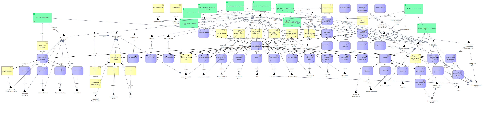

# ESRS Stakeholder Overview

[Archimate](../../Archimate/index.md) / [ESRS Navigator Stakeholder Map](../index.md)

**Description:** High-level view of all stakeholders in ESRS reporting ecosystem

## Elements

- [Affected Communities (ESRS S3)](../Affected Communities (ESRS S3).md)
- [Affected Communities (ESRS S3)](../../People/Affected Communities (ESRS S3).md)
- [AFM](../AFM.md)
- [AFM](../../People/AFM.md)
- [Agricultural Suppliers](../Agricultural Suppliers.md)
- [Agricultural Suppliers](../../People/Agricultural Suppliers.md)
- [Banks and Financial Institutions](../Banks and Financial Institutions.md)
- [Banks and Financial Institutions](../../People/Banks and Financial Institutions.md)
- [Board of Directors (Directie)](../Board of Directors (Directie).md)
- [Board of Directors (Directie)](../../People/Board of Directors (Directie).md)
- [CEO](../CEO.md)
- [CEO](../../People/CEO.md)
- [Certification Bodies](../Certification Bodies.md)
- [Certification Bodies](../../People/Certification Bodies.md)
- [CFO](../CFO.md)
- [Chamber of Commerce (Kamer van Koophandel)](../../People/Chamber of Commerce (Kamer van Koophandel).md)
- [Chamber of Commerce/Kamer van Koophandel](../Chamber of Commerce_Kamer van Koophandel.md)
- [Chief Financial Officer](../../People/Chief Financial Officer.md)
- [Company subject to CSRD](../../People/Company subject to CSRD.md)
- [Consumers and End Users (ESRS S4)](../Consumers and End Users (ESRS S4).md)
- [Consumers and End Users (ESRS S4)](../../People/Consumers and End Users (ESRS S4).md)
- [COO](../COO.md)
- [COO](../../People/COO.md)
- [Credit Rating Agencies](../Credit Rating Agencies.md)
- [Credit Rating Agencies](../../People/Credit Rating Agencies.md)
- [Customers](../Customers.md)
- [Customers](../../People/Customers.md)
- [EFRAG](../EFRAG.md)
- [EFRAG](../../People/EFRAG.md)
- [ESRS E1 - Climate](../ESRS E1 - Climate.md)
- [ESRS E1 Climate Change](../../ESRS E1/ESRS E1 Climate Change.md)
- [ESRS E2 - Pollution](../ESRS E2 - Pollution.md)
- [ESRS E2 Pollution](../../ESRS E2/ESRS E2 Pollution.md)
- [ESRS E3 - Water](../ESRS E3 - Water.md)
- [ESRS E3 Water and Marine Resources](../../ESRS E3/ESRS E3 Water and Marine Resources.md)
- [ESRS E4 - Biodiversity](../ESRS E4 - Biodiversity.md)
- [ESRS E4 Biodiversity and Ecosystems](../../ESRS E4/ESRS E4 Biodiversity and Ecosystems.md)
- [ESRS E5 - Circular Economy](../ESRS E5 - Circular Economy.md)
- [ESRS E5 Resource Use and Circular Economy](../../ESRS E5/ESRS E5 Resource Use and Circular Economy.md)
- [ESRS G1 - Business Conduct](../ESRS G1 - Business Conduct.md)
- [ESRS G1 Business Conduct](../../ESRS G1/ESRS G1 Business Conduct.md)
- [ESRS S1 - Own Personnel](../ESRS S1 - Own Personnel.md)
- [ESRS S1 Own Workforce](../../ESRS S1/ESRS S1 Own Workforce.md)
- [ESRS S2 - Value Chain Workers](../ESRS S2 - Value Chain Workers.md)
- [ESRS S2 Workers in the Value Chain](../../ESRS S2/ESRS S2 Workers in the Value Chain.md)
- [ESRS S3 - Communities](../ESRS S3 - Communities.md)
- [ESRS S3 Affected Communities](../../ESRS S3/ESRS S3 Affected Communities.md)
- [ESRS S4 - Consumers](../ESRS S4 - Consumers.md)
- [ESRS S4 Consumers and End-users](../../ESRS S4/ESRS S4 Consumers and End-users.md)
- [European Commission](../European Commission.md)
- [European Commission](../../People/European Commission.md)
- [External Auditors](../External Auditors.md)
- [External Auditors](../../People/External Auditors.md)
- [Foodservice Companies](../Foodservice Companies.md)
- [Foodservice Companies](../../People/Foodservice Companies.md)
- [FreshFood B.V.](../FreshFood B.V..md)
- [FreshFood B.V.](../../People/FreshFood B.V..md)
- [Indigenous Peoples](../Indigenous Peoples.md)
- [Indigenous Peoples](../../People/Indigenous Peoples.md)
- [Industry Associations](../Industry Associations.md)
- [Industry Associations](../../People/Industry Associations.md)
- [Investors/Shareholders](../Investors_Shareholders.md)
- [Investors/Shareholders](../../People/Investors_Shareholders.md)
- [Large Companies (>250 employees)](../Large Companies (_250 employees).md)
- [Legal Design Agencies](../Legal Design Agencies.md)
- [Legal Design Agencies](../../People/Legal Design Agencies.md)
- [Listed SMEs](../Listed SMEs.md)
- [Listed SMEs](../../People/Listed SMEs.md)
- [Local Communities](../Local Communities.md)
- [Local Communities](../../People/Local Communities.md)
- [Ministry of Economic Affairs](../Ministry of Economic Affairs.md)
- [Ministry of Economic Affairs](../../People/Ministry of Economic Affairs.md)
- [NGOs and Civil Society](../NGOs and Civil Society.md)
- [NGOs and Civil Society](../../People/NGOs and Civil Society.md)
- [Non-listed SMEs](../Non-listed SMEs.md)
- [Non-listed SMEs](../../People/Non-listed SMEs.md)
- [Operations Manager](../Operations Manager.md)
- [Operations Manager](../../People/Operations Manager.md)
- [Own Personnel (ESRS S1)](../Own Personnel (ESRS S1).md)
- [Own Personnel (ESRS S1)](../../People/Own Personnel (ESRS S1).md)
- [Packaging Suppliers](../Packaging Suppliers.md)
- [Packaging Suppliers](../../People/Packaging Suppliers.md)
- [Permanent Employees](../Permanent Employees.md)
- [Permanent Employees](../../People/Permanent Employees.md)
- [Production Workers](../Production Workers.md)
- [Production Workers](../../People/Production Workers.md)
- [Research and Analysis Firms](../Research and Analysis Firms.md)
- [Research and Analysis Firms](../../People/Research and Analysis Firms.md)
- [Rijksdienst voor Ondernemen (RVO)](../Rijksdienst voor Ondernemen (RVO).md)
- [Rijksdienst voor Ondernemend Nederland (RVO)](../../People/Rijksdienst voor Ondernemend Nederland (RVO).md)
- [Seasonal Agricultural Workers](../Seasonal Agricultural Workers.md)
- [Seasonal Agricultural Workers](../../People/Seasonal Agricultural Workers.md)
- [Seasonal Workers](../Seasonal Workers.md)
- [Seasonal Workers](../../People/Seasonal Workers.md)
- [Sociaal Economische Raad (SER)](../Sociaal Economische Raad (SER).md)
- [Sociaal Economische Raad (SER)](../../People/Sociaal Economische Raad (SER).md)
- [Supermarket Chains](../Supermarket Chains.md)
- [Supermarket Chains](../../People/Supermarket Chains.md)
- [Supervisory Board (RvC)](../Supervisory Board (RvC).md)
- [Supervisory Board (RvC)](../../People/Supervisory Board (RvC).md)
- [Suppliers](../Suppliers.md)
- [Suppliers](../../People/Suppliers.md)
- [Sustainability Committee](../Sustainability Committee.md)
- [Sustainability Committee](../../People/Sustainability Committee.md)
- [Sustainability Consultants](../Sustainability Consultants.md)
- [Sustainability Consultants](../../People/Sustainability Consultants.md)
- [Sustainability Manager/Director](../Sustainability Manager_Director.md)
- [Sustainability Manager/Director](../../People/Sustainability Manager_Director.md)
- [Trade Unions](../Trade Unions.md)
- [Trade Unions](../../People/Trade Unions.md)
- [Training Providers](../Training Providers.md)
- [Training Providers](../../People/Training Providers.md)
- [Transport Companies](../Transport Companies.md)
- [Transport Companies](../../People/Transport Companies.md)
- [Workers in Value Chain (ESRS S2)](../Workers in Value Chain (ESRS S2).md)
- [Workers in Value Chain (ESRS S2)](../../People/Workers in Value Chain (ESRS S2).md)
- [Works Council (Ondernemingsraad)](../Works Council (Ondernemingsraad).md)
- [Works Council (Ondernemingsraad)](../../People/Works Council (Ondernemingsraad).md)

---

*Generated: 2026-06-24 14:21:40*