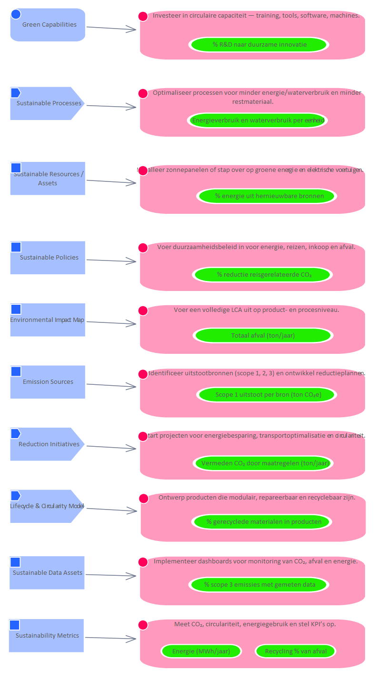

# Asset Environmental Impact Map

**Type:** Class  **Stereotype:** Asset  **StereotypeEx:** Asset  **FQStereotype:** EDGY::Asset  
**Status:** Approved<button class="ea-status-edit-btn" type="button" aria-label="Edit status">&#9998;</button>  
**Created:** 2025-12-02  **Modified:** 2026-07-13

[Home](../index.html) / [Edgy](../Edgy/index.html) / [Architecture](../Architecture/index.html) / [Asset](index.html)

<button id="ea-notes-edit-btn" class="ea-notes-edit-btn" type="button" aria-label="Edit notes">&#9998;</button>

<!--ea-notes-start-->
Overzicht van milieu-impact.
<ul>
	<li>OpenLCA – https://www.openlca.org – Tool voor levenscyclusanalyse.</li>
	<li>Samsung LCA Reports – https://www.samsung.com – Publiceert volledige impactrapportages.</li>
</ul>
<!--ea-notes-end-->

## Tagged Values

<table>
<thead><tr><th>Name</th><th>Value</th><th>Notes</th></tr></thead>
<tbody>
<tr><td>EDGY::TextAlign</td><td>Center</td><td><!--ea-row-notes-start:tag-0-->
Default: Center
<!--ea-row-notes-end:tag-0--><button class="ea-row-notes-edit-btn" type="button" data-surface="table-row" data-row-id="tag-0" data-notes-hash="5cc00a1f" data-kind="tagged-value" data-el-id="132" data-tag-name="EDGY::TextAlign" data-tag-value="Center" data-file-path="Asset/Environmental Impact Map.md" data-api-port="8001" data-api-token="cb00ff8e615c4dac03751156a603075df7bdab65ec6c0040" aria-label="Edit description">&#9998;</button></td></tr>
<tr class="ea-row-edit" data-row-id="tag-0" style="display:none"><td colspan="3"></td></tr>
</tbody>
</table>

[↑ Back to top](#)

## Relationships

| Type | Stereotype | Connected To |
|------|------------|-------------|
| ControlFlow | Flow | [Voer een volledige LCA uit op product- en procesniveau.](../Task/Voer een volledige LCA uit op product- en procesniveau..html) |
| Association | Link | [SDG 12. Responsible Consumption and Production](../Sustainability Development Goals/SDG 12. Responsible Consumption and Production.html) |
| Association | Link | [SDG 13. Climate Action](../Sustainability Development Goals/SDG 13. Climate Action.html) |

[↑ Back to top](#)

### Appears on Diagrams

  <a href="../Mapping SDG to Main/diagrams/Mapping SDG to Main.html" class="diagram-thumb">Mapping SDG to Main</a>
  <a href="../Architecture/diagrams/Architecture.html" class="diagram-thumb">Architecture</a>

[↑ Back to top](#)

### Referenced By

| Type | Stereotype | Source |
|------|------------|--------|
| Association | Link | [SDG 12. Responsible Consumption and Production](../Sustainability Development Goals/SDG 12. Responsible Consumption and Production.html) |
| Association | Link | [SDG 13. Climate Action](../Sustainability Development Goals/SDG 13. Climate Action.html) |

[↑ Back to top](#)

---

## Relationship Graph

---

*Generated: 2026-07-16 21:11:27*