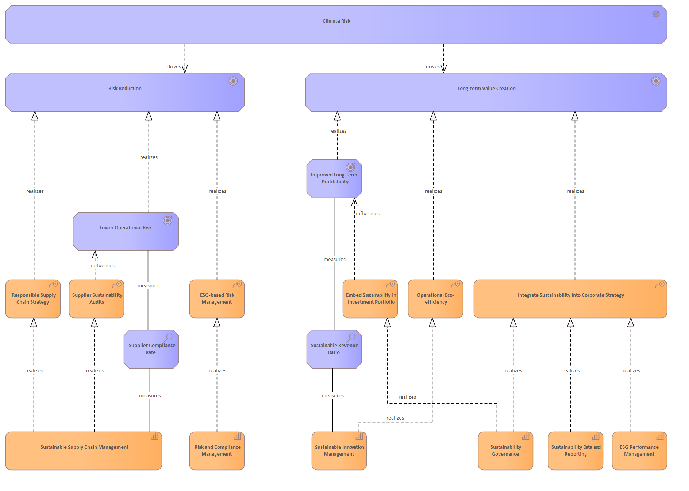

# Climate Risk

[Home](../../index.md) / [Archimate](../../Archimate/index.md) / [Strategic Sustainability Management Model (Bodenstein)](../../Strategic Sustainability Management Model (Bodenstein)/index.md) / [Climate Risk](../index.md)

**Derived Description:** Physical and transition risks associated with climate change, including extreme weather events, resource scarcity, and carbon pricing

## Elements

- Driver [Climate Risk](../../Drivers/Climate Risk.md)
- CourseOfAction [Embed Sustainability in Investment Portfolio](../../Courses of Action/Embed Sustainability in Investment Portfolio.md)
- Capability [ESG Performance Management](../../Capabilities/ESG Performance Management.md)
- CourseOfAction [ESG-based Risk Management](../../Courses of Action/ESG-based Risk Management.md)
- Outcome [Improved Long-term Profitability](../../Outcomes/Improved Long-term Profitability.md)
- CourseOfAction [Integrate Sustainability into Corporate Strategy](../../Courses of Action/Integrate Sustainability into Corporate Strategy.md)
- Goal [Long-term Value Creation](../../Goals/Long-term Value Creation.md)
- Outcome [Lower Operational Risk](../../Outcomes/Lower Operational Risk.md)
- CourseOfAction [Operational Eco-efficiency](../../Courses of Action/Operational Eco-efficiency.md)
- CourseOfAction [Responsible Supply Chain Strategy](../../Courses of Action/Responsible Supply Chain Strategy.md)
- Capability [Risk and Compliance Management](../../Capabilities/Risk and Compliance Management.md)
- Goal [Risk Reduction](../../Goals/Risk Reduction.md)
- Assessment [Supplier Compliance Rate](../../Assessments/Supplier Compliance Rate.md)
- CourseOfAction [Supplier Sustainability Audits](../../Courses of Action/Supplier Sustainability Audits.md)
- Capability [Sustainability Data and Reporting](../../Capabilities/Sustainability Data and Reporting.md)
- Capability [Sustainability Governance](../../Capabilities/Sustainability Governance.md)
- Capability [Sustainable Innovation Management](../../Capabilities/Sustainable Innovation Management.md)
- Assessment [Sustainable Revenue Ratio](../../Assessments/Sustainable Revenue Ratio.md)
- Capability [Sustainable Supply Chain Management](../../Capabilities/Sustainable Supply Chain Management.md)

---

*Generated: 2026-06-30 11:43:41*