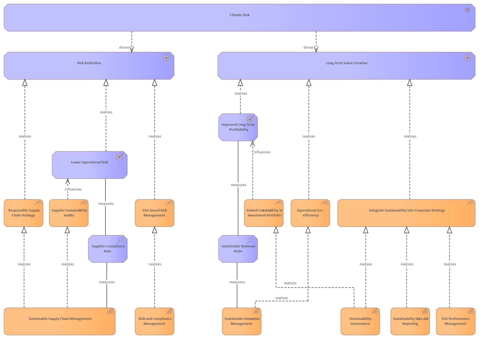

# Climate Risk

[Home](../../index.html) / [Archimate](../../Archimate/index.html) / [Strategic Sustainability Management Model (Bodenstein)](../../Strategic Sustainability Management Model (Bodenstein)/index.html) / [Climate Risk](../index.html)

<button id="ea-notes-edit-btn" class="ea-notes-edit-btn" type="button" aria-label="Edit description">&#9998;</button>

<!--ea-notes-start-->

This diagram illustrates the logical relationships between climate risk management and long-term value creation within a business context. It outlines a strategic approach to reduce environmental, social, and governance risks, and to create sustainable economic value over the long term. The diagram covers the various courses of action, capabilities, and outcomes related to managing climate-related risks and integrating sustainability into corporate strategy.

<!--ea-notes-end-->

## Elements

- Driver [Climate Risk](../../Drivers/Climate Risk.html)
- CourseOfAction [Embed Sustainability in Investment Portfolio](../../Courses of Action/Embed Sustainability in Investment Portfolio.html)
- Capability [ESG Performance Management](../../Capabilities/ESG Performance Management.html)
- CourseOfAction [ESG-based Risk Management](../../Courses of Action/ESG-based Risk Management.html)
- Outcome [Improved Long-term Profitability](../../Outcomes/Improved Long-term Profitability.html)
- CourseOfAction [Integrate Sustainability into Corporate Strategy](../../Courses of Action/Integrate Sustainability into Corporate Strategy.html)
- Goal [Long-term Value Creation](../../Goals/Long-term Value Creation.html)
- Outcome [Lower Operational Risk](../../Outcomes/Lower Operational Risk.html)
- CourseOfAction [Operational Eco-efficiency](../../Courses of Action/Operational Eco-efficiency.html)
- CourseOfAction [Responsible Supply Chain Strategy](../../Courses of Action/Responsible Supply Chain Strategy.html)
- Capability [Risk and Compliance Management](../../Capabilities/Risk and Compliance Management.html)
- Goal [Risk Reduction](../../Goals/Risk Reduction.html)
- Assessment [Supplier Compliance Rate](../../Assessments/Supplier Compliance Rate.html)
- CourseOfAction [Supplier Sustainability Audits](../../Courses of Action/Supplier Sustainability Audits.html)
- Capability [Sustainability Data and Reporting](../../Capabilities/Sustainability Data and Reporting.html)
- Capability [Sustainability Governance](../../Capabilities/Sustainability Governance.html)
- Capability [Sustainable Innovation Management](../../Capabilities/Sustainable Innovation Management.html)
- Assessment [Sustainable Revenue Ratio](../../Assessments/Sustainable Revenue Ratio.html)
- Capability [Sustainable Supply Chain Management](../../Capabilities/Sustainable Supply Chain Management.html)
