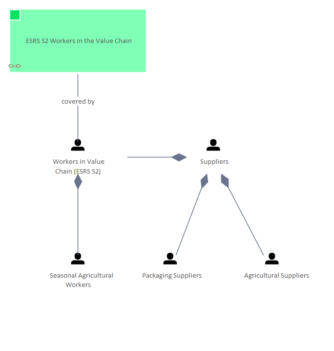

# ERSR S2 Workers in the Value Chain - People

[Home](../../index.html) / [Edgy](../../Edgy/index.html) / [ESRS](../../ESRS/index.html) / [ESRS and People](../../ESRS and People/index.html) / [ERSR S2 Workers in the Value Chain - People](../index.html)

<button id="ea-notes-edit-btn" class="ea-notes-edit-btn" type="button" aria-label="Edit description">&#9998;</button>
(derived)

<!--ea-notes-start-->

For more information:
https://www

<!--ea-notes-end-->

## Elements

- People [Agricultural Suppliers](../../People/Agricultural Suppliers.html)
- Content [ESRS S2 Workers in the Value Chain](../../ESRS S2/ESRS S2 Workers in the Value Chain.html)
- People [Packaging Suppliers](../../People/Packaging Suppliers.html)
- People [Seasonal Agricultural Workers](../../People/Seasonal Agricultural Workers.html)
- People [Suppliers](../../People/Suppliers.html)
- People [Workers in Value Chain (ESRS S2)](../../People/Workers in Value Chain (ESRS S2).html)

---

*Generated: 2026-08-04 11:36:59*