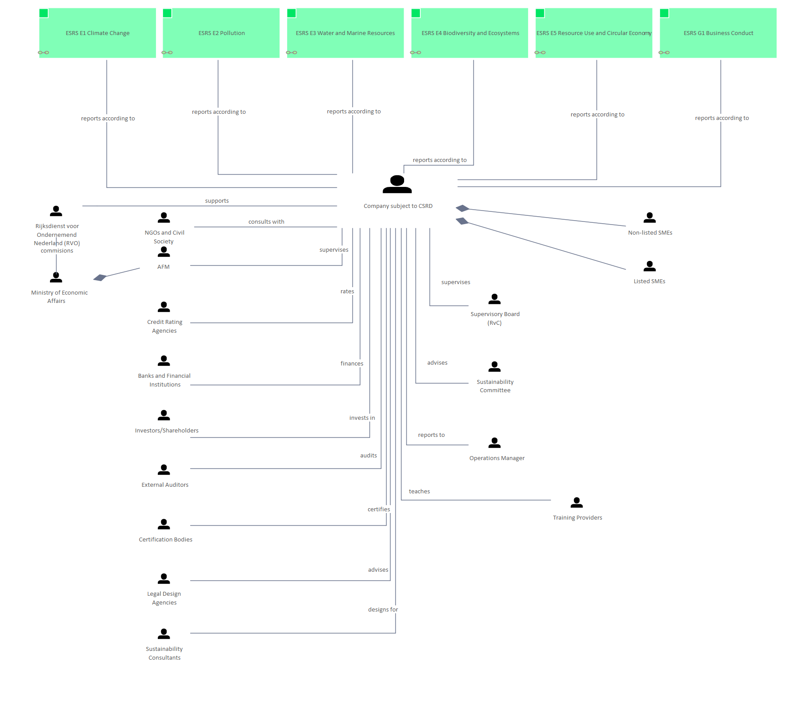

# ESRS E1, E2, E3, E4, E5, G1 - People

[Edgy](../../Edgy/index.md) / [ESRS](../../ESRS/index.md) / [ESRS and People](../../ESRS and People/index.md) / [ESRS E1, E2, E3, E4, E5, G1 - People](../index.md)

**Description:** 

## Elements

- [ESRS E1 Climate Change](../../ESRS E1/ESRS E1 Climate Change.md)
- [Company subject to CSRD](../../People/Company subject to CSRD.md)
- [Listed SMEs](../../People/Listed SMEs.md)
- [Non-listed SMEs](../../People/Non-listed SMEs.md)
- [Operations Manager](../../People/Operations Manager.md)
- [Sustainability Committee](../../People/Sustainability Committee.md)
- [Supervisory Board (RvC)](../../People/Supervisory Board (RvC).md)
- [Investors/Shareholders](../../People/Investors_Shareholders.md)
- [Banks and Financial Institutions](../../People/Banks and Financial Institutions.md)
- [Credit Rating Agencies](../../People/Credit Rating Agencies.md)
- [AFM](../../People/AFM.md)
- [External Auditors](../../People/External Auditors.md)
- [Certification Bodies](../../People/Certification Bodies.md)
- [NGOs and Civil Society](../../People/NGOs and Civil Society.md)
- [Legal Design Agencies](../../People/Legal Design Agencies.md)
- [Sustainability Consultants](../../People/Sustainability Consultants.md)
- [ESRS E2 Pollution](../../ESRS E2/ESRS E2 Pollution.md)
- [ESRS E3 Water and Marine Resources](../../ESRS E3/ESRS E3 Water and Marine Resources.md)
- [ESRS E4 Biodiversity and Ecosystems](../../ESRS E4/ESRS E4 Biodiversity and Ecosystems.md)
- [ESRS E5 Resource Use and Circular Economy](../../ESRS E5/ESRS E5 Resource Use and Circular Economy.md)
- [ESRS G1 Business Conduct](../../ESRS G1/ESRS G1 Business Conduct.md)
- [Rijksdienst voor Ondernemend Nederland (RVO)](../../People/Rijksdienst voor Ondernemend Nederland (RVO).md)
- [Ministry of Economic Affairs](../../People/Ministry of Economic Affairs.md)
- [Training Providers](../../People/Training Providers.md)

---

*Generated: 2026-06-19 11:58:47*