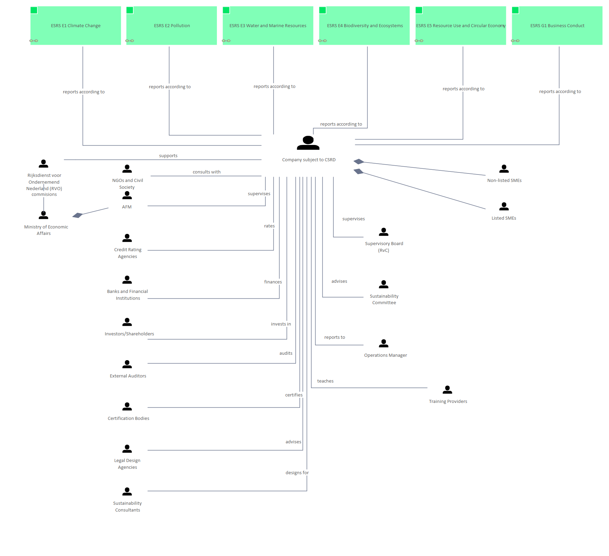

# 🗺️ ESRS E1, E2, E3, E4, E5, G1 - People

[Home](../../index.html) / [Edgy](../../Edgy/index.html) / [ESRS](../../ESRS/index.html) / [ESRS and People](../../ESRS and People/index.html) / [ESRS E1, E2, E3, E4, E5, G1 - People](../index.html)

<button id="ea-notes-edit-btn" class="ea-notes-edit-btn" type="button" aria-label="Edit description">&#9998;</button>
(derived)

<!--ea-notes-start-->

For more information:
https://www

<!--ea-notes-end-->

## Elements

- People [AFM](../../People/AFM.html)
- People [Banks and Financial Institutions](../../People/Banks and Financial Institutions.html)
- People [Certification Bodies](../../People/Certification Bodies.html)
- People [Company subject to CSRD](../../People/Company subject to CSRD.html)
- People [Credit Rating Agencies](../../People/Credit Rating Agencies.html)
- Content [ESRS E1 Climate Change](../../ESRS E1/ESRS E1 Climate Change.html)
- Content [ESRS E2 Pollution](../../ESRS E2/ESRS E2 Pollution.html)
- Content [ESRS E3 Water and Marine Resources](../../ESRS E3/ESRS E3 Water and Marine Resources.html)
- Content [ESRS E4 Biodiversity and Ecosystems](../../ESRS E4/ESRS E4 Biodiversity and Ecosystems.html)
- Content [ESRS E5 Resource Use and Circular Economy](../../ESRS E5/ESRS E5 Resource Use and Circular Economy.html)
- Content [ESRS G1 Business Conduct](../../ESRS G1/ESRS G1 Business Conduct.html)
- People [External Auditors](../../People/External Auditors.html)
- People [Investors/Shareholders](../../People/Investors_Shareholders.html)
- People [Legal Design Agencies](../../People/Legal Design Agencies.html)
- People [Listed SMEs](../../People/Listed SMEs.html)
- People [Ministry of Economic Affairs](../../People/Ministry of Economic Affairs.html)
- People [NGOs and Civil Society](../../People/NGOs and Civil Society.html)
- People [Non-listed SMEs](../../People/Non-listed SMEs.html)
- People [Operations Manager](../../People/Operations Manager.html)
- People [Rijksdienst voor Ondernemend Nederland (RVO)](../../People/Rijksdienst voor Ondernemend Nederland (RVO).html)
- People [Supervisory Board (RvC)](../../People/Supervisory Board (RvC).html)
- People [Sustainability Committee](../../People/Sustainability Committee.html)
- People [Sustainability Consultants](../../People/Sustainability Consultants.html)
- People [Training Providers](../../People/Training Providers.html)
