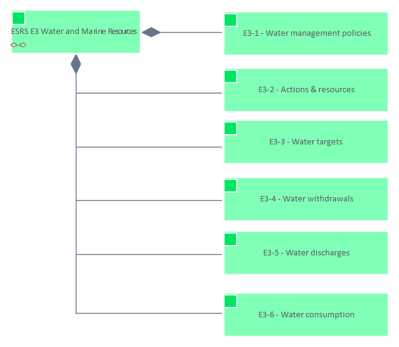

# ESRS E3

[Home](../../index.html) / [Edgy](../../Edgy/index.html) / [ESRS](../../ESRS/index.html) / [European Sustainability Reporting Standards](../../European Sustainability Reporting Standards/index.html) / [ESRS E3](../index.html)

<button id="ea-notes-edit-btn" class="ea-notes-edit-btn" type="button" aria-label="Edit description">&#9998;</button>
(derived)

<!--ea-notes-start-->

For more information:
https://www

<!--ea-notes-end-->

## Elements

- Content [ESRS E3 Water and Marine Resources](../ESRS E3 Water and Marine Resources.html)

---

*Generated: 2026-07-17 16:59:41*