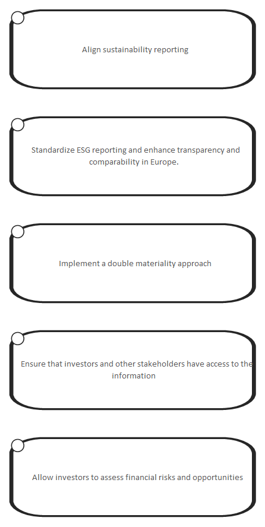

# Goals and Objectives

[Home](../../index.md) / [Edgy](../../Edgy/index.md) / [ESRS](../../ESRS/index.md) / [European Sustainability Reporting Standards](../../European Sustainability Reporting Standards/index.md) / [ESRS Goals and Objectives](../index.md)

**Derived Description:** Align sustainability reporting for businesses operating within the European Union

## Elements

- Outcome [Align sustainability reporting](../Align sustainability reporting.md)
- Outcome [Allow investors to assess financial risks and opportunities ](../Allow investors to assess financial risks and opportunities.md)
- Outcome [Ensure that investors and other stakeholders have access to the information](../Ensure that investors and other stakeholders have access to the information.md)
- Outcome [Implement a double materiality approach](../Implement a double materiality approach.md)
- Outcome [Standardize ESG reporting and enhance transparency and comparability in Europe. ](../Standardize ESG reporting and enhance transparency and comparability in Europe..md)

---

*Generated: 2026-06-26 16:40:43*