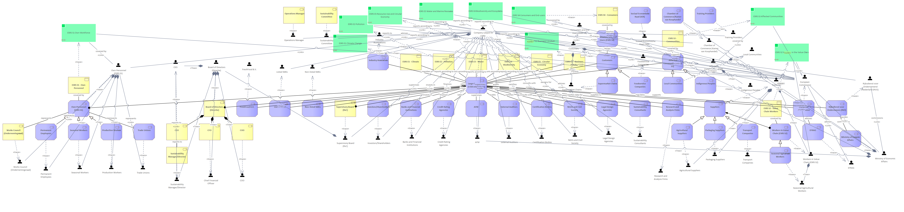

# :material-map-outline: ESRS Stakeholder Overview

[Home](../../index.html) / [Archimate](../../Archimate/index.html) / [ESRS Navigator Stakeholder Map](../index.html)

<button id="ea-notes-edit-btn" class="ea-notes-edit-btn" type="button" aria-label="Edit description">&#9998;</button>

<!--ea-notes-start-->

This logical diagram provides a comprehensive overview of all stakeholders in the ESRS reporting ecosystem, including companies, employees, suppliers, customers, and various organizations that interact with the reporting organization. It highlights the different types of stakeholders, their roles, and responsibilities, and how they are connected within the ecosystem. The diagram is intended to provide a high-level view of the stakeholders involved in the ESRS reporting process.

<!--ea-notes-end-->

## Elements

- Stakeholder [Affected Communities (ESRS S3)](../Affected Communities (ESRS S3).html)
- People [Affected Communities (ESRS S3)](../../People/Affected Communities (ESRS S3).html)
- Stakeholder [AFM](../AFM.html)
- People [AFM](../../People/AFM.html)
- Stakeholder [Agricultural Suppliers](../Agricultural Suppliers.html)
- People [Agricultural Suppliers](../../People/Agricultural Suppliers.html)
- Stakeholder [Banks and Financial Institutions](../Banks and Financial Institutions.html)
- People [Banks and Financial Institutions](../../People/Banks and Financial Institutions.html)
- BusinessRole [Board of Directors (Directie)](../Board of Directors (Directie).html)
- People [Board of Directors (Directie)](../../People/Board of Directors (Directie).html)
- BusinessRole [CEO](../CEO.html)
- People [CEO](../../People/CEO.html)
- Stakeholder [Certification Bodies](../Certification Bodies.html)
- People [Certification Bodies](../../People/Certification Bodies.html)
- BusinessRole [CFO](../CFO.html)
- People [Chamber of Commerce (Kamer van Koophandel)](../../People/Chamber of Commerce (Kamer van Koophandel).html)
- Stakeholder [Chamber of Commerce/Kamer van Koophandel](../Chamber of Commerce_Kamer van Koophandel.html)
- People [Chief Financial Officer](../../People/Chief Financial Officer.html)
- People [Company subject to CSRD](../../People/Company subject to CSRD.html)
- Stakeholder [Consumers and End Users (ESRS S4)](../Consumers and End Users (ESRS S4).html)
- People [Consumers and End Users (ESRS S4)](../../People/Consumers and End Users (ESRS S4).html)
- BusinessRole [COO](../COO.html)
- People [COO](../../People/COO.html)
- Stakeholder [Credit Rating Agencies](../Credit Rating Agencies.html)
- People [Credit Rating Agencies](../../People/Credit Rating Agencies.html)
- Stakeholder [Customers](../Customers.html)
- People [Customers](../../People/Customers.html)
- Stakeholder [EFRAG](../EFRAG.html)
- People [EFRAG](../../People/EFRAG.html)
- BusinessObject [ESRS E1 - Climate](../ESRS E1 - Climate.html)
- Content [ESRS E1 Climate Change](../../ESRS E1/ESRS E1 Climate Change.html)
- BusinessObject [ESRS E2 - Pollution](../ESRS E2 - Pollution.html)
- Content [ESRS E2 Pollution](../../ESRS E2/ESRS E2 Pollution.html)
- BusinessObject [ESRS E3 - Water](../ESRS E3 - Water.html)
- Content [ESRS E3 Water and Marine Resources](../../ESRS E3/ESRS E3 Water and Marine Resources.html)
- BusinessObject [ESRS E4 - Biodiversity](../ESRS E4 - Biodiversity.html)
- Content [ESRS E4 Biodiversity and Ecosystems](../../ESRS E4/ESRS E4 Biodiversity and Ecosystems.html)
- BusinessObject [ESRS E5 - Circular Economy](../ESRS E5 - Circular Economy.html)
- Content [ESRS E5 Resource Use and Circular Economy](../../ESRS E5/ESRS E5 Resource Use and Circular Economy.html)
- BusinessObject [ESRS G1 - Business Conduct](../ESRS G1 - Business Conduct.html)
- Content [ESRS G1 Business Conduct](../../ESRS G1/ESRS G1 Business Conduct.html)
- BusinessObject [ESRS S1 - Own Personnel](../ESRS S1 - Own Personnel.html)
- Content [ESRS S1 Own Workforce](../../ESRS S1/ESRS S1 Own Workforce.html)
- BusinessObject [ESRS S2 - Value Chain Workers](../ESRS S2 - Value Chain Workers.html)
- Content [ESRS S2 Workers in the Value Chain](../../ESRS S2/ESRS S2 Workers in the Value Chain.html)
- BusinessObject [ESRS S3 - Communities](../ESRS S3 - Communities.html)
- Content [ESRS S3 Affected Communities](../../ESRS S3/ESRS S3 Affected Communities.html)
- BusinessObject [ESRS S4 - Consumers](../ESRS S4 - Consumers.html)
- Content [ESRS S4 Consumers and End-users](../../ESRS S4/ESRS S4 Consumers and End-users.html)
- Stakeholder [European Commission](../European Commission.html)
- People [European Commission](../../People/European Commission.html)
- Stakeholder [External Auditors](../External Auditors.html)
- People [External Auditors](../../People/External Auditors.html)
- Stakeholder [Foodservice Companies](../Foodservice Companies.html)
- People [Foodservice Companies](../../People/Foodservice Companies.html)
- Stakeholder [FreshFood B.V.](../FreshFood B.V..html)
- People [FreshFood B.V.](../../People/FreshFood B.V..html)
- Stakeholder [Indigenous Peoples](../Indigenous Peoples.html)
- People [Indigenous Peoples](../../People/Indigenous Peoples.html)
- Stakeholder [Industry Associations](../Industry Associations.html)
- People [Industry Associations](../../People/Industry Associations.html)
- Stakeholder [Investors/Shareholders](../Investors_Shareholders.html)
- People [Investors/Shareholders](../../People/Investors_Shareholders.html)
- Stakeholder [Large Companies (>250 employees)](../Large Companies (_250 employees).html)
- Stakeholder [Legal Design Agencies](../Legal Design Agencies.html)
- People [Legal Design Agencies](../../People/Legal Design Agencies.html)
- Stakeholder [Listed SMEs](../Listed SMEs.html)
- People [Listed SMEs](../../People/Listed SMEs.html)
- Stakeholder [Local Communities](../Local Communities.html)
- People [Local Communities](../../People/Local Communities.html)
- Stakeholder [Ministry of Economic Affairs](../Ministry of Economic Affairs.html)
- People [Ministry of Economic Affairs](../../People/Ministry of Economic Affairs.html)
- Stakeholder [NGOs and Civil Society](../NGOs and Civil Society.html)
- People [NGOs and Civil Society](../../People/NGOs and Civil Society.html)
- Stakeholder [Non-listed SMEs](../Non-listed SMEs.html)
- People [Non-listed SMEs](../../People/Non-listed SMEs.html)
- BusinessRole [Operations Manager](../Operations Manager.html)
- People [Operations Manager](../../People/Operations Manager.html)
- Stakeholder [Own Personnel (ESRS S1)](../Own Personnel (ESRS S1).html)
- People [Own Personnel (ESRS S1)](../../People/Own Personnel (ESRS S1).html)
- Stakeholder [Packaging Suppliers](../Packaging Suppliers.html)
- People [Packaging Suppliers](../../People/Packaging Suppliers.html)
- Stakeholder [Permanent Employees](../Permanent Employees.html)
- People [Permanent Employees](../../People/Permanent Employees.html)
- Stakeholder [Production Workers](../Production Workers.html)
- People [Production Workers](../../People/Production Workers.html)
- Stakeholder [Research and Analysis Firms](../Research and Analysis Firms.html)
- People [Research and Analysis Firms](../../People/Research and Analysis Firms.html)
- Stakeholder [Rijksdienst voor Ondernemen (RVO)](../Rijksdienst voor Ondernemen (RVO).html)
- People [Rijksdienst voor Ondernemend Nederland (RVO)](../../People/Rijksdienst voor Ondernemend Nederland (RVO).html)
- Stakeholder [Seasonal Agricultural Workers](../Seasonal Agricultural Workers.html)
- People [Seasonal Agricultural Workers](../../People/Seasonal Agricultural Workers.html)
- Stakeholder [Seasonal Workers](../Seasonal Workers.html)
- People [Seasonal Workers](../../People/Seasonal Workers.html)
- Stakeholder [Sociaal Economische Raad (SER)](../Sociaal Economische Raad (SER).html)
- People [Sociaal Economische Raad (SER)](../../People/Sociaal Economische Raad (SER).html)
- Stakeholder [Supermarket Chains](../Supermarket Chains.html)
- People [Supermarket Chains](../../People/Supermarket Chains.html)
- BusinessRole [Supervisory Board (RvC)](../Supervisory Board (RvC).html)
- People [Supervisory Board (RvC)](../../People/Supervisory Board (RvC).html)
- Stakeholder [Suppliers](../Suppliers.html)
- People [Suppliers](../../People/Suppliers.html)
- BusinessRole [Sustainability Committee](../Sustainability Committee.html)
- People [Sustainability Committee](../../People/Sustainability Committee.html)
- Stakeholder [Sustainability Consultants](../Sustainability Consultants.html)
- People [Sustainability Consultants](../../People/Sustainability Consultants.html)
- BusinessRole [Sustainability Manager/Director](../Sustainability Manager_Director.html)
- People [Sustainability Manager/Director](../../People/Sustainability Manager_Director.html)
- Stakeholder [Trade Unions](../Trade Unions.html)
- People [Trade Unions](../../People/Trade Unions.html)
- Stakeholder [Training Providers](../Training Providers.html)
- People [Training Providers](../../People/Training Providers.html)
- Stakeholder [Transport Companies](../Transport Companies.html)
- People [Transport Companies](../../People/Transport Companies.html)
- Stakeholder [Workers in Value Chain (ESRS S2)](../Workers in Value Chain (ESRS S2).html)
- People [Workers in Value Chain (ESRS S2)](../../People/Workers in Value Chain (ESRS S2).html)
- BusinessRole [Works Council (Ondernemingsraad)](../Works Council (Ondernemingsraad).html)
- People [Works Council (Ondernemingsraad)](../../People/Works Council (Ondernemingsraad).html)
