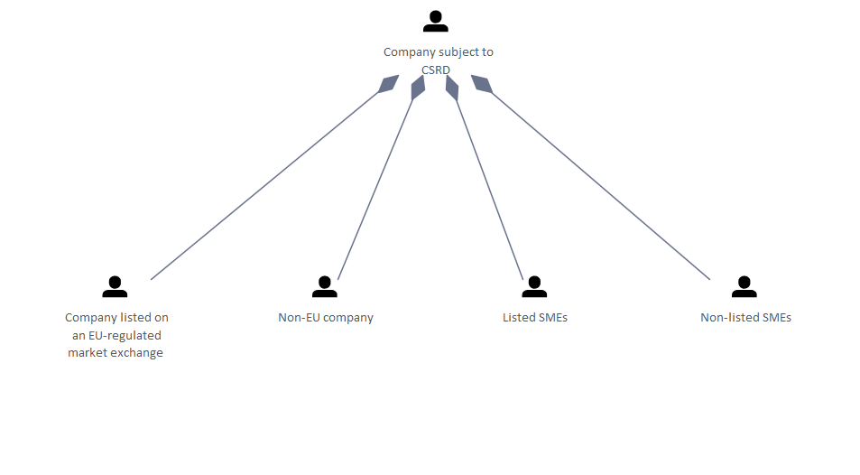

# ESRS Required Companies

[Home](../../index.html) / [Edgy](../../Edgy/index.html) / [ESRS](../../ESRS/index.html) / [European Sustainability Reporting Standards](../../European Sustainability Reporting Standards/index.html) / [ESRS Required Companies](../index.html)

<button id="ea-notes-edit-btn" class="ea-notes-edit-btn" type="button" aria-label="Edit description">&#9998;</button>

<!--ea-notes-start-->

Not all companies are subjected to report according to the ESRS.

<!--ea-notes-end-->

## Elements

- People [Company listed on an EU-regulated market exchange](../../People/Company listed on an EU-regulated market exchange.html)
- People [Company subject to CSRD](../../People/Company subject to CSRD.html)
- People [Listed SMEs](../../People/Listed SMEs.html)
- People [Non-EU company](../../People/Non-EU company.html)
- People [Non-listed SMEs](../../People/Non-listed SMEs.html)

---

*Generated: 2026-07-31 18:00:39*