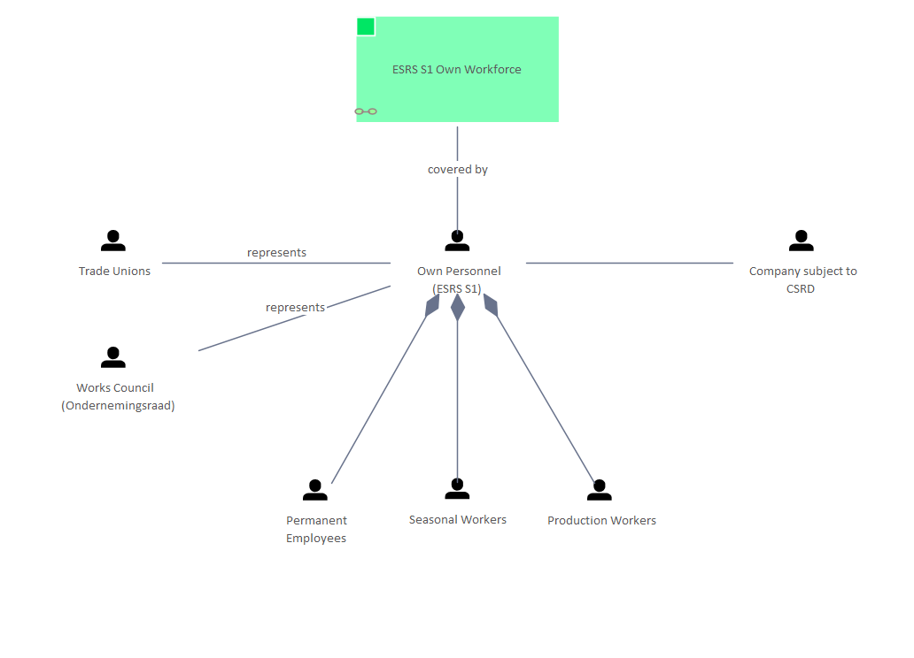

# ESRS S1 Own Workforce - People

[Home](../../index.html) / [Edgy](../../Edgy/index.html) / [ESRS](../../ESRS/index.html) / [ESRS and People](../../ESRS and People/index.html) / [ESRS S1 Own Workforce - People](../index.html)

<button id="ea-notes-edit-btn" class="ea-notes-edit-btn" type="button" aria-label="Edit description">&#9998;</button>
(derived)

<!--ea-notes-start-->

For more information:
https://www

<!--ea-notes-end-->

## Elements

- People [Company subject to CSRD](../../People/Company subject to CSRD.html)
- Content [ESRS S1 Own Workforce](../../ESRS S1/ESRS S1 Own Workforce.html)
- People [Own Personnel (ESRS S1)](../../People/Own Personnel (ESRS S1).html)
- People [Permanent Employees](../../People/Permanent Employees.html)
- People [Production Workers](../../People/Production Workers.html)
- People [Seasonal Workers](../../People/Seasonal Workers.html)
- People [Trade Unions](../../People/Trade Unions.html)
- People [Works Council (Ondernemingsraad)](../../People/Works Council (Ondernemingsraad).html)

---

*Generated: 2026-07-17 16:59:47*