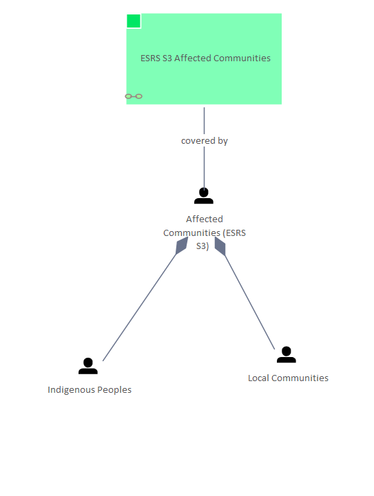

# 🗺️ ESRS S3 Affected Communities - People

[Home](../../index.html) / [Edgy](../../Edgy/index.html) / [ESRS](../../ESRS/index.html) / [ESRS and People](../../ESRS and People/index.html) / [ESRS S3 Affected Communities - People](../index.html)

<button id="ea-notes-edit-btn" class="ea-notes-edit-btn" type="button" aria-label="Edit description">&#9998;</button>
(derived)

<!--ea-notes-start-->

For more information:
https://www

<!--ea-notes-end-->

## Elements

- People [Affected Communities (ESRS S3)](../../People/Affected Communities (ESRS S3).html)
- Content [ESRS S3 Affected Communities](../../ESRS S3/ESRS S3 Affected Communities.html)
- People [Indigenous Peoples](../../People/Indigenous Peoples.html)
- People [Local Communities](../../People/Local Communities.html)
