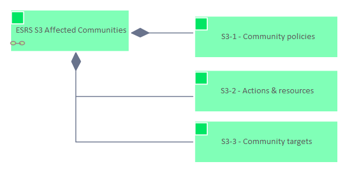

# ESRS S3

[Home](../../index.md) / [Edgy](../../Edgy/index.md) / [ESRS](../../ESRS/index.md) / [European Sustainability Reporting Standards](../../European Sustainability Reporting Standards/index.md) / [ESRS S3](../index.md)

<button id="ea-notes-edit-btn" class="ea-notes-edit-btn" type="button" aria-label="Edit description">&#9998;</button>
(derived)

<!--ea-notes-start-->

For more information:
https://www

<!--ea-notes-end-->

## Elements

- Content [ESRS S3 Affected Communities](../ESRS S3 Affected Communities.md)

---

*Generated: 2026-07-01 12:05:14*