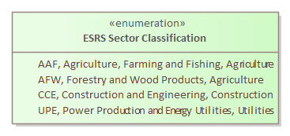

# ESRS Sector Classification

[Home](../../index.md) / [Archimate](../../Archimate/index.md) / [ESRS Classification](../../ESRS Classification/index.md) / [ESRS Sector Classification](../index.md)

<button id="ea-notes-edit-btn" class="ea-notes-edit-btn" type="button" aria-label="Edit description">&#9998;</button>

<!--ea-notes-start-->

The Sector Classification is important.

<!--ea-notes-end-->

## Elements

- Uncategorized [ESRS Sector Classification](../ESRS Sector Classification.md)

---

*Generated: 2026-07-01 12:22:05*