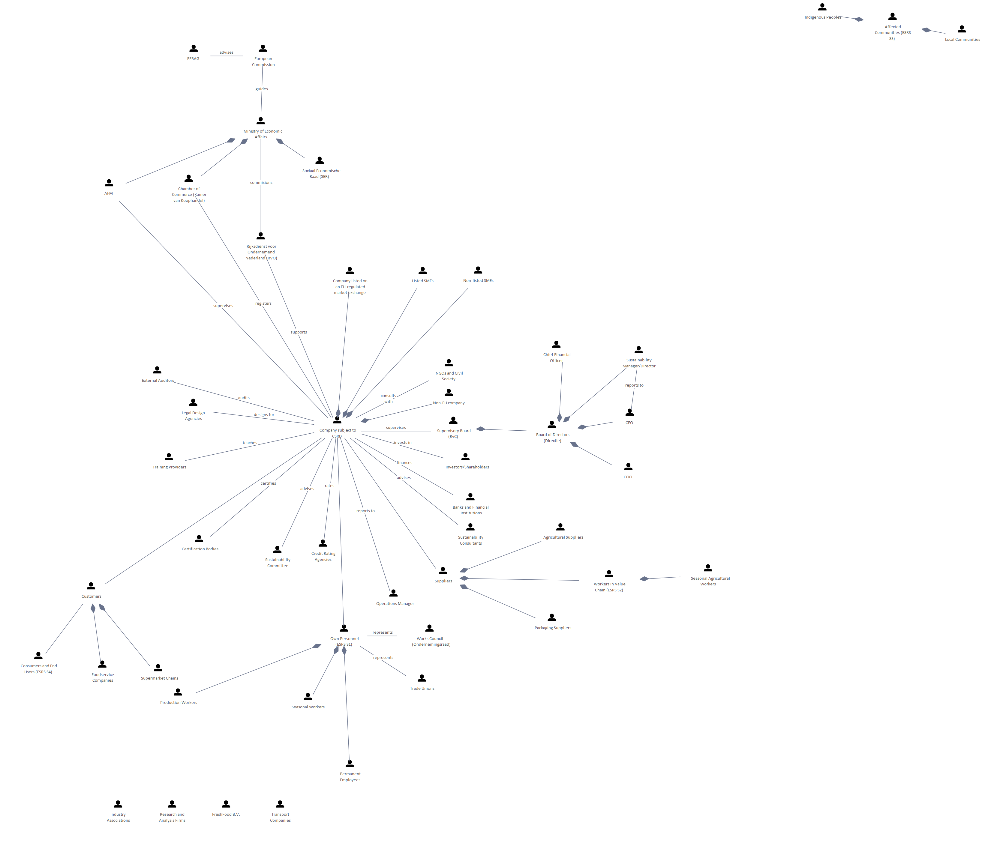

# ESRS Stakeholder Map

[Edgy](../../Edgy/index.md) / [ESRS](../../ESRS/index.md) / [ESRS and People](../index.md)

**Description:** 

## Elements

- [Works Council (Ondernemingsraad)](../../People/Works Council (Ondernemingsraad).md)
- [Affected Communities (ESRS S3)](../../People/Affected Communities (ESRS S3).md)
- [AFM](../../People/AFM.md)
- [Agricultural Suppliers](../../People/Agricultural Suppliers.md)
- [Banks and Financial Institutions](../../People/Banks and Financial Institutions.md)
- [Board of Directors (Directie)](../../People/Board of Directors (Directie).md)
- [CEO](../../People/CEO.md)
- [Certification Bodies](../../People/Certification Bodies.md)
- [Chamber of Commerce (Kamer van Koophandel)](../../People/Chamber of Commerce (Kamer van Koophandel).md)
- [Chief Financial Officer](../../People/Chief Financial Officer.md)
- [Company listed on an EU-regulated market exchange](../../People/Company listed on an EU-regulated market exchange.md)
- [Company subject to CSRD](../../People/Company subject to CSRD.md)
- [Consumers and End Users (ESRS S4)](../../People/Consumers and End Users (ESRS S4).md)
- [COO](../../People/COO.md)
- [Credit Rating Agencies](../../People/Credit Rating Agencies.md)
- [Customers](../../People/Customers.md)
- [EFRAG](../../People/EFRAG.md)
- [European Commission](../../People/European Commission.md)
- [External Auditors](../../People/External Auditors.md)
- [Foodservice Companies](../../People/Foodservice Companies.md)
- [FreshFood B.V.](../../People/FreshFood B.V..md)
- [Indigenous Peoples](../../People/Indigenous Peoples.md)
- [Industry Associations](../../People/Industry Associations.md)
- [Investors/Shareholders](../../People/Investors_Shareholders.md)
- [Legal Design Agencies](../../People/Legal Design Agencies.md)
- [Listed SMEs](../../People/Listed SMEs.md)
- [Local Communities](../../People/Local Communities.md)
- [Ministry of Economic Affairs](../../People/Ministry of Economic Affairs.md)
- [NGOs and Civil Society](../../People/NGOs and Civil Society.md)
- [Non-EU company](../../People/Non-EU company.md)
- [Non-listed SMEs](../../People/Non-listed SMEs.md)
- [Operations Manager](../../People/Operations Manager.md)
- [Own Personnel (ESRS S1)](../../People/Own Personnel (ESRS S1).md)
- [Packaging Suppliers](../../People/Packaging Suppliers.md)
- [Permanent Employees](../../People/Permanent Employees.md)
- [Production Workers](../../People/Production Workers.md)
- [Research and Analysis Firms](../../People/Research and Analysis Firms.md)
- [Rijksdienst voor Ondernemend Nederland (RVO)](../../People/Rijksdienst voor Ondernemend Nederland (RVO).md)
- [Seasonal Agricultural Workers](../../People/Seasonal Agricultural Workers.md)
- [Seasonal Workers](../../People/Seasonal Workers.md)
- [Sociaal Economische Raad (SER)](../../People/Sociaal Economische Raad (SER).md)
- [Supermarket Chains](../../People/Supermarket Chains.md)
- [Supervisory Board (RvC)](../../People/Supervisory Board (RvC).md)
- [Suppliers](../../People/Suppliers.md)
- [Sustainability Committee](../../People/Sustainability Committee.md)
- [Sustainability Consultants](../../People/Sustainability Consultants.md)
- [Sustainability Manager/Director](../../People/Sustainability Manager_Director.md)
- [Trade Unions](../../People/Trade Unions.md)
- [Training Providers](../../People/Training Providers.md)
- [Transport Companies](../../People/Transport Companies.md)
- [Workers in Value Chain (ESRS S2)](../../People/Workers in Value Chain (ESRS S2).md)

---

*Generated: 2026-06-19 11:58:46*