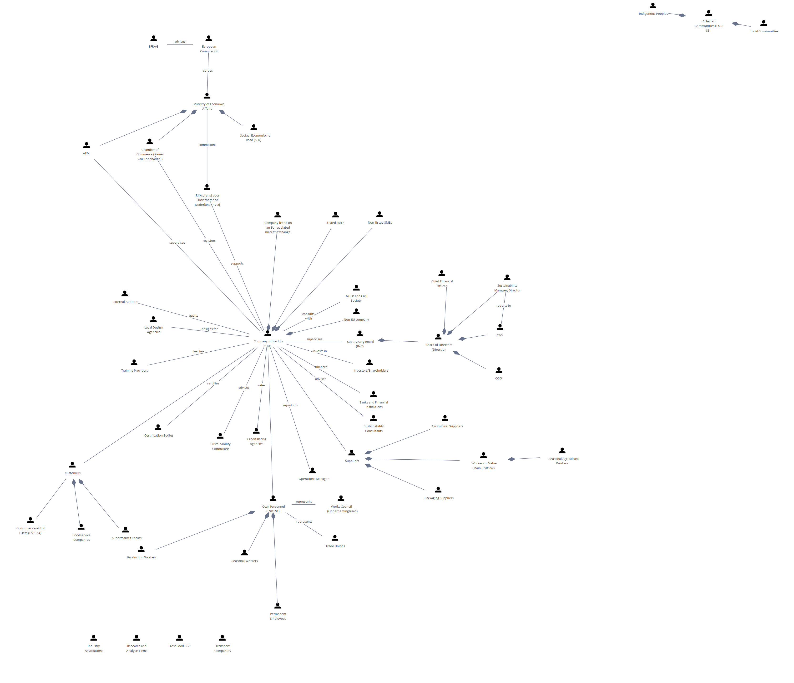

# ESRS Stakeholder Map

[Home](../../index.html) / [Edgy](../../Edgy/index.html) / [ESRS](../../ESRS/index.html) / [ESRS and People](../index.html)

<button id="ea-notes-edit-btn" class="ea-notes-edit-btn" type="button" aria-label="Edit description">&#9998;</button>
(derived)

<!--ea-notes-start-->

Employee representation with quarterly management consultation

<!--ea-notes-end-->

## Elements

- People [Affected Communities (ESRS S3)](../../People/Affected Communities (ESRS S3).html)
- People [AFM](../../People/AFM.html)
- People [Agricultural Suppliers](../../People/Agricultural Suppliers.html)
- People [Banks and Financial Institutions](../../People/Banks and Financial Institutions.html)
- People [Board of Directors (Directie)](../../People/Board of Directors (Directie).html)
- People [CEO](../../People/CEO.html)
- People [Certification Bodies](../../People/Certification Bodies.html)
- People [Chamber of Commerce (Kamer van Koophandel)](../../People/Chamber of Commerce (Kamer van Koophandel).html)
- People [Chief Financial Officer](../../People/Chief Financial Officer.html)
- People [Company listed on an EU-regulated market exchange](../../People/Company listed on an EU-regulated market exchange.html)
- People [Company subject to CSRD](../../People/Company subject to CSRD.html)
- People [Consumers and End Users (ESRS S4)](../../People/Consumers and End Users (ESRS S4).html)
- People [COO](../../People/COO.html)
- People [Credit Rating Agencies](../../People/Credit Rating Agencies.html)
- People [Customers](../../People/Customers.html)
- People [EFRAG](../../People/EFRAG.html)
- People [European Commission](../../People/European Commission.html)
- People [External Auditors](../../People/External Auditors.html)
- People [Foodservice Companies](../../People/Foodservice Companies.html)
- People [FreshFood B.V.](../../People/FreshFood B.V..html)
- People [Indigenous Peoples](../../People/Indigenous Peoples.html)
- People [Industry Associations](../../People/Industry Associations.html)
- People [Investors/Shareholders](../../People/Investors_Shareholders.html)
- People [Legal Design Agencies](../../People/Legal Design Agencies.html)
- People [Listed SMEs](../../People/Listed SMEs.html)
- People [Local Communities](../../People/Local Communities.html)
- People [Ministry of Economic Affairs](../../People/Ministry of Economic Affairs.html)
- People [NGOs and Civil Society](../../People/NGOs and Civil Society.html)
- People [Non-EU company](../../People/Non-EU company.html)
- People [Non-listed SMEs](../../People/Non-listed SMEs.html)
- People [Operations Manager](../../People/Operations Manager.html)
- People [Own Personnel (ESRS S1)](../../People/Own Personnel (ESRS S1).html)
- People [Packaging Suppliers](../../People/Packaging Suppliers.html)
- People [Permanent Employees](../../People/Permanent Employees.html)
- People [Production Workers](../../People/Production Workers.html)
- People [Research and Analysis Firms](../../People/Research and Analysis Firms.html)
- People [Rijksdienst voor Ondernemend Nederland (RVO)](../../People/Rijksdienst voor Ondernemend Nederland (RVO).html)
- People [Seasonal Agricultural Workers](../../People/Seasonal Agricultural Workers.html)
- People [Seasonal Workers](../../People/Seasonal Workers.html)
- People [Sociaal Economische Raad (SER)](../../People/Sociaal Economische Raad (SER).html)
- People [Supermarket Chains](../../People/Supermarket Chains.html)
- People [Supervisory Board (RvC)](../../People/Supervisory Board (RvC).html)
- People [Suppliers](../../People/Suppliers.html)
- People [Sustainability Committee](../../People/Sustainability Committee.html)
- People [Sustainability Consultants](../../People/Sustainability Consultants.html)
- People [Sustainability Manager/Director](../../People/Sustainability Manager_Director.html)
- People [Trade Unions](../../People/Trade Unions.html)
- People [Training Providers](../../People/Training Providers.html)
- People [Transport Companies](../../People/Transport Companies.html)
- People [Workers in Value Chain (ESRS S2)](../../People/Workers in Value Chain (ESRS S2).html)
- People [Works Council (Ondernemingsraad)](../../People/Works Council (Ondernemingsraad).html)
