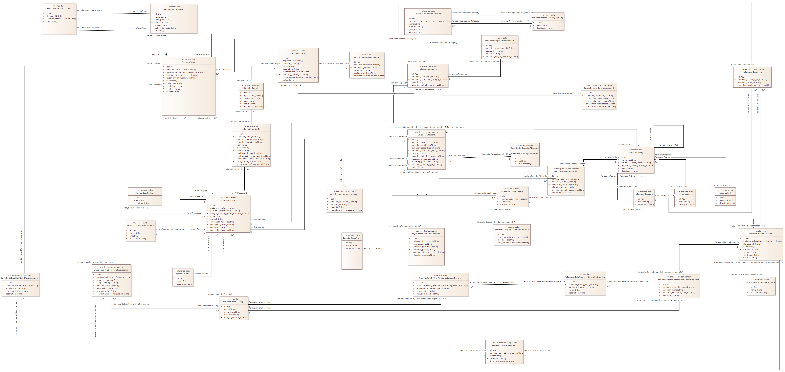

# work-product-component OrganizationEmissionAllocation

**Type:** Class  **Stereotype:** work-product-component  **StereotypeEx:** work-product-component  **FQStereotype:** work-product-component  
**Status:** Not Set<button class="ea-status-edit-btn" type="button" aria-label="Edit status">&#9998;</button>  
**Created:** 2026-02-27  **Modified:** 2026-05-20

[Home](../index.html) / [Data Layer](../Data Layer/index.html) / [Open Footprint Data Model LDM](../Open Footprint Data Model LDM/index.html) / [Emissions](index.html)

<button id="ea-notes-edit-btn" class="ea-notes-edit-btn" type="button" aria-label="Edit notes">&#9998;</button>

<!--ea-notes-start-->

OrganizationEmissionAllocation is a work-product-component that records the share of an EmissionStatement total quantity allocated to a specific Organisation when equity-share or financial-control consolidation requires that group emissions be apportioned across multiple legal entities or subsidiaries. The allocation percentage and method are stored alongside the allocated quantity to maintain a complete audit trail from group total to entity share.

<!--ea-notes-end-->

## Attributes

<table>
<thead><tr><th>Name</th><th>Type</th><th>Default</th><th>Description</th></tr></thead>
<tbody>
<tr><td>id</td><td>Key</td><td></td><td><!--ea-row-notes-start:attr-0-->
The unique identifier for this OrganizationEmissionAllocation record, used to aggregate all shares of a given statement and verify that allocations sum to 100% for fully consolidated inventories.
<!--ea-row-notes-end:attr-0--><button class="ea-row-notes-edit-btn" type="button" data-surface="table-row" data-row-id="attr-0" data-notes-hash="91a7d3cb" data-kind="attribute" data-el-id="801" data-attr-name="id" data-attr-type="Key" data-file-path="Emissions/OrganizationEmissionAllocation.md" data-api-port="8001" data-api-token="e9a260cc7815d7609eabcda6e3d715efdce31af9e5bbe3c0" aria-label="Edit description">&#9998;</button></td></tr>
<tr class="ea-row-edit" data-row-id="attr-0" style="display:none"><td colspan="4"></td></tr>
<tr><td>emission_statement_id</td><td>String</td><td></td><td><!--ea-row-notes-start:attr-1-->
Foreign key to the EmissionStatement whose total is being apportioned across organisations by this and other allocation records.
<!--ea-row-notes-end:attr-1--><button class="ea-row-notes-edit-btn" type="button" data-surface="table-row" data-row-id="attr-1" data-notes-hash="07a627fd" data-kind="attribute" data-el-id="801" data-attr-name="emission_statement_id" data-attr-type="String" data-file-path="Emissions/OrganizationEmissionAllocation.md" data-api-port="8001" data-api-token="e9a260cc7815d7609eabcda6e3d715efdce31af9e5bbe3c0" aria-label="Edit description">&#9998;</button></td></tr>
<tr class="ea-row-edit" data-row-id="attr-1" style="display:none"><td colspan="4"></td></tr>
<tr><td>organisation_id</td><td>String</td><td></td><td><!--ea-row-notes-start:attr-2-->
Foreign key to the Organisation receiving the allocated share of the emission quantity, identifying which entity inventory this apportioned amount feeds into.
<!--ea-row-notes-end:attr-2--><button class="ea-row-notes-edit-btn" type="button" data-surface="table-row" data-row-id="attr-2" data-notes-hash="0d3fbae5" data-kind="attribute" data-el-id="801" data-attr-name="organisation_id" data-attr-type="String" data-file-path="Emissions/OrganizationEmissionAllocation.md" data-api-port="8001" data-api-token="e9a260cc7815d7609eabcda6e3d715efdce31af9e5bbe3c0" aria-label="Edit description">&#9998;</button></td></tr>
<tr class="ea-row-edit" data-row-id="attr-2" style="display:none"><td colspan="4"></td></tr>
<tr><td>allocation_percentage</td><td>String</td><td></td><td><!--ea-row-notes-start:attr-3-->
The percentage of the parent statement emission quantity allocated to this organisation, derived from the equity share, financial control ratio, or other allocation rule applied.
<!--ea-row-notes-end:attr-3--><button class="ea-row-notes-edit-btn" type="button" data-surface="table-row" data-row-id="attr-3" data-notes-hash="59ff4829" data-kind="attribute" data-el-id="801" data-attr-name="allocation_percentage" data-attr-type="String" data-file-path="Emissions/OrganizationEmissionAllocation.md" data-api-port="8001" data-api-token="e9a260cc7815d7609eabcda6e3d715efdce31af9e5bbe3c0" aria-label="Edit description">&#9998;</button></td></tr>
<tr class="ea-row-edit" data-row-id="attr-3" style="display:none"><td colspan="4"></td></tr>
<tr><td>allocated_quantity</td><td>String</td><td></td><td><!--ea-row-notes-start:attr-4-->
The absolute emission quantity allocated to this organisation, calculated as the parent statement quantity multiplied by the allocation percentage, for direct use in the organisation inventory totals.
<!--ea-row-notes-end:attr-4--><button class="ea-row-notes-edit-btn" type="button" data-surface="table-row" data-row-id="attr-4" data-notes-hash="9bc7b02d" data-kind="attribute" data-el-id="801" data-attr-name="allocated_quantity" data-attr-type="String" data-file-path="Emissions/OrganizationEmissionAllocation.md" data-api-port="8001" data-api-token="e9a260cc7815d7609eabcda6e3d715efdce31af9e5bbe3c0" aria-label="Edit description">&#9998;</button></td></tr>
<tr class="ea-row-edit" data-row-id="attr-4" style="display:none"><td colspan="4"></td></tr>
<tr><td>quantity_unit_of_measure_id</td><td>String</td><td></td><td><!--ea-row-notes-start:attr-5-->
Foreign key to the UnitOfMeasure in which the allocated_quantity is expressed, ensuring consistent unit handling when allocation records are aggregated.
<!--ea-row-notes-end:attr-5--><button class="ea-row-notes-edit-btn" type="button" data-surface="table-row" data-row-id="attr-5" data-notes-hash="338718b5" data-kind="attribute" data-el-id="801" data-attr-name="quantity_unit_of_measure_id" data-attr-type="String" data-file-path="Emissions/OrganizationEmissionAllocation.md" data-api-port="8001" data-api-token="e9a260cc7815d7609eabcda6e3d715efdce31af9e5bbe3c0" aria-label="Edit description">&#9998;</button></td></tr>
<tr class="ea-row-edit" data-row-id="attr-5" style="display:none"><td colspan="4"></td></tr>
<tr><td>allocation_method</td><td>String</td><td></td><td><!--ea-row-notes-start:attr-6-->
A description of the method used to determine the allocation percentage, such as equity share per shareholder register or financial control 100% consolidation, supporting audit traceability.
<!--ea-row-notes-end:attr-6--><button class="ea-row-notes-edit-btn" type="button" data-surface="table-row" data-row-id="attr-6" data-notes-hash="b8542825" data-kind="attribute" data-el-id="801" data-attr-name="allocation_method" data-attr-type="String" data-file-path="Emissions/OrganizationEmissionAllocation.md" data-api-port="8001" data-api-token="e9a260cc7815d7609eabcda6e3d715efdce31af9e5bbe3c0" aria-label="Edit description">&#9998;</button></td></tr>
<tr class="ea-row-edit" data-row-id="attr-6" style="display:none"><td colspan="4"></td></tr>
</tbody>
</table>

[↑ Back to top](#)

## Tagged Values

<table>
<thead><tr><th>Name</th><th>Value</th><th>Notes</th></tr></thead>
<tbody>
<tr><td>description</td><td>OrganizationEmissionAllocation is a work-product-component that records the share of an EmissionStatement total quantity allocated to a specific Organisation when equity-share or financial-control consolidation requires that group emissions be apportioned</td><td><!--ea-row-notes-start:tag-0--><!--ea-row-notes-end:tag-0--><button class="ea-row-notes-edit-btn" type="button" data-surface="table-row" data-row-id="tag-0" data-notes-hash="e3b0c442" data-kind="tagged-value" data-el-id="801" data-tag-name="description" data-tag-value="OrganizationEmissionAllocation is a work-product-component that records the share of an EmissionStatement total quantity allocated to a specific Organisation when equity-share or financial-control consolidation requires that group emissions be apportioned" data-file-path="Emissions/OrganizationEmissionAllocation.md" data-api-port="8001" data-api-token="e9a260cc7815d7609eabcda6e3d715efdce31af9e5bbe3c0" aria-label="Edit description">&#9998;</button></td></tr>
<tr class="ea-row-edit" data-row-id="tag-0" style="display:none"><td colspan="3"></td></tr>
</tbody>
</table>

[↑ Back to top](#)

## Relationships

| Type | Stereotype | Connected To |
|------|------------|-------------|
| Association |  | [Organization](../Organisation/Organization.html) |
| Association |  | [EmissionStatement](EmissionStatement.html) |

[↑ Back to top](#)

### Appears on Diagrams

  <a href="diagrams/Emissions.html" class="diagram-thumb">Emissions</a>

[↑ Back to top](#)

---

## Relationship Graph

---

*Generated: 2026-08-04 11:36:53*