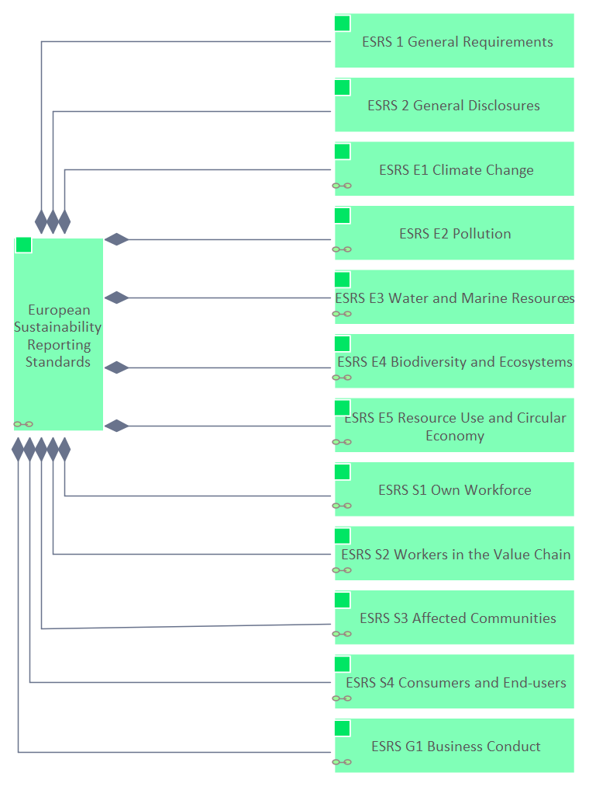

# Content European Sustainability Reporting Standards

**Type:** Class  **Stereotype:** Content  **StereotypeEx:** Content  **FQStereotype:** EDGY::Content  
**Status:** Proposed<button class="ea-status-edit-btn" type="button" aria-label="Edit status">&#9998;</button>  
**Created:** 2025-12-15  **Modified:** 2026-05-13

[Home](../index.html) / [Edgy](../Edgy/index.html) / [ESRS](../ESRS/index.html) / [European Sustainability Reporting Standards](index.html)

<button id="ea-notes-edit-btn" class="ea-notes-edit-btn" type="button" aria-label="Edit notes">&#9998;</button>

<!--ea-notes-start-->

The European Sustainability Reporting Standards (ESRS) oblige all companies subject to the Corporate Sustainability Reporting Directive (CSRD) of the European Union to report both on their impacts on people and the environment, and on how social and environmental issues create financial risks and opportunities for the company.

<!--ea-notes-end-->

## Tagged Values

<table>
<thead><tr><th>Name</th><th>Value</th><th>Notes</th></tr></thead>
<tbody>
<tr><td>EDGY::TextAlign</td><td>Center</td><td><!--ea-row-notes-start:tag-0-->
Default: Center
<!--ea-row-notes-end:tag-0--><button class="ea-row-notes-edit-btn" type="button" data-surface="table-row" data-row-id="tag-0" data-notes-hash="5cc00a1f" data-kind="tagged-value" data-el-id="555" data-tag-name="EDGY::TextAlign" data-tag-value="Center" data-file-path="European Sustainability Reporting Standards/European Sustainability Reporting Standards.md" data-api-port="8001" data-api-token="f3a0491e87a05fb2833bbd1e4cdb8499a0101703959665df" aria-label="Edit description">&#9998;</button></td></tr>
<tr class="ea-row-edit" data-row-id="tag-0" style="display:none"><td colspan="3"></td></tr>
</tbody>
</table>

[↑ Back to top](#)

## Relationships

| Type | Stereotype | Connected To |
|------|------------|-------------|
| Association | Link | [EFRAG](../People/EFRAG.html) |
| Aggregation | Tree | [ESRS G1 Business Conduct](../ESRS G1/ESRS G1 Business Conduct.html) |
| Aggregation | Tree | [ESRS 1 General Requirements](../ESRS 1/ESRS 1 General Requirements.html) |
| Aggregation | Tree | [ESRS 2 General Disclosures](../ESRS 2/ESRS 2 General Disclosures.html) |
| Aggregation | Tree | [ESRS E1 Climate Change](../ESRS E1/ESRS E1 Climate Change.html) |
| Aggregation | Tree | [ESRS E2 Pollution](../ESRS E2/ESRS E2 Pollution.html) |
| Aggregation | Tree | [ESRS E3 Water and Marine Resources](../ESRS E3/ESRS E3 Water and Marine Resources.html) |
| Aggregation | Tree | [ESRS E4 Biodiversity and Ecosystems](../ESRS E4/ESRS E4 Biodiversity and Ecosystems.html) |
| Aggregation | Tree | [ESRS E5 Resource Use and Circular Economy](../ESRS E5/ESRS E5 Resource Use and Circular Economy.html) |
| Aggregation | Tree | [ESRS S1 Own Workforce](../ESRS S1/ESRS S1 Own Workforce.html) |
| Aggregation | Tree | [ESRS S2 Workers in the Value Chain](../ESRS S2/ESRS S2 Workers in the Value Chain.html) |
| Aggregation | Tree | [ESRS S3 Affected Communities](../ESRS S3/ESRS S3 Affected Communities.html) |
| Aggregation | Tree | [ESRS S4 Consumers and End-users](../ESRS S4/ESRS S4 Consumers and End-users.html) |

[↑ Back to top](#)

### Appears on Diagrams

  <a href="diagrams/ESRS.html" class="diagram-thumb">ESRS</a>
  <a href="../European Union - People/diagrams/European Union - People.html" class="diagram-thumb">European Union - People</a>
  <a href="../Introduction EurSuRA/diagrams/Introduction EDGY Presentation 13 May Event.html" class="diagram-thumb">Introduction EDGY Presentation 13 May Event</a>

[↑ Back to top](#)

### Referenced By

| Type | Stereotype | Source |
|------|------------|--------|
| Association | Link | [EFRAG](../People/EFRAG.html) |

[↑ Back to top](#)

---

## Relationship Graph

---

*Generated: 2026-07-31 18:00:34*