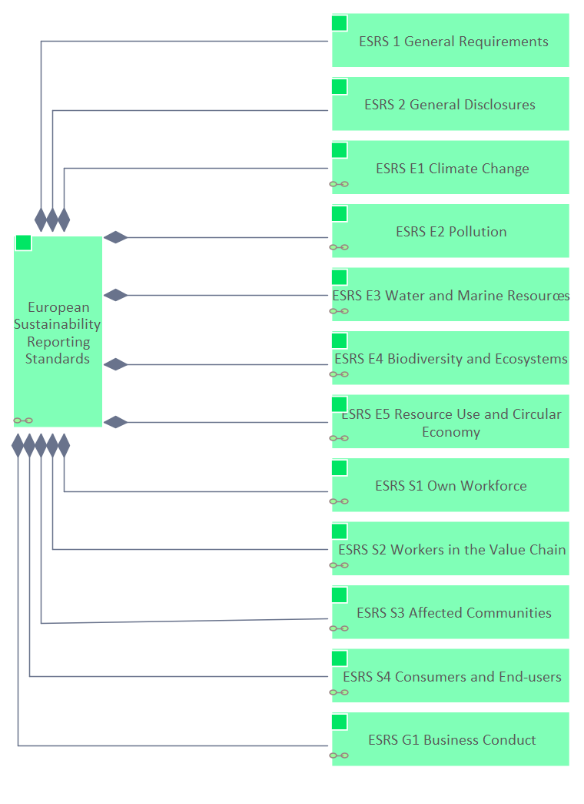

# ESRS

[Edgy](../../Edgy/index.md) / [ESRS](../../ESRS/index.md) / [European Sustainability Reporting Standards](../index.md)

**Description:** 

## Elements

- [ESRS 1 General Requirements](../../ESRS 1/ESRS 1 General Requirements.md)
- [ESRS 2 General Disclosures](../../ESRS 2/ESRS 2 General Disclosures.md)
- [ESRS E1 Climate Change](../../ESRS E1/ESRS E1 Climate Change.md)
- [ESRS E2 Pollution](../../ESRS E2/ESRS E2 Pollution.md)
- [ESRS E3 Water and Marine Resources](../../ESRS E3/ESRS E3 Water and Marine Resources.md)
- [ESRS E4 Biodiversity and Ecosystems](../../ESRS E4/ESRS E4 Biodiversity and Ecosystems.md)
- [ESRS E5 Resource Use and Circular Economy](../../ESRS E5/ESRS E5 Resource Use and Circular Economy.md)
- [ESRS S1 Own Workforce](../../ESRS S1/ESRS S1 Own Workforce.md)
- [ESRS S2 Workers in the Value Chain](../../ESRS S2/ESRS S2 Workers in the Value Chain.md)
- [ESRS S3 Affected Communities](../../ESRS S3/ESRS S3 Affected Communities.md)
- [ESRS S4 Consumers and End-users](../../ESRS S4/ESRS S4 Consumers and End-users.md)
- [ESRS G1 Business Conduct](../../ESRS G1/ESRS G1 Business Conduct.md)
- [European Sustainability Reporting Standards](../European Sustainability Reporting Standards.md)

---

*Generated: 2026-06-19 13:04:07*