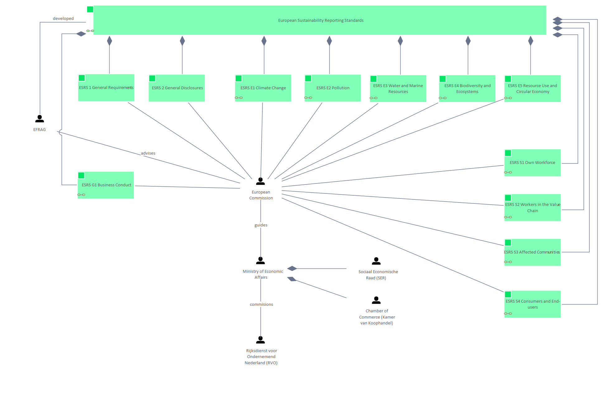

# European Union - People

[Home](../../index.md) / [Edgy](../../Edgy/index.md) / [ESRS](../../ESRS/index.md) / [ESRS and People](../../ESRS and People/index.md) / [European Union - People](../index.md)

**Description:** In this diagram the political structure is shown between the EU and the government of each individual European country. 

## Elements

- PEO [Chamber of Commerce (Kamer van Koophandel)](../../People/Chamber of Commerce (Kamer van Koophandel).md)
- PEO [EFRAG](../../People/EFRAG.md)
- CON [ESRS 1 General Requirements](../../ESRS 1/ESRS 1 General Requirements.md)
- CON [ESRS 2 General Disclosures](../../ESRS 2/ESRS 2 General Disclosures.md)
- CON [ESRS E1 Climate Change](../../ESRS E1/ESRS E1 Climate Change.md)
- CON [ESRS E2 Pollution](../../ESRS E2/ESRS E2 Pollution.md)
- CON [ESRS E3 Water and Marine Resources](../../ESRS E3/ESRS E3 Water and Marine Resources.md)
- CON [ESRS E4 Biodiversity and Ecosystems](../../ESRS E4/ESRS E4 Biodiversity and Ecosystems.md)
- CON [ESRS E5 Resource Use and Circular Economy](../../ESRS E5/ESRS E5 Resource Use and Circular Economy.md)
- CON [ESRS G1 Business Conduct](../../ESRS G1/ESRS G1 Business Conduct.md)
- CON [ESRS S1 Own Workforce](../../ESRS S1/ESRS S1 Own Workforce.md)
- CON [ESRS S2 Workers in the Value Chain](../../ESRS S2/ESRS S2 Workers in the Value Chain.md)
- CON [ESRS S3 Affected Communities](../../ESRS S3/ESRS S3 Affected Communities.md)
- CON [ESRS S4 Consumers and End-users](../../ESRS S4/ESRS S4 Consumers and End-users.md)
- PEO [European Commission](../../People/European Commission.md)
- CON [European Sustainability Reporting Standards](../../European Sustainability Reporting Standards/European Sustainability Reporting Standards.md)
- PEO [Ministry of Economic Affairs](../../People/Ministry of Economic Affairs.md)
- PEO [Rijksdienst voor Ondernemend Nederland (RVO)](../../People/Rijksdienst voor Ondernemend Nederland (RVO).md)
- PEO [Sociaal Economische Raad (SER)](../../People/Sociaal Economische Raad (SER).md)

---

*Generated: 2026-06-26 09:44:57*