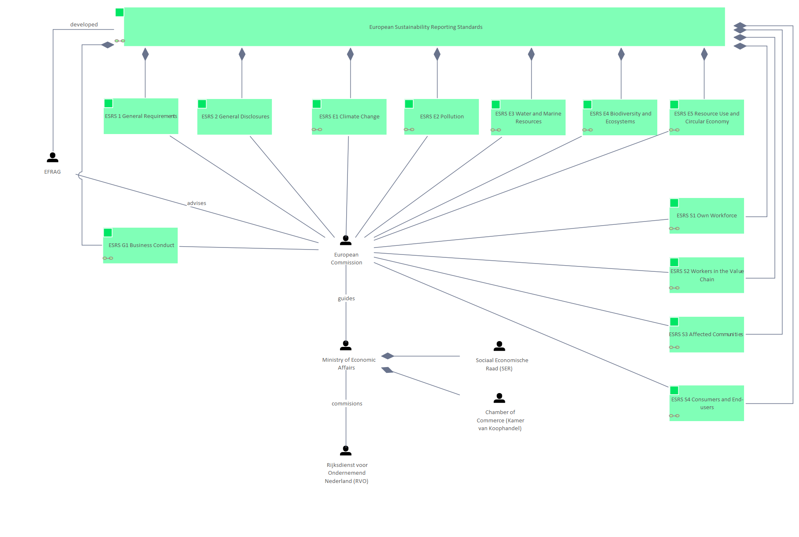

# 🗺️ European Union - People

[Home](../../index.html) / [Edgy](../../Edgy/index.html) / [ESRS](../../ESRS/index.html) / [ESRS and People](../../ESRS and People/index.html) / [European Union - People](../index.html)

<button id="ea-notes-edit-btn" class="ea-notes-edit-btn" type="button" aria-label="Edit description">&#9998;</button>

<!--ea-notes-start-->

In this diagram the political structure is shown between the EU and the government of each individual European country.

<!--ea-notes-end-->

## Elements

- People [Chamber of Commerce (Kamer van Koophandel)](../../People/Chamber of Commerce (Kamer van Koophandel).html)
- People [EFRAG](../../People/EFRAG.html)
- Content [ESRS 1 General Requirements](../../ESRS 1/ESRS 1 General Requirements.html)
- Content [ESRS 2 General Disclosures](../../ESRS 2/ESRS 2 General Disclosures.html)
- Content [ESRS E1 Climate Change](../../ESRS E1/ESRS E1 Climate Change.html)
- Content [ESRS E2 Pollution](../../ESRS E2/ESRS E2 Pollution.html)
- Content [ESRS E3 Water and Marine Resources](../../ESRS E3/ESRS E3 Water and Marine Resources.html)
- Content [ESRS E4 Biodiversity and Ecosystems](../../ESRS E4/ESRS E4 Biodiversity and Ecosystems.html)
- Content [ESRS E5 Resource Use and Circular Economy](../../ESRS E5/ESRS E5 Resource Use and Circular Economy.html)
- Content [ESRS G1 Business Conduct](../../ESRS G1/ESRS G1 Business Conduct.html)
- Content [ESRS S1 Own Workforce](../../ESRS S1/ESRS S1 Own Workforce.html)
- Content [ESRS S2 Workers in the Value Chain](../../ESRS S2/ESRS S2 Workers in the Value Chain.html)
- Content [ESRS S3 Affected Communities](../../ESRS S3/ESRS S3 Affected Communities.html)
- Content [ESRS S4 Consumers and End-users](../../ESRS S4/ESRS S4 Consumers and End-users.html)
- People [European Commission](../../People/European Commission.html)
- Content [European Sustainability Reporting Standards](../../European Sustainability Reporting Standards/European Sustainability Reporting Standards.html)
- People [Ministry of Economic Affairs](../../People/Ministry of Economic Affairs.html)
- People [Rijksdienst voor Ondernemend Nederland (RVO)](../../People/Rijksdienst voor Ondernemend Nederland (RVO).html)
- People [Sociaal Economische Raad (SER)](../../People/Sociaal Economische Raad (SER).html)
