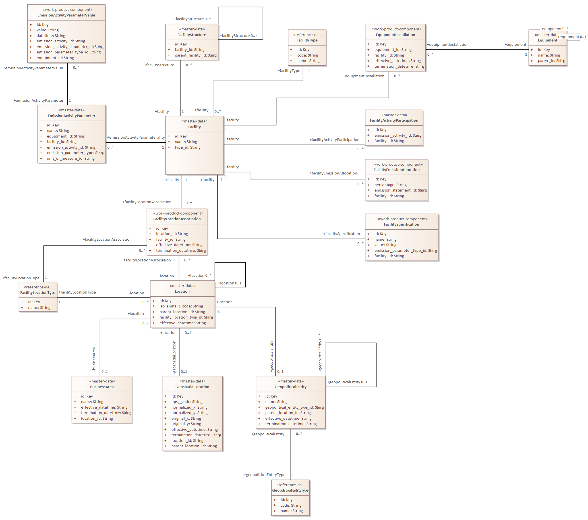

# master-data Facility

**Type:** Class  **Stereotype:** master-data  **StereotypeEx:** master-data  **FQStereotype:** master-data  
**Status:** Not Set<button class="ea-status-edit-btn" type="button" aria-label="Edit status">&#9998;</button>  
**Created:** 2026-02-27  **Modified:** 2026-05-20

[Home](../index.html) / [Data Layer](../Data Layer/index.html) / [Open Footprint Data Model LDM](../Open Footprint Data Model LDM/index.html) / [Facilities](index.html)

<button id="ea-notes-edit-btn" class="ea-notes-edit-btn" type="button" aria-label="Edit notes">&#9998;</button>

<!--ea-notes-start-->

Facility represents the capability of an organisation to perform a particular business function or service. It is a concept used to describe the functional capability that may arise from the installation of equipment and materials provided by a collection of assets and different locations. A facility can represent both a general aggregate capability of the organisation or a specific asset that is built, installed, or established to serve a particular purpose, such as a Plant, Research Laboratory, Office, or Offshore Platform. Facilities are classified by FacilityType and are assigned to locations through FacilityLocationAssociation, enabling accurate geographic attribution of site-level emission data.

<!--ea-notes-end-->

## Attributes

<table>
<thead><tr><th>Name</th><th>Type</th><th>Default</th><th>Description</th></tr></thead>
<tbody>
<tr><td>id</td><td>Key</td><td></td><td><!--ea-row-notes-start:attr-0-->
The unique system-assigned identifier for the Facility record. It is the primary key referenced by EmissionInventory to associate an inventory with the facility at which the emissions were measured. It must be globally unique and must not be reused after a facility is decommissioned or retired from the system.
<!--ea-row-notes-end:attr-0--><button class="ea-row-notes-edit-btn" type="button" data-surface="table-row" data-row-id="attr-0" data-notes-hash="de07b9ac" data-kind="attribute" data-el-id="753" data-attr-name="id" data-attr-type="Key" data-file-path="Facilities/Facility.md" data-api-port="8001" data-api-token="0a090fdc614acadb47d274812862962392b5fdee6a3e1f83" aria-label="Edit description">&#9998;</button></td></tr>
<tr class="ea-row-edit" data-row-id="attr-0" style="display:none"><td colspan="4"></td></tr>
<tr><td>name</td><td>String</td><td></td><td><!--ea-row-notes-start:attr-1-->
The operational or registered name of the facility, such as "Plant A", "Unit AA", or "Offshore Platform North Sea Block 42". The name is used in reports, maps, and dashboards to identify the physical site and should correspond to the name used in regulatory submissions and site permits.
<!--ea-row-notes-end:attr-1--><button class="ea-row-notes-edit-btn" type="button" data-surface="table-row" data-row-id="attr-1" data-notes-hash="0c8591c5" data-kind="attribute" data-el-id="753" data-attr-name="name" data-attr-type="String" data-file-path="Facilities/Facility.md" data-api-port="8001" data-api-token="0a090fdc614acadb47d274812862962392b5fdee6a3e1f83" aria-label="Edit description">&#9998;</button></td></tr>
<tr class="ea-row-edit" data-row-id="attr-1" style="display:none"><td colspan="4"></td></tr>
<tr><td>type_id</td><td>String</td><td></td><td><!--ea-row-notes-start:attr-2-->
A foreign key referencing the FacilityType that classifies this facility. The type determines the applicable emission factor sets, regulatory reporting categories, and benchmarking peer group for this facility.
<!--ea-row-notes-end:attr-2--><button class="ea-row-notes-edit-btn" type="button" data-surface="table-row" data-row-id="attr-2" data-notes-hash="2f5dcd30" data-kind="attribute" data-el-id="753" data-attr-name="type_id" data-attr-type="String" data-file-path="Facilities/Facility.md" data-api-port="8001" data-api-token="0a090fdc614acadb47d274812862962392b5fdee6a3e1f83" aria-label="Edit description">&#9998;</button></td></tr>
<tr class="ea-row-edit" data-row-id="attr-2" style="display:none"><td colspan="4"></td></tr>
</tbody>
</table>

[↑ Back to top](#)

## Tagged Values

<table>
<thead><tr><th>Name</th><th>Value</th><th>Notes</th></tr></thead>
<tbody>
<tr><td>description</td><td>Facility represents the capability of an organisation to perform a particular business function or service.</td><td><!--ea-row-notes-start:tag-0--><!--ea-row-notes-end:tag-0--><button class="ea-row-notes-edit-btn" type="button" data-surface="table-row" data-row-id="tag-0" data-notes-hash="e3b0c442" data-kind="tagged-value" data-el-id="753" data-tag-name="description" data-tag-value="Facility represents the capability of an organisation to perform a particular business function or service." data-file-path="Facilities/Facility.md" data-api-port="8001" data-api-token="0a090fdc614acadb47d274812862962392b5fdee6a3e1f83" aria-label="Edit description">&#9998;</button></td></tr>
<tr class="ea-row-edit" data-row-id="tag-0" style="display:none"><td colspan="3"></td></tr>
</tbody>
</table>

[↑ Back to top](#)

## Relationships

| Type | Stereotype | Connected To |
|------|------------|-------------|
| Association |  | [FacilityEmissionAllocation](FacilityEmissionAllocation.html) |
| Association |  | [EmissionActivityParameter](EmissionActivityParameter.html) |
| Association |  | [EquipmentInstallation](EquipmentInstallation.html) |
| Association |  | [FacilityActivityParticipation](FacilityActivityParticipation.html) |
| Association |  | [FacilitySpecification](FacilitySpecification.html) |
| Association |  | [FacilityLocationAssociation](FacilityLocationAssociation.html) |
| Association |  | [FacilityStructure](FacilityStructure.html) |
| Association |  | [FacilityType](FacilityType.html) |
| Association |  | [Organization](../Organisation/Organization.html) |

[↑ Back to top](#)

### Appears on Diagrams

  <a href="diagrams/Facilities.html" class="diagram-thumb">Facilities</a>

[↑ Back to top](#)

### Referenced By

| Type | Stereotype | Source |
|------|------------|--------|
| Association |  | [Organization](../Organisation/Organization.html) |

[↑ Back to top](#)

---

## Relationship Graph

