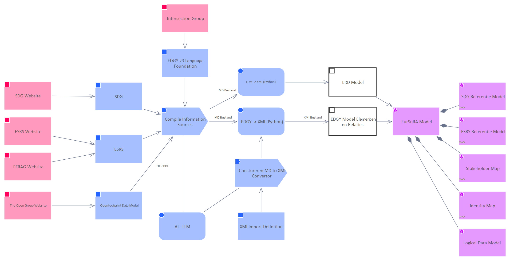

# Information Collection and Model Creation

[Model Creation](../../Model Creation/index.md) / [Information Collection and Model Creation](../index.md)

**Description:** 

## Elements

- [AI - LLM](../AI - LLM.md)
- [Compile Information Sources](../Compile Information Sources.md)
- [Constureren MD to XMI Convertor](../Constureren MD to XMI Convertor.md)
- [EDGY -> XMI (Python)](../EDGY -_ XMI (Python).md)
- [EDGY 23 Language Foundation](../EDGY 23 Language Foundation.md)
- [EDGY Model Elementen en Relaties](../EDGY Model Elementen en Relaties.md)
- [EFRAG Website](../EFRAG Website.md)
- [ERD Model](../ERD Model.md)
- [ESRS](../ESRS.md)
- [ESRS Referentie Model](../ESRS Referentie Model.md)
- [ESRS Website](../ESRS Website.md)
- [EurSuRA Model](../EurSuRA Model.md)
- [Identity Map](../Identity Map.md)
- [Intersection Group](../Intersection Group.md)
- [LDM -> XMI (Python)](../LDM -_ XMI (Python).md)
- [Logical Data Model](../Logical Data Model.md)
- [Openfootprint Data Model](../Openfootprint Data Model.md)
- [SDG](../SDG.md)
- [SDG Referentie Model](../SDG Referentie Model.md)
- [SDG Website](../SDG Website.md)
- [Stakeholder Map](../Stakeholder Map.md)
- [The Open Group Website](../The Open Group Website.md)
- [XMI Import Definition](../XMI Import Definition.md)

---

*Generated: 2026-06-24 15:15:42*