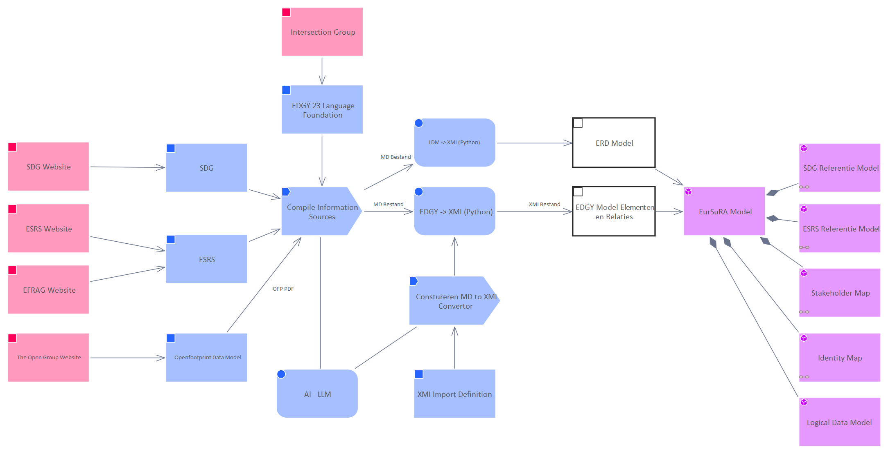

# Information Collection and Model Creation

[Home](../../index.html) / [Model Creation](../../Model Creation/index.html) / [Information Collection and Model Creation](../index.html)

<button id="ea-notes-edit-btn" class="ea-notes-edit-btn" type="button" aria-label="Edit description">&#9998;</button>
(derived)

<!--ea-notes-start-->

The EFRAG Website is a proposed Channel class that is responsible for collecting information and creating models

<!--ea-notes-end-->

## Elements

- Capability [AI - LLM](../AI - LLM.html)
- Process [Compile Information Sources](../Compile Information Sources.html)
- Process [Constureren MD to XMI Convertor](../Constureren MD to XMI Convertor.html)
- Capability [EDGY -> XMI (Python)](../EDGY -_ XMI (Python).html)
- Asset [EDGY 23 Language Foundation](../EDGY 23 Language Foundation.html)
- Object [EDGY Model Elementen en Relaties](../EDGY Model Elementen en Relaties.html)
- Channel [EFRAG Website](../EFRAG Website.html)
- Object [ERD Model](../ERD Model.html)
- Asset [ESRS](../ESRS.html)
- Product [ESRS Referentie Model](../ESRS Referentie Model.html)
- Channel [ESRS Website](../ESRS Website.html)
- Product [EurSuRA Model](../EurSuRA Model.html)
- Product [Identity Map](../Identity Map.html)
- Channel [Intersection Group](../Intersection Group.html)
- Capability [LDM -> XMI (Python)](../LDM -_ XMI (Python).html)
- Product [Logical Data Model](../Logical Data Model.html)
- Asset [Openfootprint Data Model](../Openfootprint Data Model.html)
- Asset [SDG](../SDG.html)
- Product [SDG Referentie Model](../SDG Referentie Model.html)
- Channel [SDG Website](../SDG Website.html)
- Product [Stakeholder Map](../Stakeholder Map.html)
- Channel [The Open Group Website](../The Open Group Website.html)
- Asset [XMI Import Definition](../XMI Import Definition.html)

---

*Generated: 2026-07-31 18:00:58*