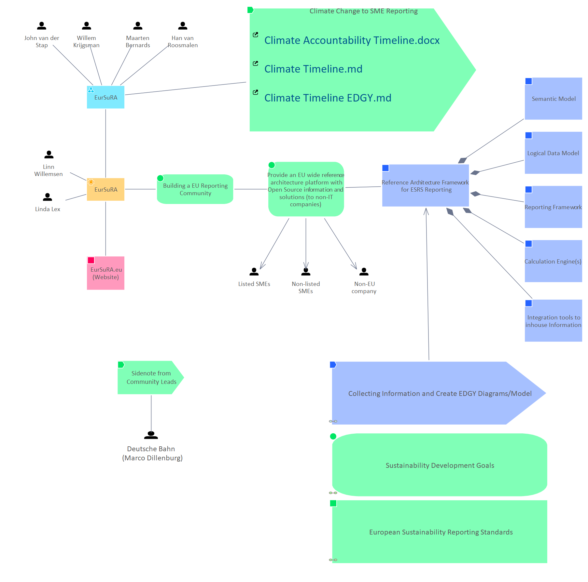

# Introduction EDGY Presentation 13 May Event

[Model Creation](../../Model Creation/index.md) / [Introduction EurSuRA](../index.md)

**Description:** 

## Elements

- [M:\EurSuRA\Information\Climate Timeline EDGY.md](../M__EurSuRA_Information_Climate Timeline EDGY.md.md)
- [EurSuRA](../EurSuRA.md)
- [EurSuRA](../EurSuRA.md)
- [John van der Stap](../John van der Stap.md)
- [Willem Krijgsman](../Willem Krijgsman.md)
- [Maarten Bernards](../Maarten Bernards.md)
- [Han van Roosmalen](../Han van Roosmalen.md)
- [Linn Willemsen](../Linn Willemsen.md)
- [Linda Lex](../Linda Lex.md)
- [EurSuRA.eu (Website)](../EurSuRA.eu (Website).md)
- [Provide an EU wide reference architecture platform with Open Source information and solutions (to non-IT companies)](../Provide an EU wide reference architecture platform with Open Source information and solutions (to non-IT companies).md)
- [Listed SMEs](../../People/Listed SMEs.md)
- [Non-listed SMEs](../../People/Non-listed SMEs.md)
- [Non-EU company](../../People/Non-EU company.md)
- [M:\EurSuRA\Information\Climate Timeline.md](../M__EurSuRA_Information_Climate Timeline.md.md)
- [M:\EurSuRA\Information\Climate Accountability Timeline.docx](../M__EurSuRA_Information_Climate Accountability Timeline.docx.md)
- [Reference Architecture Framework for ESRS Reporting](../Reference Architecture Framework for ESRS Reporting.md)
- [Logical Data Model](../Logical Data Model.md)
- [Semantic Model](../Semantic Model.md)
- [Reporting Framework](../Reporting Framework.md)
- [Calculation Engine(s)](../Calculation Engine(s).md)
- [Climate Change to SME Reporting](../Climate Change to SME Reporting.md)
- [Building a EU Reporting Community](../Building a EU Reporting Community.md)
- [Integration tools to inhouse Information](../Integration tools to inhouse Information.md)
- [Collecting Information and Create EDGY Diagrams/Model](../Collecting Information and Create EDGY Diagrams_Model.md)
- [Deutsche Bahn (Marco Dillenburg)](../Deutsche Bahn (Marco Dillenburg).md)
- [Sidenote from Community Leads](../Sidenote from Community Leads.md)
- [European Sustainability Reporting Standards](../../European Sustainability Reporting Standards/European Sustainability Reporting Standards.md)
- [Sustainability Development Goals](../../Sustainability Development Goals/Sustainability Development Goals.md)

---

*Generated: 2026-06-19 11:58:58*