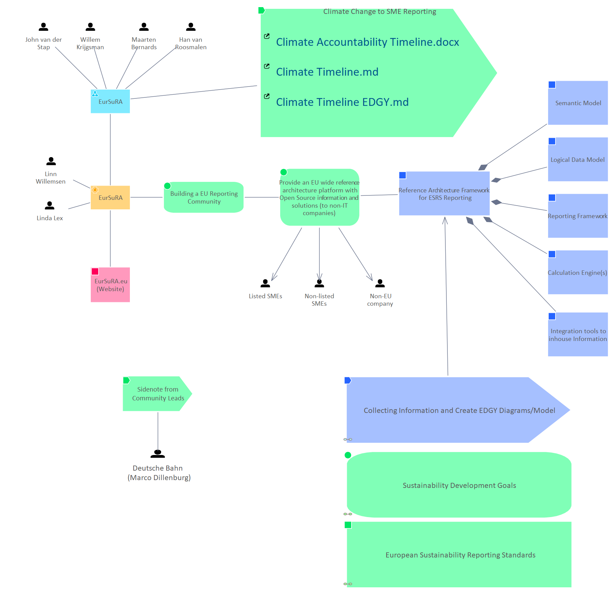

# Introduction EDGY Presentation 13 May Event

[Home](../../index.html) / [Model Creation](../../Model Creation/index.html) / [Introduction EurSuRA](../index.html)

<button id="ea-notes-edit-btn" class="ea-notes-edit-btn" type="button" aria-label="Edit description">&#9998;</button>
(derived)

<!--ea-notes-start-->
Small and medium enterprises with stock exchange listing (future LSME standard)
Required to report: 
Any listed companies that meet two of the following three criteria on any two consecutive balance sheet dates:
<ol>
	<li>at least EUR 25 million in total assets</li>
	<li>at least EUR 50 million in net turnover</li>
	<li>at least 250 employees (average) during the year</li>
</ol>
<!--ea-notes-end-->

## Elements

- Purpose [Building a EU Reporting Community](../Building a EU Reporting Community.html)
- Asset [Calculation Engine(s)](../Calculation Engine(s).html)
- Story [Climate Change to SME Reporting](../Climate Change to SME Reporting.html)
- Process [Collecting Information and Create EDGY Diagrams/Model](../Collecting Information and Create EDGY Diagrams_Model.html)
- People [Deutsche Bahn (Marco Dillenburg)](../Deutsche Bahn (Marco Dillenburg).html)
- Content [European Sustainability Reporting Standards](../../European Sustainability Reporting Standards/European Sustainability Reporting Standards.html)
- Brand [EurSuRA](../EurSuRA.html)
- Organisation [EurSuRA](../EurSuRA.html)
- Channel [EurSuRA.eu (Website)](../EurSuRA.eu (Website).html)
- People [Han van Roosmalen](../Han van Roosmalen.html)
- Asset [Integration tools to inhouse Information](../Integration tools to inhouse Information.html)
- People [John van der Stap](../John van der Stap.html)
- People [Linda Lex](../Linda Lex.html)
- People [Linn Willemsen](../Linn Willemsen.html)
- People [Listed SMEs](../../People/Listed SMEs.html)
- Asset [Logical Data Model](../Logical Data Model.html)
- Uncategorized [M:\EurSuRA\Information\Climate Accountability Timeline.docx](../M__EurSuRA_Information_Climate Accountability Timeline.docx.html)
- Uncategorized [M:\EurSuRA\Information\Climate Timeline EDGY.md](../M__EurSuRA_Information_Climate Timeline EDGY.md.html)
- Uncategorized [M:\EurSuRA\Information\Climate Timeline.md](../M__EurSuRA_Information_Climate Timeline.md.html)
- People [Maarten Bernards](../Maarten Bernards.html)
- People [Non-EU company](../../People/Non-EU company.html)
- People [Non-listed SMEs](../../People/Non-listed SMEs.html)
- Purpose [Provide an EU wide reference architecture platform with Open Source information and solutions (to non-IT companies)](../Provide an EU wide reference architecture platform with Open Source information and solutions (to non-IT companies).html)
- Asset [Reference Architecture Framework for ESRS Reporting](../Reference Architecture Framework for ESRS Reporting.html)
- Asset [Reporting Framework](../Reporting Framework.html)
- Asset [Semantic Model](../Semantic Model.html)
- Story [Sidenote from Community Leads](../Sidenote from Community Leads.html)
- Purpose [Sustainability Development Goals](../../Sustainability Development Goals/Sustainability Development Goals.html)
- People [Willem Krijgsman](../Willem Krijgsman.html)

---

*Generated: 2026-07-16 12:12:34*