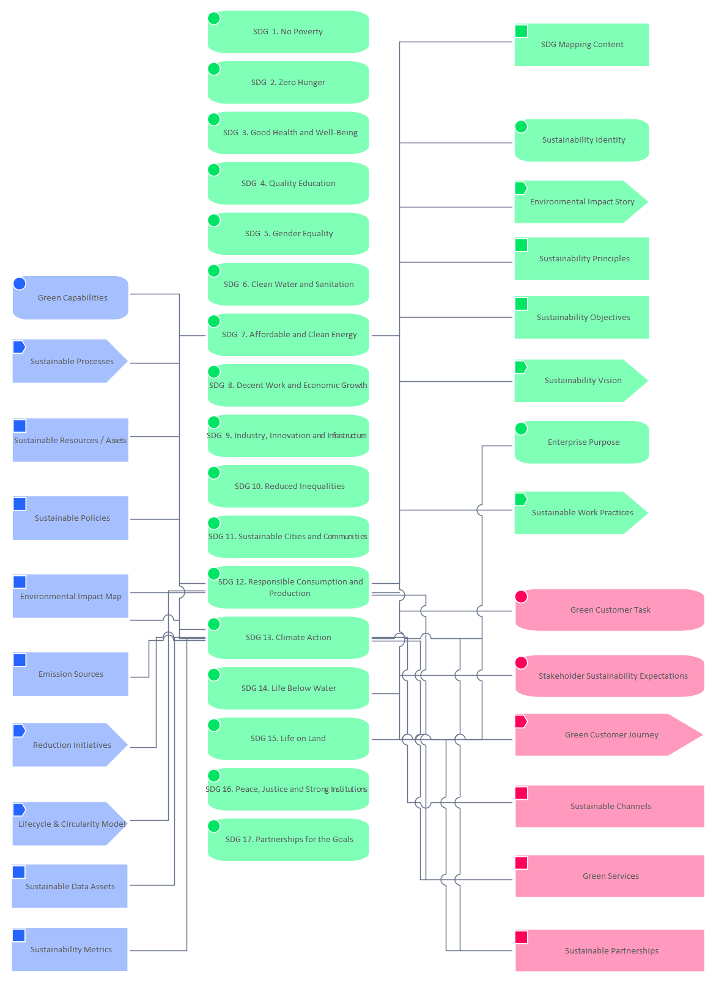

# Mapping SDG to Main

[Home](../../index.md) / [Edgy](../../Edgy/index.md) / [SDGs](../../SDGs/index.md) / [Mapping SDG to Main](../index.md)

**Derived Description:** Strengthen the means of implementation and revitalize the global partnership for sustainable development

## Elements

- ASS [Emission Sources](../../Asset/Emission Sources.md)
- PUR [Enterprise Purpose](../../Purpose/Enterprise Purpose.md)
- ASS [Environmental Impact Map](../../Asset/Environmental Impact Map.md)
- STO [Environmental Impact Story](../../Story/Environmental Impact Story.md)
- CAP [Green Capabilities](../../Capability/Green Capabilities.md)
- JOU [Green Customer Journey](../../Journey/Green Customer Journey.md)
- TAS [Green Customer Task](../../Task/Green Customer Task.md)
- CHA [Green Services](../../Channel/Green Services.md)
- PRO [Lifecycle & Circularity Model](../../Process/Lifecycle & Circularity Model.md)
- PRO [Reduction Initiatives](../../Process/Reduction Initiatives.md)
- PUR [SDG  1. No Poverty](../../Sustainability Development Goals/SDG  1. No Poverty.md)
- PUR [SDG  2. Zero Hunger](../../Sustainability Development Goals/SDG  2. Zero Hunger.md)
- PUR [SDG  3. Good Health and Well-Being](../../Sustainability Development Goals/SDG  3. Good Health and Well-Being.md)
- PUR [SDG  4. Quality Education](../../Sustainability Development Goals/SDG  4. Quality Education.md)
- PUR [SDG  5. Gender Equality](../../Sustainability Development Goals/SDG  5. Gender Equality.md)
- PUR [SDG  6. Clean Water and Sanitation](../../Sustainability Development Goals/SDG  6. Clean Water and Sanitation.md)
- PUR [SDG  7. Affordable and Clean Energy](../../Sustainability Development Goals/SDG  7. Affordable and Clean Energy.md)
- PUR [SDG  8. Decent Work and Economic Growth](../../Sustainability Development Goals/SDG  8. Decent Work and Economic Growth.md)
- PUR [SDG  9. Industry, Innovation and Infrastructure](../../Sustainability Development Goals/SDG  9. Industry, Innovation and Infrastructure.md)
- PUR [SDG 10. Reduced Inequalities](../../Sustainability Development Goals/SDG 10. Reduced Inequalities.md)
- PUR [SDG 11. Sustainable Cities and Communities](../../Sustainability Development Goals/SDG 11. Sustainable Cities and Communities.md)
- PUR [SDG 12. Responsible Consumption and Production](../../Sustainability Development Goals/SDG 12. Responsible Consumption and Production.md)
- PUR [SDG 13. Climate Action](../../Sustainability Development Goals/SDG 13. Climate Action.md)
- PUR [SDG 14. Life Below Water](../../Sustainability Development Goals/SDG 14. Life Below Water.md)
- PUR [SDG 15. Life on Land](../../Sustainability Development Goals/SDG 15. Life on Land.md)
- PUR [SDG 16. Peace, Justice and Strong Institutions](../../Sustainability Development Goals/SDG 16. Peace, Justice and Strong Institutions.md)
- PUR [SDG 17. Partnerships for the Goals](../../Sustainability Development Goals/SDG 17. Partnerships for the Goals.md)
- CON [SDG Mapping Content](../../Content/SDG Mapping Content.md)
- TAS [Stakeholder Sustainability Expectations](../../Task/Stakeholder Sustainability Expectations.md)
- PUR [Sustainability Identity](../../Purpose/Sustainability Identity.md)
- ASS [Sustainability Metrics](../../Asset/Sustainability Metrics.md)
- CON [Sustainability Objectives](../../Content/Sustainability Objectives.md)
- CON [Sustainability Principles](../../Content/Sustainability Principles.md)
- STO [Sustainability Vision](../../Story/Sustainability Vision.md)
- CHA [Sustainable Channels](../../Channel/Sustainable Channels.md)
- ASS [Sustainable Data Assets](../../Asset/Sustainable Data Assets.md)
- CHA [Sustainable Partnerships](../../Channel/Sustainable Partnerships.md)
- ASS [Sustainable Policies](../../Asset/Sustainable Policies.md)
- PRO [Sustainable Processes](../../Process/Sustainable Processes.md)
- ASS [Sustainable Resources / Assets](../../Asset/Sustainable Resources _ Assets.md)
- STO [Sustainable Work Practices](../../Story/Sustainable Work Practices.md)

---

*Generated: 2026-06-26 09:44:53*