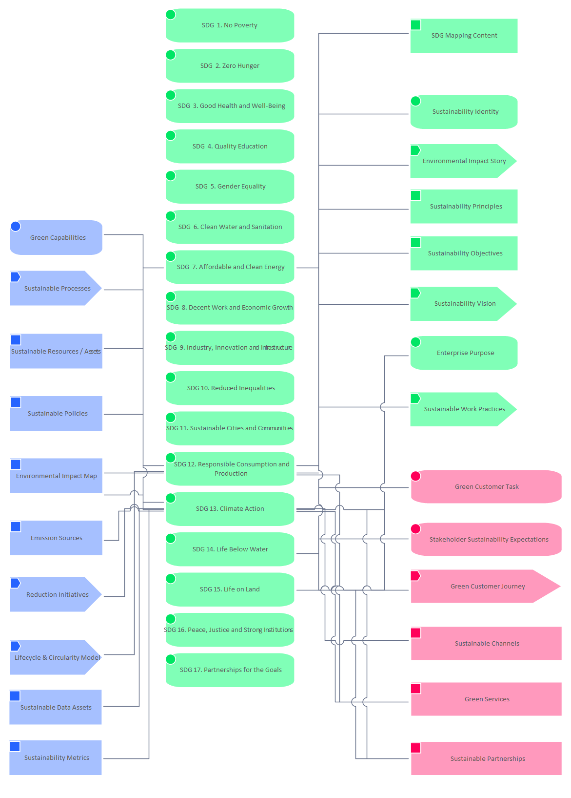

# Mapping SDG to Main

[Home](../../index.html) / [Edgy](../../Edgy/index.html) / [SDGs](../../SDGs/index.html) / [Mapping SDG to Main](../index.html)

<button id="ea-notes-edit-btn" class="ea-notes-edit-btn" type="button" aria-label="Edit description">&#9998;</button>
(derived)

<!--ea-notes-start-->

Strengthen the means of implementation and revitalize the global partnership for sustainable development

<!--ea-notes-end-->

## Elements

- Asset [Emission Sources](../../Asset/Emission Sources.html)
- Purpose [Enterprise Purpose](../../Purpose/Enterprise Purpose.html)
- Asset [Environmental Impact Map](../../Asset/Environmental Impact Map.html)
- Story [Environmental Impact Story](../../Story/Environmental Impact Story.html)
- Capability [Green Capabilities](../../Capability/Green Capabilities.html)
- Journey [Green Customer Journey](../../Journey/Green Customer Journey.html)
- Task [Green Customer Task](../../Task/Green Customer Task.html)
- Channel [Green Services](../../Channel/Green Services.html)
- Process [Lifecycle & Circularity Model](../../Process/Lifecycle & Circularity Model.html)
- Process [Reduction Initiatives](../../Process/Reduction Initiatives.html)
- Purpose [SDG  1. No Poverty](../../Sustainability Development Goals/SDG  1. No Poverty.html)
- Purpose [SDG  2. Zero Hunger](../../Sustainability Development Goals/SDG  2. Zero Hunger.html)
- Purpose [SDG  3. Good Health and Well-Being](../../Sustainability Development Goals/SDG  3. Good Health and Well-Being.html)
- Purpose [SDG  4. Quality Education](../../Sustainability Development Goals/SDG  4. Quality Education.html)
- Purpose [SDG  5. Gender Equality](../../Sustainability Development Goals/SDG  5. Gender Equality.html)
- Purpose [SDG  6. Clean Water and Sanitation](../../Sustainability Development Goals/SDG  6. Clean Water and Sanitation.html)
- Purpose [SDG  7. Affordable and Clean Energy](../../Sustainability Development Goals/SDG  7. Affordable and Clean Energy.html)
- Purpose [SDG  8. Decent Work and Economic Growth](../../Sustainability Development Goals/SDG  8. Decent Work and Economic Growth.html)
- Purpose [SDG  9. Industry, Innovation and Infrastructure](../../Sustainability Development Goals/SDG  9. Industry, Innovation and Infrastructure.html)
- Purpose [SDG 10. Reduced Inequalities](../../Sustainability Development Goals/SDG 10. Reduced Inequalities.html)
- Purpose [SDG 11. Sustainable Cities and Communities](../../Sustainability Development Goals/SDG 11. Sustainable Cities and Communities.html)
- Purpose [SDG 12. Responsible Consumption and Production](../../Sustainability Development Goals/SDG 12. Responsible Consumption and Production.html)
- Purpose [SDG 13. Climate Action](../../Sustainability Development Goals/SDG 13. Climate Action.html)
- Purpose [SDG 14. Life Below Water](../../Sustainability Development Goals/SDG 14. Life Below Water.html)
- Purpose [SDG 15. Life on Land](../../Sustainability Development Goals/SDG 15. Life on Land.html)
- Purpose [SDG 16. Peace, Justice and Strong Institutions](../../Sustainability Development Goals/SDG 16. Peace, Justice and Strong Institutions.html)
- Purpose [SDG 17. Partnerships for the Goals](../../Sustainability Development Goals/SDG 17. Partnerships for the Goals.html)
- Content [SDG Mapping Content](../../Content/SDG Mapping Content.html)
- Task [Stakeholder Sustainability Expectations](../../Task/Stakeholder Sustainability Expectations.html)
- Purpose [Sustainability Identity](../../Purpose/Sustainability Identity.html)
- Asset [Sustainability Metrics](../../Asset/Sustainability Metrics.html)
- Content [Sustainability Objectives](../../Content/Sustainability Objectives.html)
- Content [Sustainability Principles](../../Content/Sustainability Principles.html)
- Story [Sustainability Vision](../../Story/Sustainability Vision.html)
- Channel [Sustainable Channels](../../Channel/Sustainable Channels.html)
- Asset [Sustainable Data Assets](../../Asset/Sustainable Data Assets.html)
- Channel [Sustainable Partnerships](../../Channel/Sustainable Partnerships.html)
- Asset [Sustainable Policies](../../Asset/Sustainable Policies.html)
- Process [Sustainable Processes](../../Process/Sustainable Processes.html)
- Asset [Sustainable Resources / Assets](../../Asset/Sustainable Resources _ Assets.html)
- Story [Sustainable Work Practices](../../Story/Sustainable Work Practices.html)

---

*Generated: 2026-08-03 08:46:20*