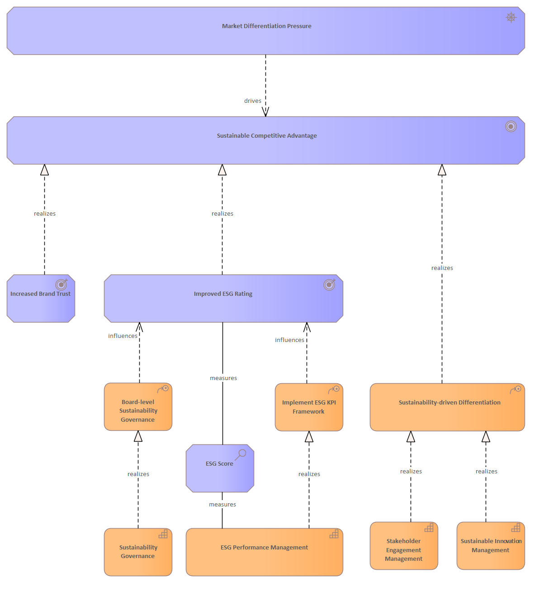

# Market Differentiation Pressure

[Home](../../index.md) / [Archimate](../../Archimate/index.md) / [Strategic Sustainability Management Model (Bodenstein)](../../Strategic Sustainability Management Model (Bodenstein)/index.md) / [Market Differentiation Pressure](../index.md)

**Derived Description:** Competitive pressure to differentiate through sustainability leadership and eco-innovation

## Elements

- COA [Board-level Sustainability Governance](../../Courses of Action/Board-level Sustainability Governance.md)
- CAP [ESG Performance Management](../../Capabilities/ESG Performance Management.md)
- AS [ESG Score](../../Assessments/ESG Score.md)
- COA [Implement ESG KPI Framework](../../Courses of Action/Implement ESG KPI Framework.md)
- OC [Improved ESG Rating](../../Outcomes/Improved ESG Rating.md)
- OC [Increased Brand Trust](../../Outcomes/Increased Brand Trust.md)
- DR [Market Differentiation Pressure](../../Drivers/Market Differentiation Pressure.md)
- CAP [Stakeholder Engagement Management](../../Capabilities/Stakeholder Engagement Management.md)
- CAP [Sustainability Governance](../../Capabilities/Sustainability Governance.md)
- COA [Sustainability-driven Differentiation](../../Courses of Action/Sustainability-driven Differentiation.md)
- GL [Sustainable Competitive Advantage](../../Goals/Sustainable Competitive Advantage.md)
- CAP [Sustainable Innovation Management](../../Capabilities/Sustainable Innovation Management.md)

---

*Generated: 2026-06-26 13:25:51*