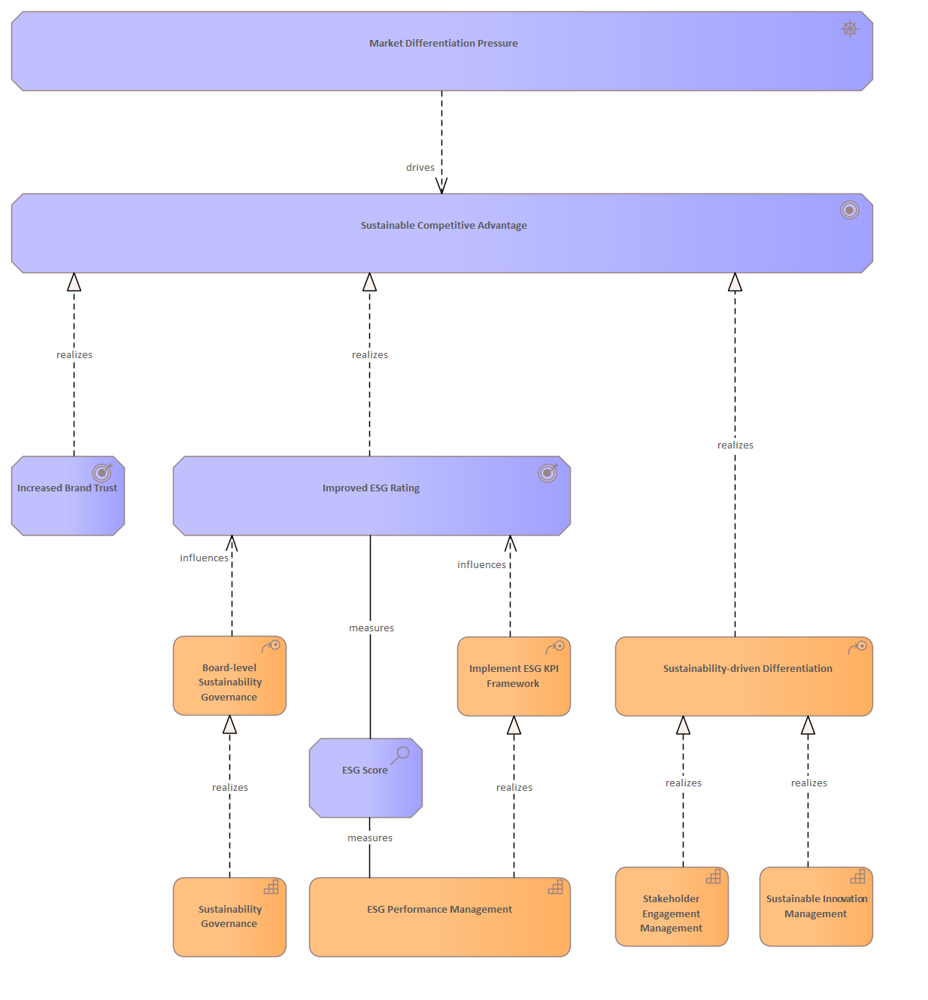

# Market Differentiation Pressure

[Home](../../index.html) / [Archimate](../../Archimate/index.html) / [Strategic Sustainability Management Model (Bodenstein)](../../Strategic Sustainability Management Model (Bodenstein)/index.html) / [Market Differentiation Pressure](../index.html)

<button id="ea-notes-edit-btn" class="ea-notes-edit-btn" type="button" aria-label="Edit description">&#9998;</button>
(derived)

<!--ea-notes-start-->

Competitive pressure to differentiate through sustainability leadership and eco-innovation

<!--ea-notes-end-->

## Elements

- CourseOfAction [Board-level Sustainability Governance](../../Courses of Action/Board-level Sustainability Governance.html)
- Capability [ESG Performance Management](../../Capabilities/ESG Performance Management.html)
- Assessment [ESG Score](../../Assessments/ESG Score.html)
- CourseOfAction [Implement ESG KPI Framework](../../Courses of Action/Implement ESG KPI Framework.html)
- Outcome [Improved ESG Rating](../../Outcomes/Improved ESG Rating.html)
- Outcome [Increased Brand Trust](../../Outcomes/Increased Brand Trust.html)
- Driver [Market Differentiation Pressure](../../Drivers/Market Differentiation Pressure.html)
- Capability [Stakeholder Engagement Management](../../Capabilities/Stakeholder Engagement Management.html)
- Capability [Sustainability Governance](../../Capabilities/Sustainability Governance.html)
- CourseOfAction [Sustainability-driven Differentiation](../../Courses of Action/Sustainability-driven Differentiation.html)
- Goal [Sustainable Competitive Advantage](../../Goals/Sustainable Competitive Advantage.html)
- Capability [Sustainable Innovation Management](../../Capabilities/Sustainable Innovation Management.html)

---

*Generated: 2026-08-03 11:12:14*