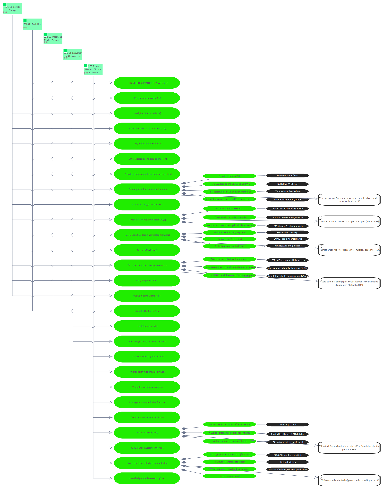

# Metric Uitstoot NOₓ/SOₓ (kg/jaar)

**Type:** Requirement  **Stereotype:** Metric  **StereotypeEx:** Metric  **FQStereotype:** EDGY::Metric  
**Status:** Proposed  
**Created:** 2025-12-03  **Modified:** 2025-12-03

[Home](../index.md) / [Edgy](../Edgy/index.md) / [Metrics](index.md)

## Tagged Values

| Name | Value | Notes |
|------|-------|-------|
| EDGY::MetricStatus | Good | Default: Good  |
| EDGY::MetricValue | <VALUE> | Default: <VALUE>  |

[↑ Back to top](#)

## Relationships

| Type | Stereotype | Connected To |
|------|------------|-------------|
| ControlFlow | Flow | [ESRS E2 Pollution](../ESRS E2/ESRS E2 Pollution.md) |
| Association | Link | [Maak een publiek impactrapport over emissies, afval, water en circulariteit.](../Task/Maak een publiek impactrapport over emissies, afval, water en circulariteit..md) |

[↑ Back to top](#)

### Appears on Diagrams

  <a href="../Identity/diagrams/Identity.html" class="diagram-thumb">Identity</a>
  <a href="diagrams/Metrics.html" class="diagram-thumb">Metrics</a>

[↑ Back to top](#)

### Referenced By

| Type | Stereotype | Source |
|------|------------|--------|
| ControlFlow | Flow | [ESRS E2 Pollution](../ESRS E2/ESRS E2 Pollution.md) |
| Association | Link | [Maak een publiek impactrapport over emissies, afval, water en circulariteit.](../Task/Maak een publiek impactrapport over emissies, afval, water en circulariteit..md) |

[↑ Back to top](#)

---

## Relationship Graph

{&quot;nodes&quot;:[{&quot;id&quot;:&quot;e37&quot;,&quot;label&quot;:&quot;ESRS E2 Pollution&quot;,&quot;fullName&quot;:&quot;ESRS E2 Pollution&quot;,&quot;packageName&quot;:&quot;ESRS E2&quot;,&quot;layer&quot;:&quot;edgy-id&quot;,&quot;isFocal&quot;:false,&quot;hasUrl&quot;:true,&quot;url&quot;:&quot;../ESRS E2/ESRS E2 Pollution.html&quot;},{&quot;id&quot;:&quot;e142&quot;,&quot;label&quot;:&quot;Maak een publiek impact…&quot;,&quot;fullName&quot;:&quot;Maak een publiek impactrapport over emissies, afval, water en circulariteit.&quot;,&quot;packageName&quot;:&quot;Task&quot;,&quot;layer&quot;:&quot;edgy-ex&quot;,&quot;isFocal&quot;:false,&quot;hasUrl&quot;:true,&quot;url&quot;:&quot;../Task/Maak een publiek impactrapport over emissies, afval, water en circulariteit..html&quot;},{&quot;id&quot;:&quot;e168&quot;,&quot;label&quot;:&quot;Uitstoot NOₓ/SOₓ (kg/ja…&quot;,&quot;fullName&quot;:&quot;Uitstoot NOₓ/SOₓ (kg/jaar)&quot;,&quot;packageName&quot;:&quot;Metrics&quot;,&quot;layer&quot;:&quot;edgy-lb&quot;,&quot;isFocal&quot;:true,&quot;hasUrl&quot;:false,&quot;url&quot;:&quot;&quot;},{&quot;id&quot;:&quot;e185&quot;,&quot;label&quot;:&quot;# SDGs met meetbare KPI…&quot;,&quot;fullName&quot;:&quot;# SDGs met meetbare KPI’s&quot;,&quot;packageName&quot;:&quot;Metrics&quot;,&quot;layer&quot;:&quot;edgy-lb&quot;,&quot;isFocal&quot;:false,&quot;hasUrl&quot;:true,&quot;url&quot;:&quot;_ SDGs met meetbare KPI’s.html&quot;},{&quot;id&quot;:&quot;e510&quot;,&quot;label&quot;:&quot;Company subject to CSRD&quot;,&quot;fullName&quot;:&quot;Company subject to CSRD&quot;,&quot;packageName&quot;:&quot;People&quot;,&quot;layer&quot;:&quot;edgy-pe&quot;,&quot;isFocal&quot;:false,&quot;hasUrl&quot;:true,&quot;url&quot;:&quot;../People/Company subject to CSRD.html&quot;},{&quot;id&quot;:&quot;e248&quot;,&quot;label&quot;:&quot;ESRS E2 - Pollution&quot;,&quot;fullName&quot;:&quot;ESRS E2 - Pollution&quot;,&quot;packageName&quot;:&quot;ESRS Navigator Stakeholder Map&quot;,&quot;layer&quot;:&quot;business&quot;,&quot;isFocal&quot;:false,&quot;hasUrl&quot;:true,&quot;url&quot;:&quot;../ESRS Navigator Stakeholder Map/ESRS E2 - Pollution.html&quot;},{&quot;id&quot;:&quot;e531&quot;,&quot;label&quot;:&quot;European Commission&quot;,&quot;fullName&quot;:&quot;European Commission&quot;,&quot;packageName&quot;:&quot;People&quot;,&quot;layer&quot;:&quot;edgy-pe&quot;,&quot;isFocal&quot;:false,&quot;hasUrl&quot;:true,&quot;url&quot;:&quot;../People/European Commission.html&quot;},{&quot;id&quot;:&quot;e555&quot;,&quot;label&quot;:&quot;European Sustainability…&quot;,&quot;fullName&quot;:&quot;European Sustainability Reporting Standards&quot;,&quot;packageName&quot;:&quot;European Sustainability Reporting Standards&quot;,&quot;layer&quot;:&quot;edgy-id&quot;,&quot;isFocal&quot;:false,&quot;hasUrl&quot;:true,&quot;url&quot;:&quot;../European Sustainability Reporting Standards/European Sustainability Reporting Standards.html&quot;},{&quot;id&quot;:&quot;e122&quot;,&quot;label&quot;:&quot;Environmental Impact St…&quot;,&quot;fullName&quot;:&quot;Environmental Impact Story&quot;,&quot;packageName&quot;:&quot;Story&quot;,&quot;layer&quot;:&quot;edgy-id&quot;,&quot;isFocal&quot;:false,&quot;hasUrl&quot;:true,&quot;url&quot;:&quot;../Story/Environmental Impact Story.html&quot;}],&quot;edges&quot;:[{&quot;id&quot;:&quot;c92&quot;,&quot;source&quot;:&quot;e37&quot;,&quot;target&quot;:&quot;e168&quot;,&quot;label&quot;:&quot;ControlFlow&quot;,&quot;sourceLayer&quot;:&quot;edgy-id&quot;},{&quot;id&quot;:&quot;c114&quot;,&quot;source&quot;:&quot;e37&quot;,&quot;target&quot;:&quot;e185&quot;,&quot;label&quot;:&quot;ControlFlow&quot;,&quot;sourceLayer&quot;:&quot;edgy-id&quot;},{&quot;id&quot;:&quot;c557&quot;,&quot;source&quot;:&quot;e510&quot;,&quot;target&quot;:&quot;e37&quot;,&quot;label&quot;:&quot;reports according to&quot;,&quot;sourceLayer&quot;:&quot;edgy-pe&quot;},{&quot;id&quot;:&quot;c567&quot;,&quot;source&quot;:&quot;e248&quot;,&quot;target&quot;:&quot;e37&quot;,&quot;label&quot;:&quot;Abstraction&quot;,&quot;sourceLayer&quot;:&quot;business&quot;},{&quot;id&quot;:&quot;c587&quot;,&quot;source&quot;:&quot;e531&quot;,&quot;target&quot;:&quot;e37&quot;,&quot;label&quot;:&quot;Association&quot;,&quot;sourceLayer&quot;:&quot;edgy-pe&quot;},{&quot;id&quot;:&quot;c600&quot;,&quot;source&quot;:&quot;e555&quot;,&quot;target&quot;:&quot;e37&quot;,&quot;label&quot;:&quot;Aggregation&quot;,&quot;sourceLayer&quot;:&quot;edgy-id&quot;},{&quot;id&quot;:&quot;c35&quot;,&quot;source&quot;:&quot;e122&quot;,&quot;target&quot;:&quot;e142&quot;,&quot;label&quot;:&quot;ControlFlow&quot;,&quot;sourceLayer&quot;:&quot;edgy-id&quot;},{&quot;id&quot;:&quot;c121&quot;,&quot;source&quot;:&quot;e142&quot;,&quot;target&quot;:&quot;e168&quot;,&quot;label&quot;:&quot;Association&quot;,&quot;sourceLayer&quot;:&quot;edgy-ex&quot;}]}

---

*Generated: 2026-07-08 15:12:48*