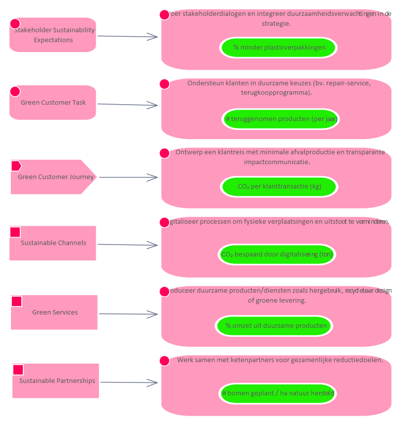

# Metric # bomen geplant / ha natuur hersteld

**Type:** Requirement  **Stereotype:** Metric  **StereotypeEx:** Metric  **FQStereotype:** EDGY::Metric  
**Status:** Proposed<button class="ea-status-edit-btn" type="button" aria-label="Edit status">&#9998;</button>  
**Created:** 2025-12-03  **Modified:** 2025-12-03

[Home](../index.md) / [Edgy](../Edgy/index.md) / [Metrics](index.md)

## Tagged Values

| Name | Value | Notes |
|------|-------|-------|
| EDGY::MetricStatus | Good | Default: Good  |
| EDGY::MetricValue | <VALUE> | Default: <VALUE>  |

[↑ Back to top](#)

## Relationships

| Type | Stereotype | Connected To |
|------|------------|-------------|
| ControlFlow | Flow | [ESRS E4 Biodiversity and Ecosystems](../ESRS E4/ESRS E4 Biodiversity and Ecosystems.md) |
| Association | Link | [Werk samen met ketenpartners voor gezamenlijke reductiedoelen.](../Task/Werk samen met ketenpartners voor gezamenlijke reductiedoelen..md) |

[↑ Back to top](#)

### Appears on Diagrams

  <a href="../Experience/diagrams/Experience.html" class="diagram-thumb">Experience</a>
  <a href="diagrams/Metrics.html" class="diagram-thumb">Metrics</a>

[↑ Back to top](#)

### Referenced By

| Type | Stereotype | Source |
|------|------------|--------|
| ControlFlow | Flow | [ESRS E4 Biodiversity and Ecosystems](../ESRS E4/ESRS E4 Biodiversity and Ecosystems.md) |
| Association | Link | [Werk samen met ketenpartners voor gezamenlijke reductiedoelen.](../Task/Werk samen met ketenpartners voor gezamenlijke reductiedoelen..md) |

[↑ Back to top](#)

---

## Relationship Graph

{"nodes":[{"id":"e39","label":"ESRS E4 Biodiversity an…","fullName":"ESRS E4 Biodiversity and Ecosystems","packageName":"ESRS E4","layer":"edgy-id","isFocal":false,"hasUrl":true,"url":"../ESRS E4/ESRS E4 Biodiversity and Ecosystems.html"},{"id":"e158","label":"Werk samen met ketenpar…","fullName":"Werk samen met ketenpartners voor gezamenlijke reductiedoelen.","packageName":"Task","layer":"edgy-ex","isFocal":false,"hasUrl":true,"url":"../Task/Werk samen met ketenpartners voor gezamenlijke reductiedoelen..html"},{"id":"e184","label":"# bomen geplant / ha na…","fullName":"# bomen geplant / ha natuur hersteld","packageName":"Metrics","layer":"edgy-lb","isFocal":true,"hasUrl":false,"url":""},{"id":"e120","label":"Herstelde natuur (ha)","fullName":"Herstelde natuur (ha)","packageName":"Metrics","layer":"edgy-lb","isFocal":false,"hasUrl":true,"url":"Herstelde natuur (ha).html"},{"id":"e185","label":"# SDGs met meetbare KPI…","fullName":"# SDGs met meetbare KPI’s","packageName":"Metrics","layer":"edgy-lb","isFocal":false,"hasUrl":true,"url":"_ SDGs met meetbare KPI’s.html"},{"id":"e510","label":"Company subject to CSRD","fullName":"Company subject to CSRD","packageName":"People","layer":"edgy-pe","isFocal":false,"hasUrl":true,"url":"../People/Company subject to CSRD.html"},{"id":"e341","label":"ESRS E4 - Biodiversity","fullName":"ESRS E4 - Biodiversity","packageName":"ESRS Navigator Stakeholder Map","layer":"business","isFocal":false,"hasUrl":true,"url":"../ESRS Navigator Stakeholder Map/ESRS E4 - Biodiversity.html"},{"id":"e531","label":"European Commission","fullName":"European Commission","packageName":"People","layer":"edgy-pe","isFocal":false,"hasUrl":true,"url":"../People/European Commission.html"},{"id":"e555","label":"European Sustainability…","fullName":"European Sustainability Reporting Standards","packageName":"European Sustainability Reporting Standards","layer":"edgy-id","isFocal":false,"hasUrl":true,"url":"../European Sustainability Reporting Standards/European Sustainability Reporting Standards.html"},{"id":"e137","label":"Sustainable Partnerships","fullName":"Sustainable Partnerships","packageName":"Channel","layer":"edgy-ex","isFocal":false,"hasUrl":true,"url":"../Channel/Sustainable Partnerships.html"}],"edges":[{"id":"c20","source":"e39","target":"e120","label":"ControlFlow","sourceLayer":"edgy-id"},{"id":"c109","source":"e39","target":"e184","label":"ControlFlow","sourceLayer":"edgy-id"},{"id":"c110","source":"e39","target":"e185","label":"ControlFlow","sourceLayer":"edgy-id"},{"id":"c559","source":"e510","target":"e39","label":"reports according to","sourceLayer":"edgy-pe"},{"id":"c569","source":"e341","target":"e39","label":"Abstraction","sourceLayer":"business"},{"id":"c589","source":"e531","target":"e39","label":"Association","sourceLayer":"edgy-pe"},{"id":"c602","source":"e555","target":"e39","label":"Aggregation","sourceLayer":"edgy-id"},{"id":"c42","source":"e137","target":"e158","label":"ControlFlow","sourceLayer":"edgy-ex"},{"id":"c143","source":"e158","target":"e184","label":"Association","sourceLayer":"edgy-ex"}]}

---

*Generated: 2026-07-01 11:29:53*