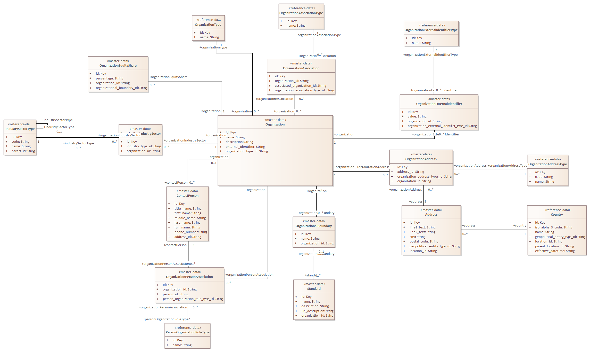

# master-data Address

**Type:** Class  **Stereotype:** master-data  **StereotypeEx:** master-data  **FQStereotype:** master-data  **Status:** Not Set  
**Created:** 2026-02-27  **Modified:** 2026-05-20

[Home](../index.md) / [Data Layer](../Data Layer/index.md) / [Open Footprint Data Model LDM](../Open Footprint Data Model LDM/index.md) / [Organisation](index.md)

<button id="ea-notes-edit-btn" class="ea-notes-edit-btn" type="button" aria-label="Edit notes">&#9998;</button>

<!--ea-notes-start-->

Address captures the postal or physical address associated with a contact person, facility, or organisational unit. A structured address representation is preferred over a free-text field because it enables geographic analysis, regulatory jurisdiction mapping, and integration with postal validation services. The Address entity is deliberately kept simple, covering the most commonly required address components, and is linked to a Location entity that provides ISO country coding. A single contact or organisation may have multiple address records representing, for example, registered, trading, and correspondence addresses.

<!--ea-notes-end-->

## Attributes

| Name | Type | Default | Description |
|------|------|---------|-------------|
| id | Key |  | The unique system-assigned identifier for the Address record. It serves as the primary key referenced by ContactPerson and other entities that require a postal or physical address. It must be unique across all address records in the system and must not be reused after deletion. |
| line1_text | String |  | The first line of the street address, typically containing the building number and street name, or a named building. This is the primary navigational element of the address and is required for postal delivery purposes. It is rendered as the first address line in formatted address displays and on correspondence. |
| line2_text | String |  | The second line of the address, used for suite numbers, floor designations, care-of information, or other supplementary addressing details that do not fit on the first line. This field is optional and should be left blank when not required rather than populated with placeholder text. |
| city | String |  | The city, town, or locality component of the address. It is used in geographic aggregations, jurisdiction mapping, and together with postal_code provides sufficient information to uniquely identify the delivery locality in most postal systems. |
| postal_code | String |  | The postal or ZIP code associated with the address. The format varies by country and is validated against country-specific rules where possible. It is used for geographic analysis, logistics routing, and regulatory jurisdiction determination. |
| geopolitical_entity_type_id | String |  | A foreign key referencing the GeopoliticalEntityType that classifies the geographic entity in which this address resides. This supports geographic analysis and regulatory jurisdiction mapping for emission reporting purposes. |
| location_id | String |  | A foreign key identifying the Country or Location entity associated with this address. This attribute links the address to the standardised geographic reference hierarchy and enables alignment with country-level emission factor datasets and regulatory jurisdiction rules. |

[↑ Back to top](#)

## Tagged Values

| Name | Value | Notes |
|------|-------|-------|
| description | Address captures the postal or physical address associated with a contact person, facility, or organisational unit. |  |

[↑ Back to top](#)

## Relationships

| Type | Stereotype | Connected To |
|------|------------|-------------|
| Association |  | [Country](Country.md) |
| Association |  | [OrganizationAddress](OrganizationAddress.md) |

[↑ Back to top](#)

### Appears on Diagrams

  <a href="diagrams/Organisation.html" class="diagram-thumb">Organisation</a>

[↑ Back to top](#)

### Referenced By

| Type | Stereotype | Source |
|------|------------|--------|
| Association |  | [Country](Country.md) |

[↑ Back to top](#)

---

## Relationship Graph

{"nodes":[{"id":"e745","label":"Country","fullName":"Country","packageName":"Organisation","layer":"uml","isFocal":false,"hasUrl":true,"url":"Country.html"},{"id":"e743","label":"OrganizationAddress","fullName":"OrganizationAddress","packageName":"Organisation","layer":"uml","isFocal":false,"hasUrl":true,"url":"OrganizationAddress.html"},{"id":"e737","label":"Address","fullName":"Address","packageName":"Organisation","layer":"uml","isFocal":true,"hasUrl":false,"url":""},{"id":"e766","label":"GeopoliticalEntity","fullName":"GeopoliticalEntity","packageName":"Facilities","layer":"uml","isFocal":false,"hasUrl":true,"url":"../Facilities/GeopoliticalEntity.html"},{"id":"e744","label":"OrganizationAddressType","fullName":"OrganizationAddressType","packageName":"Organisation","layer":"uml","isFocal":false,"hasUrl":true,"url":"OrganizationAddressType.html"},{"id":"e735","label":"Organization","fullName":"Organization","packageName":"Organisation","layer":"uml","isFocal":false,"hasUrl":true,"url":"Organization.html"}],"edges":[{"id":"c893","source":"e745","target":"e766","label":"Association","sourceLayer":"uml"},{"id":"c909","source":"e745","target":"e737","label":"Association","sourceLayer":"uml"},{"id":"c910","source":"e744","target":"e743","label":"Association","sourceLayer":"uml"},{"id":"c911","source":"e737","target":"e743","label":"Association","sourceLayer":"uml"},{"id":"c912","source":"e735","target":"e743","label":"Association","sourceLayer":"uml"},{"id":"c884","source":"e766","target":"e766","label":"Association","sourceLayer":"uml"}]}

---

*Generated: 2026-07-01 10:25:44*