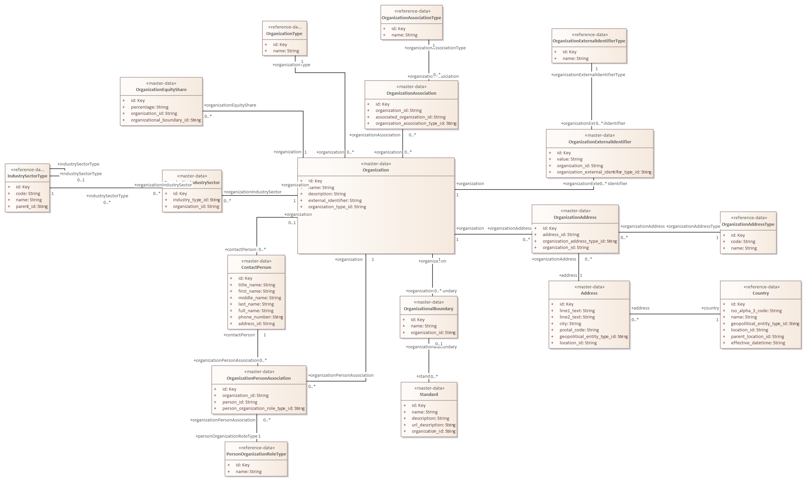

# master-data OrganizationalBoundary

**Type:** Class  **Stereotype:** master-data  **StereotypeEx:** master-data  **FQStereotype:** master-data  
**Status:** Not Set<button class="ea-status-edit-btn" type="button" aria-label="Edit status">&#9998;</button>  
**Created:** 2026-02-27  **Modified:** 2026-05-20

[Home](../index.html) / [Data Layer](../Data Layer/index.html) / [Open Footprint Data Model LDM](../Open Footprint Data Model LDM/index.html) / [Organisation](index.html)

<button id="ea-notes-edit-btn" class="ea-notes-edit-btn" type="button" aria-label="Edit notes">&#9998;</button>

<!--ea-notes-start-->

OrganizationalBoundary defines the scope boundary used to determine which emission sources are included in an organisation's GHG inventory. The GHG Protocol specifies three common approaches: equity share, financial control, and operational control. A boundary record links a named boundary definition to the organisation it applies to, enabling an organisation to maintain multiple concurrent boundary definitions for different reporting frameworks or stakeholder requirements. The boundary concept is foundational to GHG accounting because it determines which emission activities are attributed to the reporting organisation.

<!--ea-notes-end-->

## Attributes

<table>
<thead><tr><th>Name</th><th>Type</th><th>Default</th><th>Description</th></tr></thead>
<tbody>
<tr><td>id</td><td>Key</td><td></td><td><!--ea-row-notes-start:attr-0-->
The unique system-assigned identifier for the OrganizationalBoundary record. It is the primary key referenced by EmissionActivity to associate each activity with the boundary under which it is reported. It must be unique and stable across changes to the boundary's name or associated organisation.
<!--ea-row-notes-end:attr-0--><button class="ea-row-notes-edit-btn" type="button" data-surface="table-row" data-row-id="attr-0" data-notes-hash="fc05b271" data-kind="attribute" data-el-id="740" data-attr-name="id" data-attr-type="Key" data-file-path="Organisation/OrganizationalBoundary.md" data-api-port="8001" data-api-token="28ba5ca38017843d31ceee1f4b6fb60f5b087780a7c0e6dc" aria-label="Edit description">&#9998;</button></td></tr>
<tr class="ea-row-edit" data-row-id="attr-0" style="display:none"><td colspan="4"></td></tr>
<tr><td>name</td><td>String</td><td></td><td><!--ea-row-notes-start:attr-1-->
The descriptive name of the organisational boundary approach, such as "Operational Control", "Financial Control", or "Equity Share 50%". The name conveys the boundary-setting methodology applied and is displayed in inventory reports and disclosure documents to indicate the scope of the reported emissions data.
<!--ea-row-notes-end:attr-1--><button class="ea-row-notes-edit-btn" type="button" data-surface="table-row" data-row-id="attr-1" data-notes-hash="858ac922" data-kind="attribute" data-el-id="740" data-attr-name="name" data-attr-type="String" data-file-path="Organisation/OrganizationalBoundary.md" data-api-port="8001" data-api-token="28ba5ca38017843d31ceee1f4b6fb60f5b087780a7c0e6dc" aria-label="Edit description">&#9998;</button></td></tr>
<tr class="ea-row-edit" data-row-id="attr-1" style="display:none"><td colspan="4"></td></tr>
<tr><td>organization_id</td><td>String</td><td></td><td><!--ea-row-notes-start:attr-2-->
A foreign key identifying the Organisation for which this boundary is defined. An organisation may have multiple boundary records reflecting different consolidation approaches or different reporting frameworks, all linked through this attribute.
<!--ea-row-notes-end:attr-2--><button class="ea-row-notes-edit-btn" type="button" data-surface="table-row" data-row-id="attr-2" data-notes-hash="3e70cee2" data-kind="attribute" data-el-id="740" data-attr-name="organization_id" data-attr-type="String" data-file-path="Organisation/OrganizationalBoundary.md" data-api-port="8001" data-api-token="28ba5ca38017843d31ceee1f4b6fb60f5b087780a7c0e6dc" aria-label="Edit description">&#9998;</button></td></tr>
<tr class="ea-row-edit" data-row-id="attr-2" style="display:none"><td colspan="4"></td></tr>
</tbody>
</table>

[↑ Back to top](#)

## Tagged Values

<table>
<thead><tr><th>Name</th><th>Value</th><th>Notes</th></tr></thead>
<tbody>
<tr><td>description</td><td>OrganizationalBoundary defines the scope boundary used to determine which emission sources are included in an organisation&#39;s GHG inventory.</td><td><!--ea-row-notes-start:tag-0--><!--ea-row-notes-end:tag-0--><button class="ea-row-notes-edit-btn" type="button" data-surface="table-row" data-row-id="tag-0" data-notes-hash="e3b0c442" data-kind="tagged-value" data-el-id="740" data-tag-name="description" data-tag-value="OrganizationalBoundary defines the scope boundary used to determine which emission sources are included in an organisation&#39;s GHG inventory." data-file-path="Organisation/OrganizationalBoundary.md" data-api-port="8001" data-api-token="28ba5ca38017843d31ceee1f4b6fb60f5b087780a7c0e6dc" aria-label="Edit description">&#9998;</button></td></tr>
<tr class="ea-row-edit" data-row-id="tag-0" style="display:none"><td colspan="3"></td></tr>
</tbody>
</table>

[↑ Back to top](#)

## Relationships

| Type | Stereotype | Connected To |
|------|------------|-------------|
| Association |  | [Standard](Standard.html) |
| Association |  | [Organization](Organization.html) |

[↑ Back to top](#)

### Appears on Diagrams

  <a href="diagrams/Organisation.html" class="diagram-thumb">Organisation</a>

[↑ Back to top](#)

### Referenced By

| Type | Stereotype | Source |
|------|------------|--------|
| Association |  | [Standard](Standard.html) |

[↑ Back to top](#)

---

## Relationship Graph

---

*Generated: 2026-07-17 16:59:36*