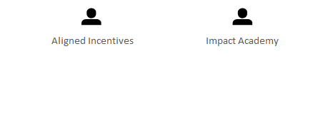

# Private Parties

[Home](../../index.html) / [Edgy](../../Edgy/index.html) / [Base](../../Base/index.html) / [People](../../People/index.html) / [Private Parties](../index.html)

<button id="ea-notes-edit-btn" class="ea-notes-edit-btn" type="button" aria-label="Edit description">&#9998;</button>
(derived)

<!--ea-notes-start-->

https://alignedincentives

<!--ea-notes-end-->

## Elements

- People [Aligned Incentives](../Aligned Incentives.html)
- People [Impact Academy](../Impact Academy.html)

---

*Generated: 2026-08-04 12:35:58*