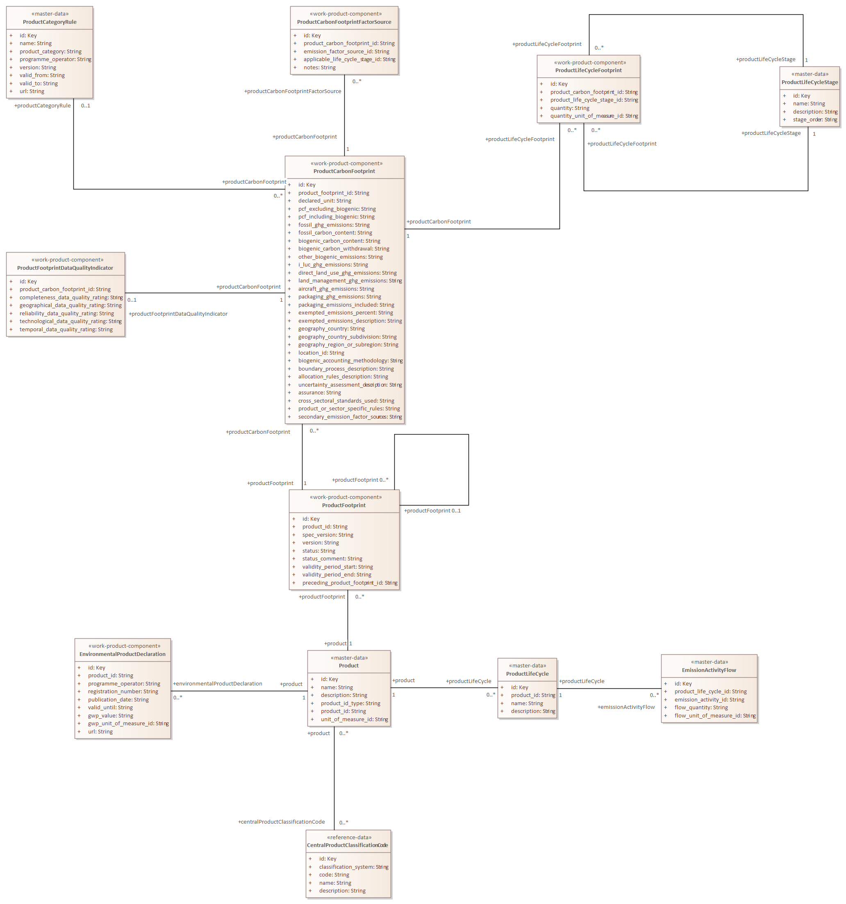

# work-product-component ProductCarbonFootprintFactorSource

**Type:** Class  **Stereotype:** work-product-component  **StereotypeEx:** work-product-component  **FQStereotype:** work-product-component  
**Status:** Not Set<button class="ea-status-edit-btn" type="button" aria-label="Edit status">&#9998;</button>  
**Created:** 2026-02-27  **Modified:** 2026-05-20

[Home](../index.html) / [Data Layer](../Data Layer/index.html) / [Open Footprint Data Model LDM](../Open Footprint Data Model LDM/index.html) / [Products](index.html)

<button id="ea-notes-edit-btn" class="ea-notes-edit-btn" type="button" aria-label="Edit notes">&#9998;</button>

<!--ea-notes-start-->

ProductCarbonFootprintFactorSource is an intersection entity that records which emission factor databases were used as secondary or background data sources in calculating a specific ProductCarbonFootprint. This entity provides the structured traceability required by the PACT technical specification secondary_emission_factor_sources field, capturing not just the database name but also the version and applicable life-cycle stage, enabling systematic data quality assessment by receivers.

<!--ea-notes-end-->

## Attributes

<table>
<thead><tr><th>Name</th><th>Type</th><th>Default</th><th>Description</th></tr></thead>
<tbody>
<tr><td>id</td><td>Key</td><td></td><td><!--ea-row-notes-start:attr-0-->
The unique identifier for this ProductCarbonFootprintFactorSource record, used to enumerate all background databases applied in a PCF calculation.
<!--ea-row-notes-end:attr-0--><button class="ea-row-notes-edit-btn" type="button" data-surface="table-row" data-row-id="attr-0" data-notes-hash="e86c9c5c" data-kind="attribute" data-el-id="818" data-attr-name="id" data-attr-type="Key" data-file-path="Products/ProductCarbonFootprintFactorSource.md" data-api-port="8001" data-api-token="0a090fdc614acadb47d274812862962392b5fdee6a3e1f83" aria-label="Edit description">&#9998;</button></td></tr>
<tr class="ea-row-edit" data-row-id="attr-0" style="display:none"><td colspan="4"></td></tr>
<tr><td>product_carbon_footprint_id</td><td>String</td><td></td><td><!--ea-row-notes-start:attr-1-->
Foreign key to the ProductCarbonFootprint for which this emission factor source was used, grouping all secondary database references under the relevant PCF.
<!--ea-row-notes-end:attr-1--><button class="ea-row-notes-edit-btn" type="button" data-surface="table-row" data-row-id="attr-1" data-notes-hash="0debe32f" data-kind="attribute" data-el-id="818" data-attr-name="product_carbon_footprint_id" data-attr-type="String" data-file-path="Products/ProductCarbonFootprintFactorSource.md" data-api-port="8001" data-api-token="0a090fdc614acadb47d274812862962392b5fdee6a3e1f83" aria-label="Edit description">&#9998;</button></td></tr>
<tr class="ea-row-edit" data-row-id="attr-1" style="display:none"><td colspan="4"></td></tr>
<tr><td>emission_factor_source_id</td><td>String</td><td></td><td><!--ea-row-notes-start:attr-2-->
Foreign key to the EmissionFactorSource record that identifies the secondary database, providing structured traceability to the source rather than a free-text citation.
<!--ea-row-notes-end:attr-2--><button class="ea-row-notes-edit-btn" type="button" data-surface="table-row" data-row-id="attr-2" data-notes-hash="70b65963" data-kind="attribute" data-el-id="818" data-attr-name="emission_factor_source_id" data-attr-type="String" data-file-path="Products/ProductCarbonFootprintFactorSource.md" data-api-port="8001" data-api-token="0a090fdc614acadb47d274812862962392b5fdee6a3e1f83" aria-label="Edit description">&#9998;</button></td></tr>
<tr class="ea-row-edit" data-row-id="attr-2" style="display:none"><td colspan="4"></td></tr>
<tr><td>applicable_life_cycle_stage_id</td><td>String</td><td></td><td><!--ea-row-notes-start:attr-3-->
Foreign key to the ProductLifeCycleStage to which this factor source was applied, enabling stage-level data quality assessment when multiple databases were used for different stages.
<!--ea-row-notes-end:attr-3--><button class="ea-row-notes-edit-btn" type="button" data-surface="table-row" data-row-id="attr-3" data-notes-hash="0b0f663c" data-kind="attribute" data-el-id="818" data-attr-name="applicable_life_cycle_stage_id" data-attr-type="String" data-file-path="Products/ProductCarbonFootprintFactorSource.md" data-api-port="8001" data-api-token="0a090fdc614acadb47d274812862962392b5fdee6a3e1f83" aria-label="Edit description">&#9998;</button></td></tr>
<tr class="ea-row-edit" data-row-id="attr-3" style="display:none"><td colspan="4"></td></tr>
<tr><td>notes</td><td>String</td><td></td><td><!--ea-row-notes-start:attr-4-->
Free-text notes describing how this source was applied, including any version adjustments or geographic mapping decisions made when using the database for this specific product.
<!--ea-row-notes-end:attr-4--><button class="ea-row-notes-edit-btn" type="button" data-surface="table-row" data-row-id="attr-4" data-notes-hash="a388aba2" data-kind="attribute" data-el-id="818" data-attr-name="notes" data-attr-type="String" data-file-path="Products/ProductCarbonFootprintFactorSource.md" data-api-port="8001" data-api-token="0a090fdc614acadb47d274812862962392b5fdee6a3e1f83" aria-label="Edit description">&#9998;</button></td></tr>
<tr class="ea-row-edit" data-row-id="attr-4" style="display:none"><td colspan="4"></td></tr>
</tbody>
</table>

<h2 id="tagged-values">Tagged Values</h2>

<table>
<thead><tr><th>Name</th><th>Value</th><th>Notes</th></tr></thead>
<tbody>
<tr><td>description</td><td>ProductCarbonFootprintFactorSource is an intersection entity that records which emission factor databases were used as secondary or background data sources in calculating a specific ProductCarbonFootprint.</td><td><!--ea-row-notes-start:tag-0--><!--ea-row-notes-end:tag-0--><button class="ea-row-notes-edit-btn" type="button" data-surface="table-row" data-row-id="tag-0" data-notes-hash="e3b0c442" data-kind="tagged-value" data-el-id="818" data-tag-name="description" data-tag-value="ProductCarbonFootprintFactorSource is an intersection entity that records which emission factor databases were used as secondary or background data sources in calculating a specific ProductCarbonFootprint." data-file-path="Products/ProductCarbonFootprintFactorSource.md" data-api-port="8001" data-api-token="0a090fdc614acadb47d274812862962392b5fdee6a3e1f83" aria-label="Edit description">&#9998;</button></td></tr>
<tr class="ea-row-edit" data-row-id="tag-0" style="display:none"><td colspan="3"></td></tr>
</tbody>
</table>

<h2 id="relationships">Relationships</h2>

| Type | Stereotype | Connected To |
|------|------------|-------------|
| Association |  | [ProductCarbonFootprint](ProductCarbonFootprint.html) |
| Association |  | [EmissionFactorSource](../Emissions/EmissionFactorSource.html) |

## Appears on Diagrams

  <a href="diagrams/Products.html" class="diagram-thumb">Products</a>

<h2 id="referenced-by">Referenced By</h2>

| Type | Stereotype | Source |
|------|------------|--------|
| Association |  | [ProductCarbonFootprint](ProductCarbonFootprint.html) |
| Association |  | [EmissionFactorSource](../Emissions/EmissionFactorSource.html) |

---

## Relationship Graph

<!-- ea-element-template:v3 -->
