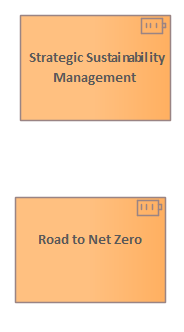

# 🗺️ Reference Documents

[Home](../../index.html) / [Archimate](../../Archimate/index.html) / [Reference Material](../../Reference Material/index.html) / [Reference Documents](../index.html)

<button id="ea-notes-edit-btn" class="ea-notes-edit-btn" type="button" aria-label="Edit description">&#9998;</button>
(derived)

<!--ea-notes-start-->

A Practical Approach for Companies Using the SDGs as a Framework, Bodenstein Robert, Herget Josef

This book provides a practical guide to implementing sustainability strategies within companies

<!--ea-notes-end-->

## Elements

- Resource [Road to Net Zero](../Road to Net Zero.html)
- Resource [Strategic Sustainability Management](../Strategic Sustainability Management.html)
