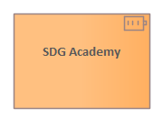

# Reference Websites

[Home](../../index.md) / [Archimate](../../Archimate/index.md) / [Reference Material](../../Reference Material/index.md) / [Reference Websites](../index.md)

<button id="ea-notes-edit-btn" class="ea-notes-edit-btn" type="button" aria-label="Edit description">&#9998;</button>
(derived)

<!--ea-notes-start-->

SDG Academy provides a number of applicable resources and provides free training material, see https://sdgacademy

<!--ea-notes-end-->

## Elements

- Resource [SDG Academy](../SDG Academy.md)

---

*Generated: 2026-07-06 21:15:44*