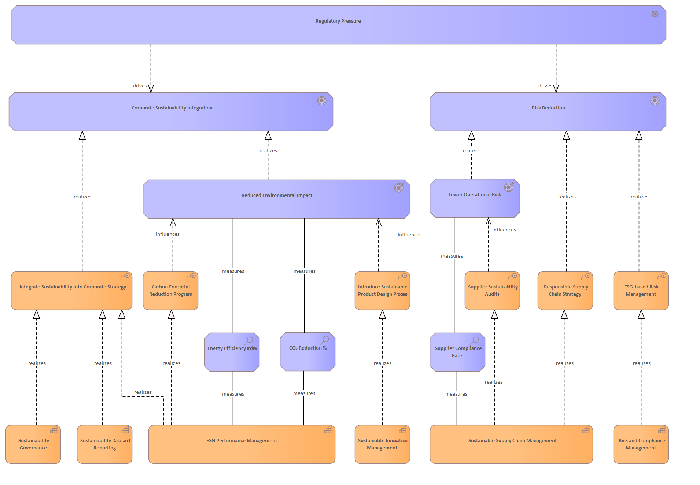

# Regulatory Pressure

[Home](../../index.md) / [Archimate](../../Archimate/index.md) / [Strategic Sustainability Management Model (Bodenstein)](../../Strategic Sustainability Management Model (Bodenstein)/index.md) / [Regulatory Pressure](../index.md)

**Derived Description:** External pressure from government regulations, environmental laws, and mandatory sustainability reporting requirements (e

## Elements

- COA [Carbon Footprint Reduction Program](../../Courses of Action/Carbon Footprint Reduction Program.md)
- AS [CO₂ Reduction %](../../Assessments/CO₂ Reduction %.md)
- GL [Corporate Sustainability Integration](../../Goals/Corporate Sustainability Integration.md)
- AS [Energy Efficiency Index](../../Assessments/Energy Efficiency Index.md)
- CAP [ESG Performance Management](../../Capabilities/ESG Performance Management.md)
- COA [ESG-based Risk Management](../../Courses of Action/ESG-based Risk Management.md)
- COA [Integrate Sustainability into Corporate Strategy](../../Courses of Action/Integrate Sustainability into Corporate Strategy.md)
- COA [Introduce Sustainable Product Design Process](../../Courses of Action/Introduce Sustainable Product Design Process.md)
- OC [Lower Operational Risk](../../Outcomes/Lower Operational Risk.md)
- OC [Reduced Environmental Impact](../../Outcomes/Reduced Environmental Impact.md)
- DR [Regulatory Pressure](../../Drivers/Regulatory Pressure.md)
- COA [Responsible Supply Chain Strategy](../../Courses of Action/Responsible Supply Chain Strategy.md)
- CAP [Risk and Compliance Management](../../Capabilities/Risk and Compliance Management.md)
- GL [Risk Reduction](../../Goals/Risk Reduction.md)
- AS [Supplier Compliance Rate](../../Assessments/Supplier Compliance Rate.md)
- COA [Supplier Sustainability Audits](../../Courses of Action/Supplier Sustainability Audits.md)
- CAP [Sustainability Data and Reporting](../../Capabilities/Sustainability Data and Reporting.md)
- CAP [Sustainability Governance](../../Capabilities/Sustainability Governance.md)
- CAP [Sustainable Innovation Management](../../Capabilities/Sustainable Innovation Management.md)
- CAP [Sustainable Supply Chain Management](../../Capabilities/Sustainable Supply Chain Management.md)

---

*Generated: 2026-06-26 13:25:51*