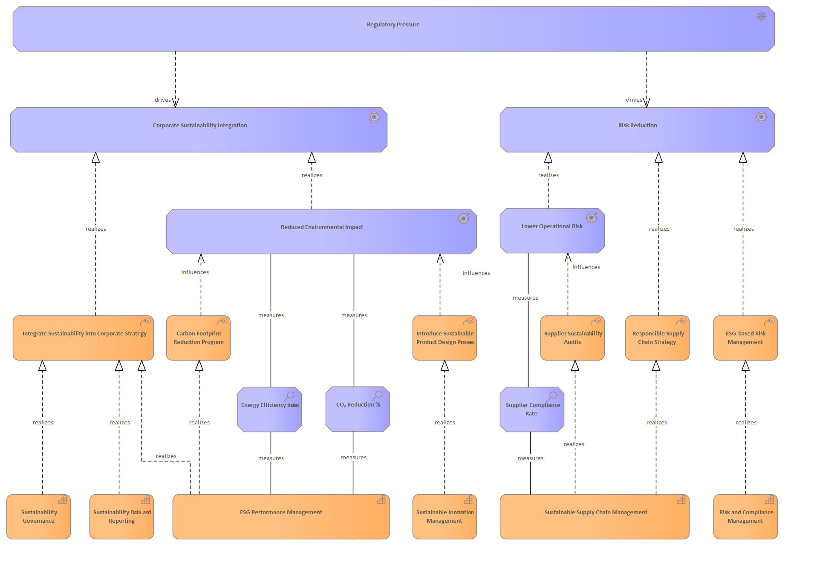

# Regulatory Pressure

[Home](../../index.html) / [Archimate](../../Archimate/index.html) / [Strategic Sustainability Management Model (Bodenstein)](../../Strategic Sustainability Management Model (Bodenstein)/index.html) / [Regulatory Pressure](../index.html)

<button id="ea-notes-edit-btn" class="ea-notes-edit-btn" type="button" aria-label="Edit description">&#9998;</button>

<!--ea-notes-start-->

This logical diagram illustrates the strategic approach to managing regulatory pressure and reducing environmental, social, and governance risks. It outlines the key objectives, actions, and outcomes related to corporate sustainability integration, supply chain management, and risk management, ultimately aiming to achieve a reduced environmental impact and improved sustainability performance. The diagram provides a comprehensive framework for addressing regulatory pressures and promoting sustainable business practices.

<!--ea-notes-end-->

## Elements

- CourseOfAction [Carbon Footprint Reduction Program](../../Courses of Action/Carbon Footprint Reduction Program.html)
- Assessment [CO₂ Reduction %](../../Assessments/CO₂ Reduction %.html)
- Goal [Corporate Sustainability Integration](../../Goals/Corporate Sustainability Integration.html)
- Assessment [Energy Efficiency Index](../../Assessments/Energy Efficiency Index.html)
- Capability [ESG Performance Management](../../Capabilities/ESG Performance Management.html)
- CourseOfAction [ESG-based Risk Management](../../Courses of Action/ESG-based Risk Management.html)
- CourseOfAction [Integrate Sustainability into Corporate Strategy](../../Courses of Action/Integrate Sustainability into Corporate Strategy.html)
- CourseOfAction [Introduce Sustainable Product Design Process](../../Courses of Action/Introduce Sustainable Product Design Process.html)
- Outcome [Lower Operational Risk](../../Outcomes/Lower Operational Risk.html)
- Outcome [Reduced Environmental Impact](../../Outcomes/Reduced Environmental Impact.html)
- Driver [Regulatory Pressure](../../Drivers/Regulatory Pressure.html)
- CourseOfAction [Responsible Supply Chain Strategy](../../Courses of Action/Responsible Supply Chain Strategy.html)
- Capability [Risk and Compliance Management](../../Capabilities/Risk and Compliance Management.html)
- Goal [Risk Reduction](../../Goals/Risk Reduction.html)
- Assessment [Supplier Compliance Rate](../../Assessments/Supplier Compliance Rate.html)
- CourseOfAction [Supplier Sustainability Audits](../../Courses of Action/Supplier Sustainability Audits.html)
- Capability [Sustainability Data and Reporting](../../Capabilities/Sustainability Data and Reporting.html)
- Capability [Sustainability Governance](../../Capabilities/Sustainability Governance.html)
- Capability [Sustainable Innovation Management](../../Capabilities/Sustainable Innovation Management.html)
- Capability [Sustainable Supply Chain Management](../../Capabilities/Sustainable Supply Chain Management.html)
