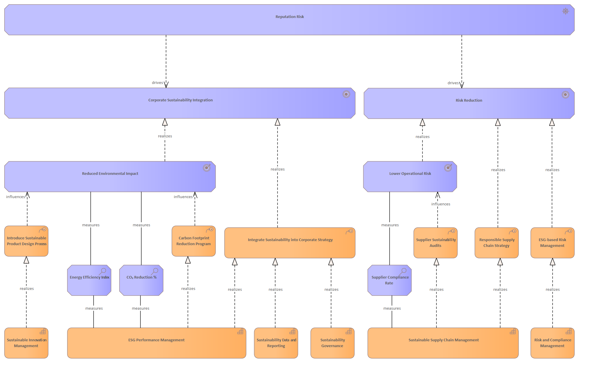

# Reputation Risk

[Home](../../index.md) / [Archimate](../../Archimate/index.md) / [Strategic Sustainability Management Model (Bodenstein)](../../Strategic Sustainability Management Model (Bodenstein)/index.md) / [Reputation Risk](../index.md)

**Derived Description:** Risk to corporate reputation from poor environmental or social performance, greenwashing accusations, or supply chain controversies

## Elements

- CourseOfAction [Carbon Footprint Reduction Program](../../Courses of Action/Carbon Footprint Reduction Program.md)
- Assessment [CO₂ Reduction %](../../Assessments/CO₂ Reduction %.md)
- Goal [Corporate Sustainability Integration](../../Goals/Corporate Sustainability Integration.md)
- Assessment [Energy Efficiency Index](../../Assessments/Energy Efficiency Index.md)
- Capability [ESG Performance Management](../../Capabilities/ESG Performance Management.md)
- CourseOfAction [ESG-based Risk Management](../../Courses of Action/ESG-based Risk Management.md)
- CourseOfAction [Integrate Sustainability into Corporate Strategy](../../Courses of Action/Integrate Sustainability into Corporate Strategy.md)
- CourseOfAction [Introduce Sustainable Product Design Process](../../Courses of Action/Introduce Sustainable Product Design Process.md)
- Outcome [Lower Operational Risk](../../Outcomes/Lower Operational Risk.md)
- Outcome [Reduced Environmental Impact](../../Outcomes/Reduced Environmental Impact.md)
- Driver [Reputation Risk](../../Drivers/Reputation Risk.md)
- CourseOfAction [Responsible Supply Chain Strategy](../../Courses of Action/Responsible Supply Chain Strategy.md)
- Capability [Risk and Compliance Management](../../Capabilities/Risk and Compliance Management.md)
- Goal [Risk Reduction](../../Goals/Risk Reduction.md)
- Assessment [Supplier Compliance Rate](../../Assessments/Supplier Compliance Rate.md)
- CourseOfAction [Supplier Sustainability Audits](../../Courses of Action/Supplier Sustainability Audits.md)
- Capability [Sustainability Data and Reporting](../../Capabilities/Sustainability Data and Reporting.md)
- Capability [Sustainability Governance](../../Capabilities/Sustainability Governance.md)
- Capability [Sustainable Innovation Management](../../Capabilities/Sustainable Innovation Management.md)
- Capability [Sustainable Supply Chain Management](../../Capabilities/Sustainable Supply Chain Management.md)

---

*Generated: 2026-06-26 15:09:38*