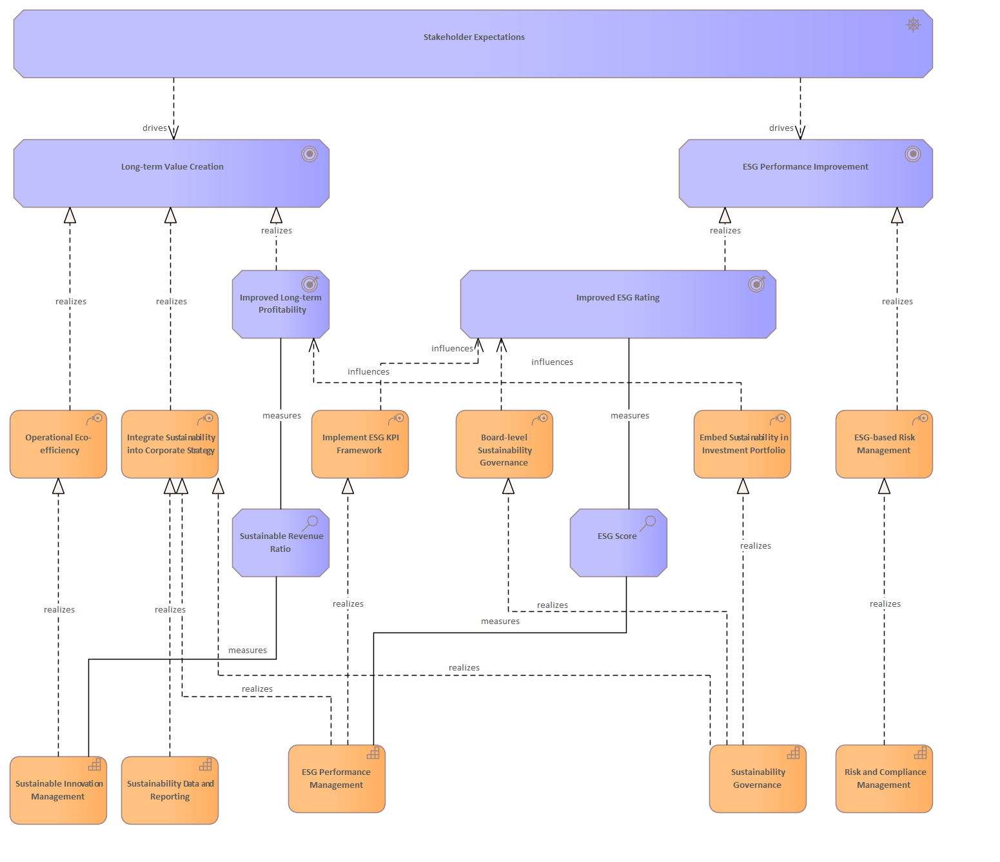

# Stakeholder Expectations

[Archimate](../../Archimate/index.md) / [Strategic Sustainability Management Model (Bodenstein)](../../Strategic Sustainability Management Model (Bodenstein)/index.md) / [Stakeholder Expectations](../index.md)

**Description:** 

## Elements

- [Board-level Sustainability Governance](../../Courses of Action/Board-level Sustainability Governance.md)
- [Embed Sustainability in Investment Portfolio](../../Courses of Action/Embed Sustainability in Investment Portfolio.md)
- [ESG Performance Improvement](../../Goals/ESG Performance Improvement.md)
- [ESG Performance Management](../../Capabilities/ESG Performance Management.md)
- [ESG Score](../../Assessments/ESG Score.md)
- [ESG-based Risk Management](../../Courses of Action/ESG-based Risk Management.md)
- [Implement ESG KPI Framework](../../Courses of Action/Implement ESG KPI Framework.md)
- [Improved ESG Rating](../../Outcomes/Improved ESG Rating.md)
- [Improved Long-term Profitability](../../Outcomes/Improved Long-term Profitability.md)
- [Integrate Sustainability into Corporate Strategy](../../Courses of Action/Integrate Sustainability into Corporate Strategy.md)
- [Long-term Value Creation](../../Goals/Long-term Value Creation.md)
- [Operational Eco-efficiency](../../Courses of Action/Operational Eco-efficiency.md)
- [Risk and Compliance Management](../../Capabilities/Risk and Compliance Management.md)
- [Stakeholder Expectations](../../Drivers/Stakeholder Expectations.md)
- [Sustainability Data and Reporting](../../Capabilities/Sustainability Data and Reporting.md)
- [Sustainability Governance](../../Capabilities/Sustainability Governance.md)
- [Sustainable Innovation Management](../../Capabilities/Sustainable Innovation Management.md)
- [Sustainable Revenue Ratio](../../Assessments/Sustainable Revenue Ratio.md)

---

*Generated: 2026-06-22 22:09:07*