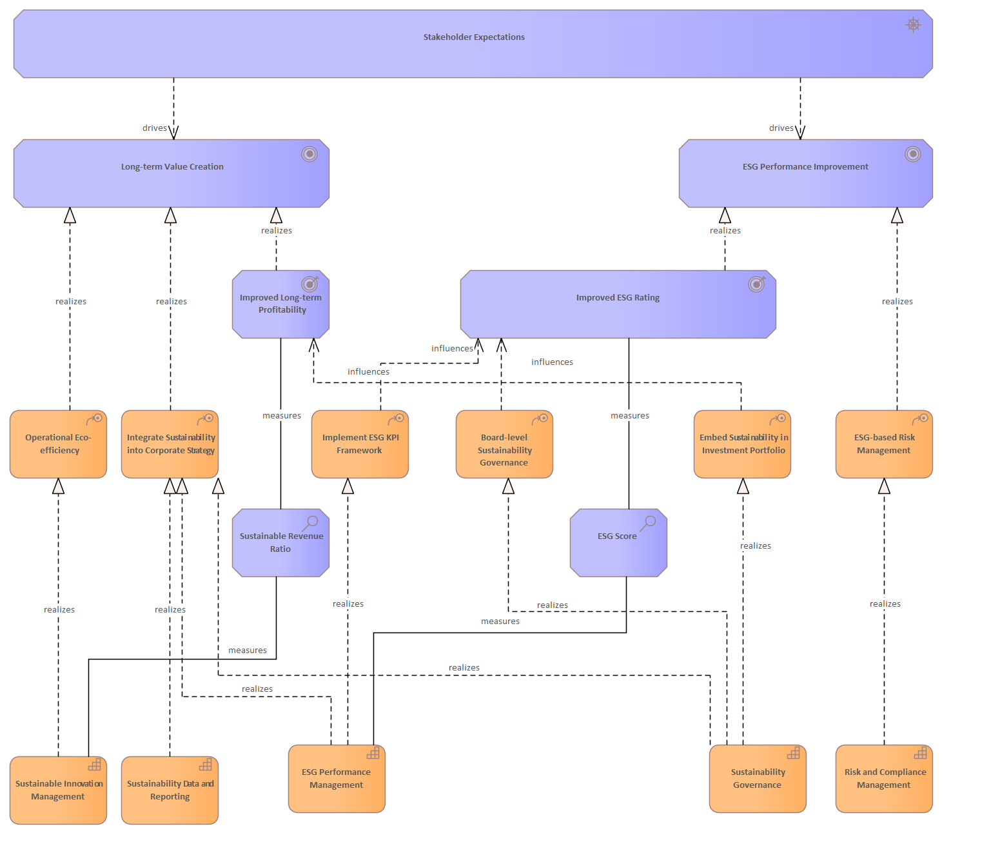

# Stakeholder Expectations

[Home](../../index.html) / [Archimate](../../Archimate/index.html) / [Strategic Sustainability Management Model (Bodenstein)](../../Strategic Sustainability Management Model (Bodenstein)/index.html) / [Stakeholder Expectations](../index.html)

<button id="ea-notes-edit-btn" class="ea-notes-edit-btn" type="button" aria-label="Edit description">&#9998;</button>
(derived)

<!--ea-notes-start-->

Growing expectations from investors, customers, employees, and civil society for transparent and responsible corporate behavior

<!--ea-notes-end-->

## Elements

- CourseOfAction [Board-level Sustainability Governance](../../Courses of Action/Board-level Sustainability Governance.html)
- CourseOfAction [Embed Sustainability in Investment Portfolio](../../Courses of Action/Embed Sustainability in Investment Portfolio.html)
- Goal [ESG Performance Improvement](../../Goals/ESG Performance Improvement.html)
- Capability [ESG Performance Management](../../Capabilities/ESG Performance Management.html)
- Assessment [ESG Score](../../Assessments/ESG Score.html)
- CourseOfAction [ESG-based Risk Management](../../Courses of Action/ESG-based Risk Management.html)
- CourseOfAction [Implement ESG KPI Framework](../../Courses of Action/Implement ESG KPI Framework.html)
- Outcome [Improved ESG Rating](../../Outcomes/Improved ESG Rating.html)
- Outcome [Improved Long-term Profitability](../../Outcomes/Improved Long-term Profitability.html)
- CourseOfAction [Integrate Sustainability into Corporate Strategy](../../Courses of Action/Integrate Sustainability into Corporate Strategy.html)
- Goal [Long-term Value Creation](../../Goals/Long-term Value Creation.html)
- CourseOfAction [Operational Eco-efficiency](../../Courses of Action/Operational Eco-efficiency.html)
- Capability [Risk and Compliance Management](../../Capabilities/Risk and Compliance Management.html)
- Driver [Stakeholder Expectations](../../Drivers/Stakeholder Expectations.html)
- Capability [Sustainability Data and Reporting](../../Capabilities/Sustainability Data and Reporting.html)
- Capability [Sustainability Governance](../../Capabilities/Sustainability Governance.html)
- Capability [Sustainable Innovation Management](../../Capabilities/Sustainable Innovation Management.html)
- Assessment [Sustainable Revenue Ratio](../../Assessments/Sustainable Revenue Ratio.html)

---

*Generated: 2026-07-16 12:12:31*