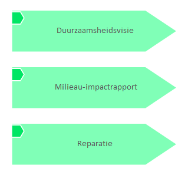

# Stories Voorbeelden

[Home](../../index.md) / [Edgy](../../Edgy/index.md) / [Stories](../index.md)

<button id="ea-notes-edit-btn" class="ea-notes-edit-btn" type="button" aria-label="Edit description">&#9998;</button>
(derived)

<!--ea-notes-start-->

Tijdens een personeelsbijeenkomst deelde de directeur een persoonlijk moment: zijn dochter had hem gevraagd: “Wat doen jullie eigenlijk voor de aarde?” Dat bleek de katalysator voor een ambitieuze duurzaamheidsvisie: klimaatneutraal in 2030 en volledig circulair in 2050

<!--ea-notes-end-->

## Elements

- Story [Duurzaamsheidsvisie](../Duurzaamsheidsvisie.md)
- Story [Milieau-impactrapport](../Milieau-impactrapport.md)
- Story [Reparatie](../Reparatie.md)

---

*Generated: 2026-07-01 12:05:21*