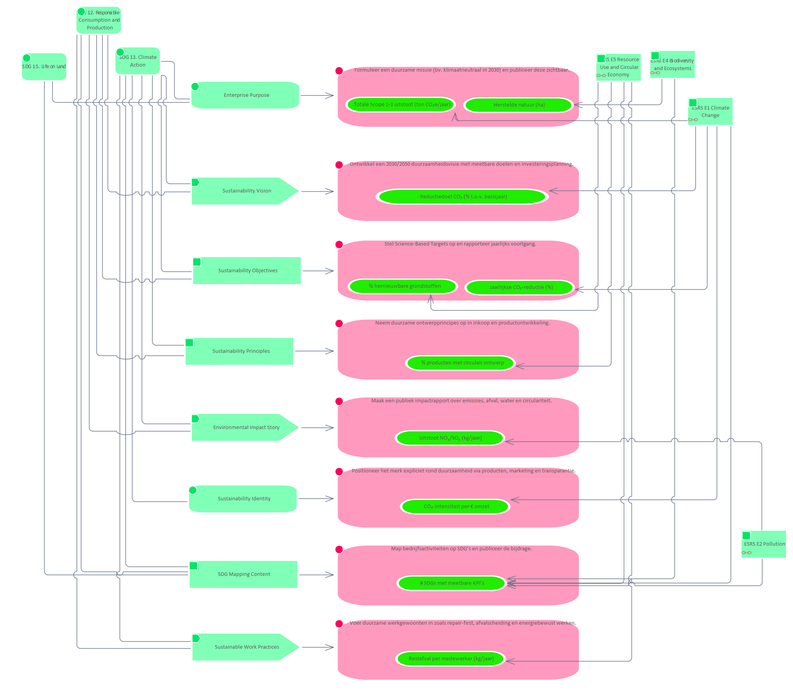

# Story Environmental Impact Story

**Type:** Interface  **Stereotype:** Story  **StereotypeEx:** Story  **FQStereotype:** EDGY::Story  
**Status:** Proposed<button class="ea-status-edit-btn" type="button" aria-label="Edit status">&#9998;</button>  
**Created:** 2025-12-02  **Modified:** 2025-12-15

[Home](../index.html) / [Edgy](../Edgy/index.html) / [Identity](../Identity/index.html) / [Story](index.html)

<button id="ea-notes-edit-btn" class="ea-notes-edit-btn" type="button" aria-label="Edit notes">&#9998;</button>

<!--ea-notes-start-->
Hoe het bedrijf haar milieu-impact begrijpt en communiceert.
<ul>
	<li>Seventh Generation – https://www.seventhgeneration.com – Verbindt merkverhaal aan klimaatbewustzijn.</li>
	<li>Ben &amp; Jerry’s – https://www.benjerry.com – Communiceert actief hun klimaatimpact en acties.</li>
</ul>
<!--ea-notes-end-->

## Tagged Values

<table>
<thead><tr><th>Name</th><th>Value</th><th>Notes</th></tr></thead>
<tbody>
<tr><td>EDGY::TextAlign</td><td>Center</td><td><!--ea-row-notes-start:tag-0-->
Default: Center
<!--ea-row-notes-end:tag-0--><button class="ea-row-notes-edit-btn" type="button" data-surface="table-row" data-row-id="tag-0" data-notes-hash="5cc00a1f" data-kind="tagged-value" data-el-id="122" data-tag-name="EDGY::TextAlign" data-tag-value="Center" data-file-path="Story/Environmental Impact Story.md" data-api-port="8001" data-api-token="d54ac7f4ba1b9561901225e0195c664d0fa006b906b25c92" aria-label="Edit description">&#9998;</button></td></tr>
<tr class="ea-row-edit" data-row-id="tag-0" style="display:none"><td colspan="3"></td></tr>
</tbody>
</table>

[↑ Back to top](#)

## Relationships

| Type | Stereotype | Connected To |
|------|------------|-------------|
| ControlFlow | Flow | [Maak een publiek impactrapport over emissies, afval, water en circulariteit.](../Task/Maak een publiek impactrapport over emissies, afval, water en circulariteit..html) |
| Association | Link | [SDG 12. Responsible Consumption and Production](../Sustainability Development Goals/SDG 12. Responsible Consumption and Production.html) |
| Association | Link | [SDG 13. Climate Action](../Sustainability Development Goals/SDG 13. Climate Action.html) |

[↑ Back to top](#)

### Appears on Diagrams

  <a href="../Mapping SDG to Main/diagrams/Mapping SDG to Main.html" class="diagram-thumb">Mapping SDG to Main</a>
  <a href="../Identity/diagrams/Identity.html" class="diagram-thumb">Identity</a>

[↑ Back to top](#)

### Referenced By

| Type | Stereotype | Source |
|------|------------|--------|
| Association | Link | [SDG 12. Responsible Consumption and Production](../Sustainability Development Goals/SDG 12. Responsible Consumption and Production.html) |
| Association | Link | [SDG 13. Climate Action](../Sustainability Development Goals/SDG 13. Climate Action.html) |

[↑ Back to top](#)

---

## Relationship Graph

---

*Generated: 2026-08-03 08:46:17*