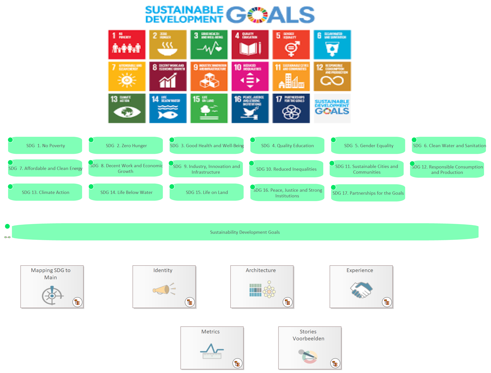

# Sustainability Development Goals

[Home](../../index.md) / [Edgy](../../Edgy/index.md) / [SDGs](../../SDGs/index.md) / [Sustainability Development Goals](../index.md)

**Derived Description:** End poverty in all its forms everywhere

## Elements

- Uncategorized 
- NavigationCell 
- NavigationCell 
- NavigationCell 
- NavigationCell 
- NavigationCell 
- NavigationCell 
- Purpose [SDG  1. No Poverty](../SDG  1. No Poverty.md)
- Purpose [SDG  2. Zero Hunger](../SDG  2. Zero Hunger.md)
- Purpose [SDG  3. Good Health and Well-Being](../SDG  3. Good Health and Well-Being.md)
- Purpose [SDG  4. Quality Education](../SDG  4. Quality Education.md)
- Purpose [SDG  5. Gender Equality](../SDG  5. Gender Equality.md)
- Purpose [SDG  6. Clean Water and Sanitation](../SDG  6. Clean Water and Sanitation.md)
- Purpose [SDG  7. Affordable and Clean Energy](../SDG  7. Affordable and Clean Energy.md)
- Purpose [SDG  8. Decent Work and Economic Growth](../SDG  8. Decent Work and Economic Growth.md)
- Purpose [SDG  9. Industry, Innovation and Infrastructure](../SDG  9. Industry, Innovation and Infrastructure.md)
- Purpose [SDG 10. Reduced Inequalities](../SDG 10. Reduced Inequalities.md)
- Purpose [SDG 11. Sustainable Cities and Communities](../SDG 11. Sustainable Cities and Communities.md)
- Purpose [SDG 12. Responsible Consumption and Production](../SDG 12. Responsible Consumption and Production.md)
- Purpose [SDG 13. Climate Action](../SDG 13. Climate Action.md)
- Purpose [SDG 14. Life Below Water](../SDG 14. Life Below Water.md)
- Purpose [SDG 15. Life on Land](../SDG 15. Life on Land.md)
- Purpose [SDG 16. Peace, Justice and Strong Institutions](../SDG 16. Peace, Justice and Strong Institutions.md)
- Purpose [SDG 17. Partnerships for the Goals](../SDG 17. Partnerships for the Goals.md)
- Purpose [Sustainability Development Goals](../Sustainability Development Goals.md)

---

*Generated: 2026-06-30 11:43:30*