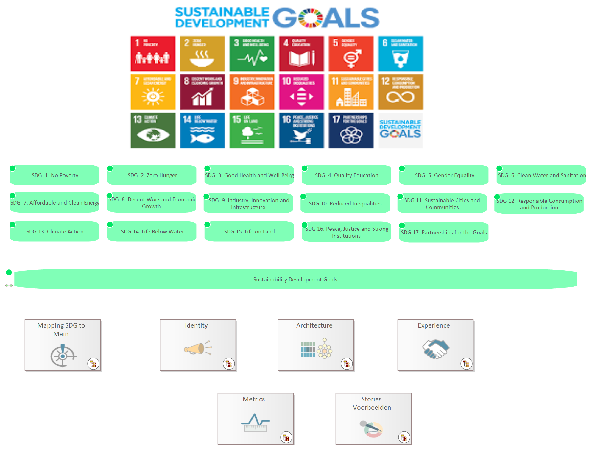

# Sustainability Development Goals

[Home](../../index.html) / [Edgy](../../Edgy/index.html) / [SDGs](../../SDGs/index.html) / [Sustainability Development Goals](../index.html)

<button id="ea-notes-edit-btn" class="ea-notes-edit-btn" type="button" aria-label="Edit description">&#9998;</button>
(derived)

<!--ea-notes-start-->

End poverty in all its forms everywhere

<!--ea-notes-end-->

## Elements

- Uncategorized 
- NavigationCell 
- NavigationCell 
- NavigationCell 
- NavigationCell 
- NavigationCell 
- NavigationCell [Architecture](../Architecture.html)
- Purpose [SDG  1. No Poverty](../SDG  1. No Poverty.html)
- Purpose [SDG  2. Zero Hunger](../SDG  2. Zero Hunger.html)
- Purpose [SDG  3. Good Health and Well-Being](../SDG  3. Good Health and Well-Being.html)
- Purpose [SDG  4. Quality Education](../SDG  4. Quality Education.html)
- Purpose [SDG  5. Gender Equality](../SDG  5. Gender Equality.html)
- Purpose [SDG  6. Clean Water and Sanitation](../SDG  6. Clean Water and Sanitation.html)
- Purpose [SDG  7. Affordable and Clean Energy](../SDG  7. Affordable and Clean Energy.html)
- Purpose [SDG  8. Decent Work and Economic Growth](../SDG  8. Decent Work and Economic Growth.html)
- Purpose [SDG  9. Industry, Innovation and Infrastructure](../SDG  9. Industry, Innovation and Infrastructure.html)
- Purpose [SDG 10. Reduced Inequalities](../SDG 10. Reduced Inequalities.html)
- Purpose [SDG 11. Sustainable Cities and Communities](../SDG 11. Sustainable Cities and Communities.html)
- Purpose [SDG 12. Responsible Consumption and Production](../SDG 12. Responsible Consumption and Production.html)
- Purpose [SDG 13. Climate Action](../SDG 13. Climate Action.html)
- Purpose [SDG 14. Life Below Water](../SDG 14. Life Below Water.html)
- Purpose [SDG 15. Life on Land](../SDG 15. Life on Land.html)
- Purpose [SDG 16. Peace, Justice and Strong Institutions](../SDG 16. Peace, Justice and Strong Institutions.html)
- Purpose [SDG 17. Partnerships for the Goals](../SDG 17. Partnerships for the Goals.html)
- Purpose [Sustainability Development Goals](../Sustainability Development Goals.html)

---

*Generated: 2026-07-16 21:11:29*